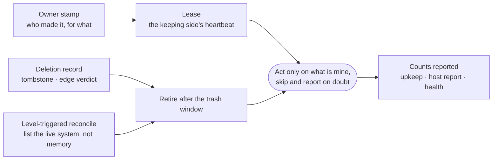

# Convergence

How the long-lived things intentic leaves behind (containers, volumes, sync sessions, login entries, records, tunnels,
hosted apps, deployed resources) return to the shape the current release expects, by themselves, on machines nobody is
watching.

(2026-10-05) A survey of the owner's own machines found:
- Mutagen sessions for sandboxes deleted weeks earlier, still being retried;
- two device agents on one PC both restarting the same sandbox;
- old agent generations never removed;
- volumes no container claimed;
- a 40 GB backup of a sandbox the other side of the PC kept.

Each piece healed well within one process's memory. None healed what fell outside it. The rules below are what every
component now follows, so a release brings old installs to the current shape instead of leaving them as they were.
The audit behind them is `docs/research/self-healing-audit-2026-10.md` in the workspace.

## The rules

1. **Everything carries its owner.** Each object says who made it and for what, and an unattended actor touches only
   what it owns.
   - Containers: `HOST_PLATFORM` plus `HOST_ENV`, and `dev.intentic.*` labels ([`ic`'s side.rs](../../_sandbox/ic/src/sandbox/side.rs), [labels.rs](../../_sandbox/ic/src/sandbox/labels.rs)).
   - Mutagen sessions: `intentic-owner` labels ([`mutagen.ts`](../../_devices/machine/src/sync/mutagen.ts)).
   - Daemon children: `INTENTIC_DAEMON_GEN` ([`workload-stamp.ts`](../../_sandbox/sandbox/src/seams/workload-stamp.ts)).
   - Tunnels: an instance id ([`identity.rs`](../../_sandbox/front/crates/tunnel/src/identity.rs)).
   - Deployed resources: `intentic.owner` ([`stamp.ts`](../../_deploy/providers/src/core/stamp.ts)).
2. **Ownership is a lease.**
   - The environment that keeps a sandbox writes `/history/.ic/keeper.json` inside it on every keeper pass. The
     other side of a PC adopts the sandbox when that heartbeat has been silent for half an hour
     ([`inside.rs`](../../_sandbox/ic/src/sandbox/inside.rs)).
   - The ingress holds one instance per sandbox while its carrier is heard, and lets a new instance from the same
     place replace it ([`registry.rs`](../../_platform/ingress/src/registry.rs)).
3. **Deletion is a record.** A consumer retires its own state only on a positive "gone": a tombstone, the edge's
   `unknown-sandbox` verdict, or `ic`'s own listing and trash. It retires it after the 7-day trash window, never on
   absence alone.
   - Sync pairings and device links follow it ([`gone.ts`](../../_devices/machine/src/sync/gone.ts),
     [`retire.ts`](../../_devices/machine/src/sync/retire.ts)).
   - So do the hosted and DNS reapers ([`hosted.ts`](../../_platform/api/src/sandbox/hosted/hosted.ts)).
4. **Converge on a level, not an event.** Clean-ups run as standing passes that list the live system, not only at
   start or once behind a marker:
   - the device agent's upkeep pass, every 6 hours ([`upkeep/`](../../_devices/machine/src/upkeep));
   - the daemon's persistent chore clock ([`boot-chores.ts`](../../_sandbox/sandbox/src/bootstrap/boot-chores.ts));
   - the platform's daily sweeps, including the app-shape check;
   - the deploy engine's daily drift check.
5. **Every store has a retention**, and goes through a trash first wherever a person might want it back:
   - `ic` backups and records;
   - the agent's trash and audit log;
   - `/history/trash`, parked refs and git objects;
   - dind data, and the desktop app's run logs.
6. **Destroy only on positive evidence.** A side `ic` cannot read is Unknown, never "mine"
   ([`side.rs`](../../_sandbox/ic/src/sandbox/side.rs)). A listing docker would not give is a failure, not an empty
   machine. A hosted app without a tombstone is `forgotten`, reported and left standing. A deployed resource without
   an owner stamp is reported, never pruned.

## Where a release reaches an old install

- **The device agent's upkeep pass** ([`upkeep/manifest.ts`](../../_devices/machine/src/upkeep/manifest.ts)) is a
  list of everything intentic ever installed on a machine. Each entry carries its own marker, so an entry a later
  release adds still runs on machines that hold old markers. `intentic-machine doctor` shows what it would do, and
  `--fix` does it.
- **`ic`'s recreate** adds the stamps an older container lacks, so every update adopts the containers made before
  stamps existed.
- **The keeper** ([`keeper.ts`](../../_devices/machine/src/device/sandbox-rounds/keeper.ts)) runs only for this
  environment's own sandboxes, and every environment runs its own backups, update downloads and tidy.

## Where convergence shows

- **The device agent:** reports its last upkeep pass in its facts (`DeviceUpkeepSchema`). The Devices view raises what
  it left for a person.
- **`ic`:** its reports name what it adopted, archived, trashed and pruned.
- **The platform:** keeps one host report per reporter, and each report carries the agent's last upkeep counts. The
  daily sweep sums them by agent version, and the admin digest names machines on the newest agent that still hold
  leftovers ([`upkeep-convergence.ts`](../../_platform/api/src/admin/upkeep-convergence.ts)). It also flags two copies
  of one sandbox announcing side by side (`duplicateCopies`), and the overview says which machines run them.
