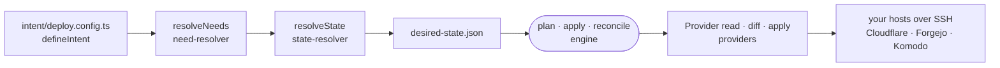

# The deployment engine

A bundled tool that turns an intent file into a desired-state graph and reconciles the user's own hosts, DNS and services until they match it.

## Where it sits

The engine is not part of the product (see [the app plane](app-plane.md)). It is baked into the sandbox image as the `intentic` CLI ([`_deploy/cli`](../../_deploy/cli)), and an agent or the daemon runs it like any other tool: [`check-run.ts`](../../_sandbox/sandbox/src/intentic/check-run.ts) resolves and plans, [`infra-apply.ts`](../../_sandbox/sandbox/src/intentic/infra-apply.ts) resolves, applies and adopts. It deploys the user's infrastructure, not intentic's own platform.

## The pipeline

1. **Intent.** `intent/deploy.config.ts` exports `intent = defineIntent((i) => …)` from [`_deploy/sdk`](../../_deploy/sdk). `i.have.*` names what the user brings (hosts, a Cloudflare zone, GitHub, GitLab), which the engine reads but never creates or destroys. `i.want.*` names what it owns end to end (apps with environments, services, databases, caches, auth, object storage, users, teams, sandbox workspaces). `moved(from, to)` renames a resource in place. The file layout comes from [`workspace-layout.ts`](../../_sandbox/scaffold/src/workspace-layout.ts).
2. **Resolve.** `intentic deploy resolve` loads the file (`loadIntent`), maps it to abstract needs (`resolveNeeds`: a capability, a scope, and a control or application plane), picks a stack (`catalogFor`: Forgejo, GitHub or GitLab for source control, Komodo for deployment, Cloudflare tunnels for domains), and emits and compiles the nodes (`resolveState`, `compile`) into a `DesiredStateGraph`. It writes `desired-state/desired-state.json`, plus `.env.example` listing the secrets the user must supply.
3. **Plan.** `plan` in [`_deploy/engine`](../../_deploy/engine) reads each node's live resource through its provider and decides create, update or noop, first by the stamped hash and then by the provider's `diff`.
4. **Apply.** `apply` walks the graph in `linearize` order, resolving each node's inputs from the outputs already produced. `reconcile` repeats apply and plan until every step is noop. The CLI's `deploy apply` wraps this with a lock per host, generated secrets, host migration and renames, and deletes removed or orphaned resources only with `--yes`.
5. **Adopt.** `intentic deploy adopt` pushes the intent and desired-state repositories to the source control it provisioned and installs resolve and apply CI workflows, so later changes reconcile from CI.

## State

There is no state file. Every resource the engine creates carries a stamp (`intentic.id`, `intentic.hash` in [`stamp.ts`](../../_deploy/graph/src/stamp.ts)) as a Docker label or a DNS record comment, and `Provider.read` finds it again. `desired-state/` keeps only the artifact, the last applied graph (the prune baseline), generated secrets and known hosts.

## Providers

`Provider` in [`provider.ts`](../../_deploy/engine/src/provider.ts) is `read`, `diff` and `apply`, with optional `list` and `delete` for pruning. `createProviders` in [`_deploy/providers`](../../_deploy/providers) builds one per resource type in [`_deploy/resources`](../../_deploy/resources), over SSH, Cloudflare, Forgejo, Komodo, GitHub, GitLab and a few service APIs. Targets are machines the user already has, reached over SSH with Docker installed. The engine provisions no cloud VMs.

## Testing it

- [`suite.engine.test.ts`](../../_deploy/providers/src/suite.engine.test.ts) reconciles a whole app over fake SSH and fake APIs, then checks the second run is idempotent.
- The CLI's `e2e:hermetic` suite runs against a Docker-in-Docker host from [`_tools/dind-host`](../../_tools/dind-host), with no secrets.
- `pnpm demo:up` stands the same host up locally, applies a demo intent and rolls out an app; `demo:down` and `demo:clear` take it away.
