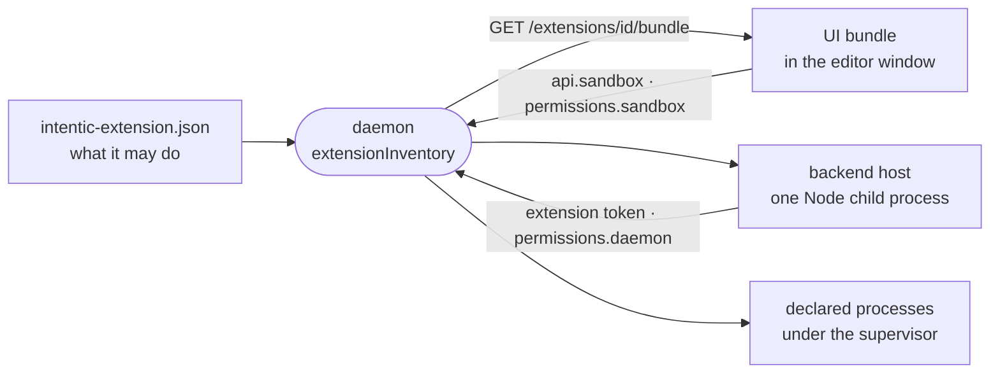

# Extensions

Extensions add views, commands, file viewers, agent skills, background processes and connectable capabilities to intentic through a declared manifest, without changing the editor or the daemon.

## The package

- An extension is a directory with an `intentic-extension.json` manifest (`ExtensionManifestSchema` in [`manifest.ts`](../../_shared/extension-manifest/src/manifest.ts)). Its id is `publisher.name`, and `engines.intentic` is a semver range over the host's extension API version, checked before activation.
- `contributes` declares everything it adds, one schema per contribution point in [`points/`](../../_shared/extension-manifest/src/points): views on the rail or in a sandbox, file viewers, commands, settings, processes, capabilities, automation templates, a `bin` directory put on the agent's `PATH`, and `agent` (the checkout is also a Claude Code plugin with skills, hooks and MCP servers).
- `entry` is a prebuilt single-file ESM bundle exporting `activate(api, context)`; `server` is a Node bundle exporting `activateServer`. Both are optional, so an extension can be data only.
- [`_shared/extension-api`](../../_shared/extension-api) is the API an extension codes against (`IntenticApi` in [`api.ts`](../../_shared/extension-api/src/api.ts)), and [`_shared/extension-ui`](../../_shared/extension-ui) the component kit and translator it draws with. The host supplies both at runtime, so every extension shares the editor's own instances.
- The in-repo extensions under [`_extensions`](../../_extensions) are `@intentic/ext-<name>` packages. [`_tools/extension-example/seed`](../../_tools/extension-example/seed) is the template an outside author copies, with one contribution of each kind.

## Where they come from

[`installed-extensions.ts`](../../_sandbox/sandbox/src/extensions/installed-extensions.ts) merges three sources:

| Source | Where | Trust |
| --- | --- | --- |
| Built in | baked into the sandbox image at `/opt/extensions` | ships with intentic |
| Installed | a git checkout pinned to a full commit sha, from a registry | the owner installed it; updates show a diff of new powers first |
| Workspace | a folder an agent wrote under `.intentic/config` | inert until the owner approves the powers it declares |

A workspace extension's approval is a digest of its declared powers, kept in `/history` where no workspace write reaches ([`extension-approvals.ts`](../../_sandbox/sandbox/src/extensions/extension-approvals.ts)). Editing its code under the same powers keeps the approval; asking for more voids it. The owner can switch any extension off except the automations and workflows engines.

A registry ([`_shared/registry`](../../_shared/registry)) is a git repository of curated listings; the official one is `github.com/intentic/registry`, and [`_tools/registry-scan`](../../_tools/registry-scan) proposes and re-checks its entries.

## Loading

- **UI.** Extensions compiled into the editor are imported from [`builtins.ts`](../../_editor/web/src/extension-host/builtins.ts). Any other bundle is fetched from the daemon and imported as a module by [`loader.ts`](../../_editor/web/src/extension-host/loader.ts); its bare imports resolve through the page's import map to the host's own copies, and [`bundle.ts`](../../_shared/extension-manifest/src/bundle.ts) refuses any other import. There is no iframe: UI code runs in the editor's window.
- **Backend.** Every enabled `server` bundle runs in one Node child process beside the daemon ([`backend-supervisor.ts`](../../_sandbox/sandbox/src/extensions/backend/backend-supervisor.ts)), and the daemon proxies `/x/<id>/*` to it. Each extension loads in its own try/catch.
- **Processes.** `contributes.processes` run under the daemon's service supervisor, such as the chat gateways built on [`_shared/connector-runtime`](../../_shared/connector-runtime).

## Isolation

- The host refuses any view, command, viewer, setting or process the manifest did not declare ([`apiImpl.ts`](../../_editor/web/src/extension-host/apiImpl.ts)), so the manifest is the approval surface the install dialog shows.
- A UI bundle's calls into the sandbox pass `permissions.sandbox`, a list of `METHOD path-glob` entries (`sandboxRouteAllowed` in [`permissions.ts`](../../_shared/extension-manifest/src/permissions.ts)). The browser enforces this list, since the code already runs with the owner's session in the owner's window.
- A backend calls the daemon with its own minted token, which the daemon checks against `permissions.daemon` ([`grants.ts`](../../_sandbox/sandbox/src/auth/grants.ts)).
- Kinds of capability that carry real privilege stay in the core catalog, so a manifest cannot contribute them ([capabilities.md](capabilities.md)).
- Extensions are trusted code inside the owner's sandbox and browser. The boundary is what they declare and what the owner approved, not a process sandbox.
