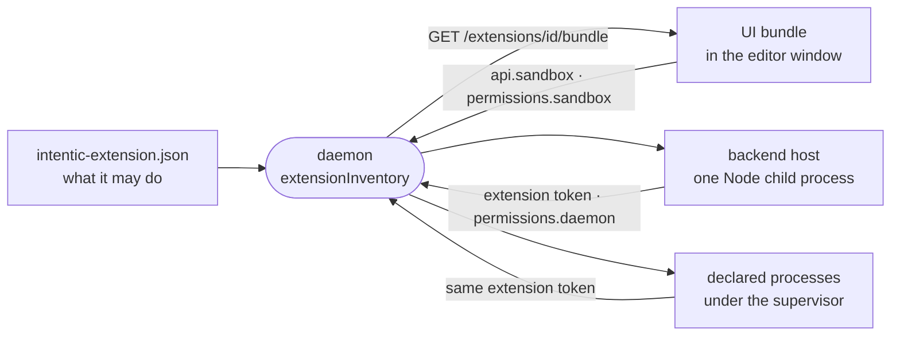

# Extensions

Extensions add views, commands, file viewers, agent skills, background processes and connectable capabilities to intentic through a declared manifest, without changing the editor or the daemon.

## The package

- An extension is a directory with an `intentic-extension.json` manifest (`ExtensionManifestSchema` in [`manifest.ts`](../../_shared/extension-manifest/src/manifest.ts)). Its id is `publisher.name`, and `engines.intentic` is a semver range over the host's extension API version, checked before activation.
- `contributes` declares everything it adds, one schema per contribution point in [`points/`](../../_shared/extension-manifest/src/points): views on the rail or in a sandbox, file viewers, commands, settings, processes, capabilities, automation templates, a `bin` directory put on the agent's `PATH`, `tools` (an MCP server every runtime's turns get, below), and `agent` (the checkout is also a Claude Code plugin with skills and hooks; a `.mcp.json` in it is deprecated and warned about at load, since only Claude Code reads it).
- What each field means to the host is declared on the field (`.meta({ power, effect, mintsServer })`, [`meaning.ts`](../../_shared/extension-manifest/src/meaning.ts)): the powers an update re-asks for, what adding a card discloses, and which kinds register an MCP server are read from there. [`surface.json`](../../_shared/extension-api/src/surface.json) records a digest of the whole generated schema per API version, so a field added at any depth needs a new version: an older host's parse drops what it does not know.
- `entry` is a prebuilt single-file ESM bundle exporting `activate(api, context)`; `server` is a Node bundle exporting `activateServer`. Both are optional, so an extension can be data only. The UI half reaches its own backend with `api.backend`, by a path relative to its namespace: the routing id is the install id, which for an extension installed by a card is the card's id, not `publisher.name`.
- `tools` gives the agent an MCP server: per granted card of one of the extension's cli kinds (`perCard`), or one for the extension. The backend serves it with `api.tools.serve((card) => [...])` and the backend host owns the transport, each call's deadline and the card lookup; or a declared process answers on its port. A cli card's `mcp` stays one release as an alias for a backend path that speaks MCP itself ([`tool-servers.ts`](../../_shared/extension-manifest/src/tool-servers.ts)).
- [`_shared/extension-api`](../../_shared/extension-api) is the API an extension codes against (`IntenticApi` in [`api.ts`](../../_shared/extension-api/src/api.ts)), and [`_shared/extension-ui`](../../_shared/extension-ui) the component kit and translator it draws with. The host supplies both at runtime, so every extension shares the editor's own instances.
- The in-repo extensions under [`_extensions`](../../_extensions) are `@intentic/ext-<name>` packages. [`_tools/extension-example/seed`](../../_tools/extension-example/seed) is the template an outside author copies, with one contribution of each kind.

## Where they come from

[`installed-extensions.ts`](../../_sandbox/sandbox/src/extensions/installed-extensions.ts) merges three sources:

| Source | Where | Trust |
| --- | --- | --- |
| Built in | baked into the sandbox image at `/opt/extensions` | ships with intentic |
| Installed | a git checkout pinned to a full commit sha, from a registry | the owner installed it; updates show a diff of new powers first |
| Workspace | a folder an agent wrote under `.intentic/config` | inert until the owner approves the powers it declares |

A workspace extension's approval is a digest of its declared powers, kept in `/history` where no workspace write reaches ([`extension-approvals.ts`](../../_sandbox/sandbox/src/extensions/extension-approvals.ts)). Editing its code under the same powers keeps the approval; asking for more voids it. The owner can switch any extension off except the automations and workflows engines.

A registry ([`_shared/registry`](../../_shared/registry)) is a git repository of curated listings; the official one is `github.com/intentic/registry`, and [`_tools/registry-scan`](../../_tools/registry-scan) proposes and re-checks its entries.

## Loading

- **UI.** Extensions compiled into the editor are imported from [`builtins.ts`](../../_editor/web/src/extension-host/builtins.ts). Any other bundle is fetched from the daemon and imported as a module by [`loader.ts`](../../_editor/web/src/extension-host/loader.ts); its bare imports resolve through the page's import map to the host's own copies, and [`bundle.ts`](../../_shared/extension-manifest/src/bundle.ts) refuses any other import. There is no iframe: UI code runs in the editor's window.
- **Backend.** Every enabled `server` bundle runs in one Node child process beside the daemon ([`backend-supervisor.ts`](../../_sandbox/sandbox/src/extensions/backend/backend-supervisor.ts)), and the daemon proxies `/x/<id>/*` to it. Each extension loads in its own try/catch. The host restarts only when what it runs changes (the set of backends, a bundle's content, what each is handed at activation); a toggle, install or edit that moves none of those converges without one, and the MCP door holds a request while a restart is under way. One process for all of them rather than one each, since a node process costs tens of megabytes before any extension code loads.
- **Processes.** `contributes.processes` run under the daemon's service supervisor, such as the chat gateways built on [`_shared/connector-runtime`](../../_shared/connector-runtime). Each is started with its extension's own token in `INTENTIC_EXTENSION_TOKEN`, never the panel token.

## Isolation

- The host refuses any view, command, viewer, setting or process the manifest did not declare ([`apiImpl.ts`](../../_editor/web/src/extension-host/apiImpl.ts)), so the manifest is the approval surface the install dialog shows.
- A UI bundle's calls into the sandbox pass `permissions.sandbox`, a list of `METHOD path-glob` entries (`sandboxRouteAllowed` in [`permissions.ts`](../../_shared/extension-manifest/src/permissions.ts)). The browser enforces this list, since the code already runs with the owner's session in the owner's window.
- A backend and the extension's processes call the daemon with one token minted for that extension, which the daemon checks against `permissions.daemon` ([`grants.ts`](../../_sandbox/sandbox/src/auth/grants.ts)). An extension that owns a provider's listener also reaches that one provider's `/listeners/<provider>/*` routes without listing them, and no other provider's, whatever its globs say. `/state` hands it only the connectors whose card it contributes itself.
- A listener provider belongs to exactly one enabled extension ([`listener-state.ts`](../../_sandbox/sandbox/src/extensions/listener-state.ts)): the declarer that also contributes the provider's connector card, else the first declarer in enumeration order (built-in, git-installed, then workspace by folder). Every other declaration of it is refused at load: the extension still runs, its listener is not granted, its gateway is not started, outbound replies go to the owner's gateway only, and the refusal shows on its row in the Extensions list (`problems`). The listener routes resolve the owner again on each request, so declaring a provider never lets a second extension fake its inbound messages.
- The panel token reaches no route that returns or uses a stored credential (`panel: false` in [`route-meta.ts`](../../_shared/sandbox-contract/src/protocol/route-meta.ts)). That token goes to every repo's operator panel, and extension code never holds it.
- An extension's tools are mounted into a turn at the daemon's one MCP door, `/mcp/<name>`, under the card's id or the extension's name ([`extension-mcp.ts`](../../_sandbox/sandbox/src/extensions/backend/extension-mcp.ts), [`turn-mounts.ts`](../../_sandbox/sandbox/src/agent/tools/turn-mounts.ts)). Each turn holds a bearer of its own that reaches only what that turn mounted and is forgotten when it ends, so it opens only the cards that turn was granted, and two turns of one conversation at once never reach each other's mounts. An ACP agent's warm session keeps its MCP config, so its turns share the conversation's bearer, one live turn at a time, reaching nothing between turns. A card's server is granted by the card (the persona's `connectors`); an extension's own server, and its agent plugin, by the persona's `extensions` list (absent: every enabled extension). The door hands the extension the card's settings as the daemon holds them now (in the tools request, or `x-intentic-card` on a forwarded one), so a switch the owner flips binds on the next call, and holds a request briefly while the backend host restarts. The host serves tools on a route of its own, never under `/x`, and `/x/<id>/<mcp path>/…` is refused, so neither is reached with a panel's or a member's bearer.
- Kinds of capability that carry real privilege stay in the core catalog, so a manifest cannot contribute them ([capabilities.md](capabilities.md)).
- Extensions are trusted code inside the owner's sandbox and browser. The boundary is what they declare and what the owner approved, not a process sandbox.
