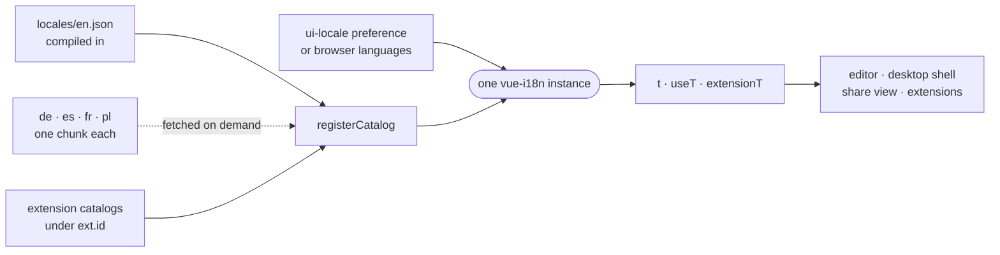

# UI languages

The editor's words live in per-package message catalogs, one file per shipped language, and a single vue-i18n instance swaps them on screen without a flash.

## Shipped languages

- [`_editor/ui/src/i18n/locales.ts`](../../_editor/ui/src/i18n/locales.ts) declares `LOCALES` and `negotiate`. English is the source language and the fallback for any key a translation lacks, so it is compiled in; every other language is a lazy chunk.
- A stored choice (`ui-locale`) wins. Without one, `negotiate` walks `navigator.languages` and matches on the primary subtag, since only base languages ship.
- The pre-paint script in [`_editor/web/index.html`](../../_editor/web/index.html) repeats that rule in ES5 to set `<html lang>` before anything renders. [`bootLocale.test.ts`](../../_editor/web/src/bootLocale.test.ts) fails if the two disagree.

## Catalogs and namespaces

Each package registers its own slice of one message tree, so no two packages can claim a key:

| Catalog | Mounted at |
| --- | --- |
| [`_editor/web/src/app/i18n/locales`](../../_editor/web/src/app/i18n/locales) | the root (`settings.…`, `chat.…`) |
| [`_editor/ui/src/i18n/locales`](../../_editor/ui/src/i18n/locales) | `ui.` |
| [`_editor/desktop-app/src/i18n/locales`](../../_editor/desktop-app/src/i18n/locales) | `desktop.` |
| [`_editor/share-view/src/i18n/locales`](../../_editor/share-view/src/i18n/locales) | `share.` |
| each extension's `src/locales` | `ext.<extension id>.` |

Inside the editor's own catalog, a word's key says who owns its meaning, not who happened to say it first:

- `ui.action.*` in the kit holds a verb any control can carry (Cancel, Restore, Show less), and `ui.status.*` the progress words (Loading…, Working…).
- `shared.*` holds a noun, or the state a thing is in, that means the same in every feature saying it: the sections' own names, Agent, Model, Running. The same English is not a reason to share a key. "Access" the sandbox section and "Access" a capability's grant are two keys.
- `<area>.words.*` holds a word several of one feature's components say. A phrase another feature borrows stays with the feature it belongs to.

Every top-level section of the editor's catalog is typed in [`app/i18n/index.ts`](../../_editor/web/src/app/i18n/index.ts), and `i18nSections.test.ts` fails on one that is not.

An extension builds its catalog and translator in one call, `extensionI18n` from [`_shared/extension-ui/src/i18n.ts`](../../_shared/extension-ui/src/i18n.ts), and the host mounts it before calling `activate`. The loader stays a literal template (`import(\`./locales/${locale}.json\`)`) so the bundler emits one chunk per language.

## Words are built when they are read

`t` reads the active language at the moment it is called. A label table evaluated at module import keeps the language the page booted in, so labels are built inside a function or a `computed`. [`turnBreak.ts`](../../_editor/web/src/features/chat/run/turnBreak.ts) and [`AgentRecovery.vue`](../../_editor/web/src/features/sandbox/agent-settings/behaviour/AgentRecovery.vue) follow this rule.

## Switching language

`setLocale` in [`_editor/ui/src/i18n/i18n.ts`](../../_editor/ui/src/i18n/i18n.ts) stores the choice, fetches the new language for every registered catalog, and only then changes the locale, the number and date formatting (`setFormatLocale`) and `<html lang>` in one tick. Other windows follow through the shared preference channel. `startI18n` is awaited before the app mounts, so a cold load paints in the right language. Plural forms follow each language's grammar (`pluralRules`: Polish has three forms, French counts zero as singular).

## Checks

- [`i18n-catalogs.mjs`](../../_tools/checks/i18n-catalogs.mjs): a translation holds only keys English has, with the same placeholders and plural forms. `--fix` drops the extras.
- [`i18n-keys.mjs`](../../_tools/checks/i18n-keys.mjs): every `t()` key exists, every message is used, and every message compiles. vue-i18n's `t` accepts any string, so the compiler cannot catch a typo.
- [`i18n-shared.mjs`](../../_tools/checks/i18n-shared.mjs): every `shared.*` message is a noun phrase. It refuses a conjunction, a personal pronoun, a leading imperative, a placeholder, punctuation at an edge and a key ending in a digit (`sandbox2`). A message that is right where it stands is listed with its reason in the check's `ALLOWED`, since a catalog has no comments to hold the pragma.
- [`i18n-literals.mjs`](../../_tools/checks/i18n-literals.mjs): no English typed into a shipped `.vue` template, nor handed from code to what says it on screen (`say`, `warn`, `noticeOf`, `noticeFrom`, a store's `run(task, wrote)`).

The daemon, the CLIs and the public site do not render through vue-i18n and are outside these rules.
