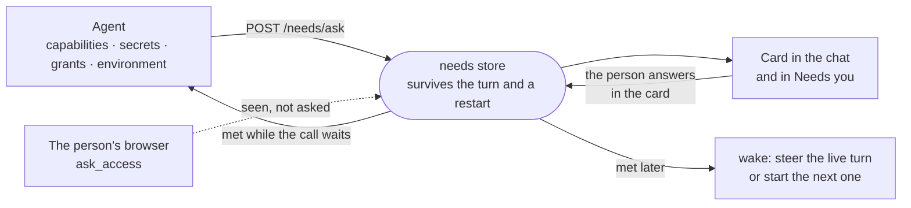

# Needs

A need is something an agent cannot finish its task without and only a person can provide: a connection, a secret's value, wider access, a tool in the image. The agent raises it once, the sandbox keeps it until someone answers, and the conversation hears the answer whenever it comes.

## Why a need is not a parked card

A parked card (plan, question, permission, payment, a per-use credential) holds a turn at one moment: when the turn ends, the card ends. Connecting GitHub or pasting an API key takes minutes, and the person often answers after the agent has finished everything else. So a need is stored on its own ([`needs-store.ts`](../../_sandbox/sandbox/src/needs/needs-store.ts)), keeps its card answerable after the turn ends and across a restart, and wakes the conversation when it is met ([`needs.ts`](../../_sandbox/sandbox/src/needs/needs.ts)), through the same door a condition watch uses ([`wake-delivery.ts`](../../_sandbox/sandbox/src/agent/run/turn/wake-delivery.ts)).

## The agent's side

Every ask is one CLI call that answers in under 100 seconds, below the shell's 110-second cutoff:

| Command | Raises | Met when |
| --- | --- | --- |
| `capabilities request <entry> [--target T] [--set k=v] --why …` | `capability`: connect, reconnect a refused credential, or change a setting on a connected one (a device switch, a Docker engine option) | an instance of the entry (matching the target) comes live, or the change is applied |
| `secrets ask NAME --why … [--where …] [--link URL]` | `secret`: a value the person pastes into the card | the name resolves |
| `grants request capability\|folder\|shelf <what> --why …` | `grant`: something this conversation's persona or area withholds | the person allows it, for this conversation or on the persona |
| `secrets request <id> --why …` | `release`: a gated account or connector for the rest of the conversation | a named approver releases it |
| `environment propose <tool> --why …` | `environment`: overlay steps for the sandbox image; with `--pack`, the steps of an opt-in image pack of that name (`office`), met at once when the image already bakes it | the approved overlay is what the running container was built from |
| the browser extension's `ask_access` | `grant` of a `site`, raised by the daemon as the call goes by ([`webext-peer.ts`](../../_sandbox/sandbox/src/webext/webext-peer.ts)) | that browser reports the site allowed, which only the person's click there can do |

`secrets generate NAME [--bytes N] [--format hex|base64url|alnum]` is not a need: a value the task can make for itself (a session key, a signing secret, a password it sets up) is made and kept by the daemon (`POST /secrets/generate`), and the agent gets its reference and length, never the value. Proposed environment steps are checked before a card goes up: an apt install without both build-cache mounts is refused with the shape to use ([`environment.ts`](../../_sandbox/sandbox/src/environment/environment.ts) `cacheProblem`).

The call holds while the person decides (90 seconds by default, never on an unattended turn) and answers one of three ways: met (exit 0, with what works in this turn and what arrives on the next), refused (exit 1, with a sentence to act on), or still open (exit 3). Still open means carry on with other work: the answer arrives in the conversation by itself, so the agent neither polls nor asks twice. `needs` lists a conversation's needs; `needs cancel <id>` withdraws one.

Before raising a card the daemon checks what the turn can already reach ([`turn-standing.ts`](../../_sandbox/sandbox/src/conversations/actor/turn-standing.ts), recorded as each turn is planned), so a capability that is connected but withheld by the persona, gated to an approver, or rejecting its credential is answered as exactly that, and the card offers the fix rather than a second connection.

## The person's side

- The card draws the need live, wherever it is: in the transcript where it was raised, pinned under the conversation while it is open, and in the Needs you inbox with everything else waiting on a person.
- It is answered in place. A connection's form opens inside the card with everything the agent could fill already filled and only the credential empty; a secret has one masked field whose value goes straight to the store and never into the transcript; a grant offers this conversation or the persona; an environment proposal shows its steps with Approve and Rebuild.
- A push names the conversation and what it needs, and is sent to the people who are away, not to nobody because someone else has a tab open.
- A conversation that came from a channel (Slack, Telegram, Discord…) hears it there too ([`need-channel.ts`](../../_sandbox/sandbox/src/needs/need-channel.ts)), with where to answer it and, for a secret, a warning not to paste it into the channel. A visitor's chat never does: nothing a need asks for is a stranger's to give.
- A pending plan names the conversation's open needs under itself, so the person answers them in the same sitting as the plan rather than one interruption at a time.
- Every yes still standing (what a grant widened, which credentials were released, whether its installs run unasked) is listed under Needs you, by conversation, each with Take back ([`standing-grants.ts`](../../_sandbox/sandbox/src/needs/standing-grants.ts)); it applies from the conversation's next turn, and for installs from its next install. A yes is kept until a person takes it back or the conversation is gone: a restart forgets none of them.

## After the answer

- Met while the call still waits: the call answers, and nothing else happens.
- Met after the call answered: a live turn is steered with the outcome; a finished conversation is continued with it (the `continueWhenNeedMet` setting, on by default, since the person just asked for exactly this); a busy one queues it.
- Declined: a live turn is told; a finished conversation is not woken to hear a no.
- A grant, a release or a connection that only mounts on the next turn says so, and the conversation is continued as soon as its current turn ends. A site allowed in the person's browser is live at once, so the running turn hears it.

## State

| Place | Holds |
| --- | --- |
| `.intentic/records/needs.json` | every open need and the recent closed ones, with who answered and how the agent was told |
| `sandbox-secrets.json` (auth root) | secrets a person pasted into a card or added on the Secrets view without DevOps, and ones `secrets generate` made |
| `conversation-grants.json` (auth root) | what a person allowed one conversation beyond its persona, and "allow installs for this conversation" from an install card |
| `credential-releases.json` (auth root, [`credential-grants.ts`](../../_sandbox/sandbox/src/secrets/credential-grants.ts)) | credentials a named approver released to a conversation, until a take-back; mirrored in memory, loaded at boot |
