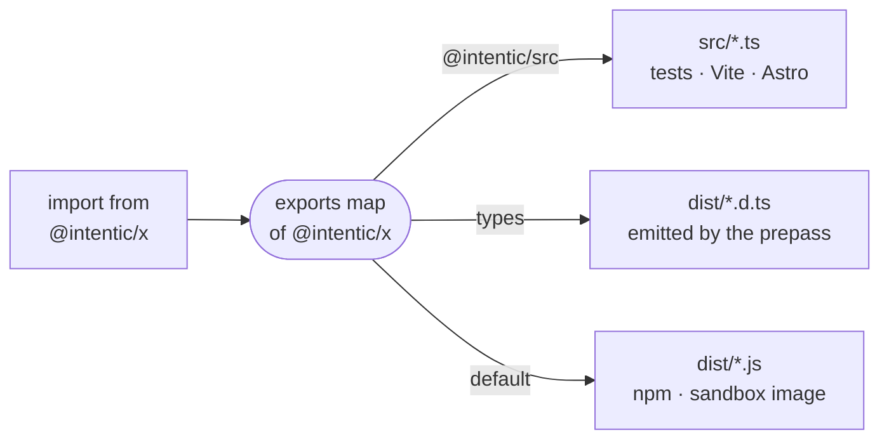

# How the monorepo is organised

The repository is one pnpm workspace of `_area/package` directories, each package named `@intentic/` plus its directory name, built by turbo and run from TypeScript source inside the repo.

## Areas and packages

- Every top-level directory that starts with `_` is an area, and each directory inside it that holds a `package.json` is a package. [`pnpm-workspace.yaml`](../../pnpm-workspace.yaml) globs `_area/*`, and [`_tools/checks/lib/repo.mjs`](../../_tools/checks/lib/repo.mjs) discovers areas the same way, so a new area needs no registration.
- The areas are the parts of the product: [`_editor`](../../_editor), [`_sandbox`](../../_sandbox), [`_shared`](../../_shared), [`_extensions`](../../_extensions), [`_devices`](../../_devices), [`_search`](../../_search), [`_platform`](../../_platform), [`_deploy`](../../_deploy), [`_site`](../../_site) and [`_tools`](../../_tools). [repo.md](repo.md) draws how they relate at runtime.
- `_shared` holds contracts and SDKs every other part is written against, and depends on nothing but the `_tools` foundation, apart from the exceptions the `shared-boundary` check names.
- Some directories are not workspace packages: the store shells [`_editor/ios-app`](../../_editor/ios-app) and [`_editor/android-app`](../../_editor/android-app) are negated in the workspace and installed on the machine that builds them, the Rust crates ([`_sandbox/front`](../../_sandbox/front), [`_sandbox/ic`](../../_sandbox/ic), [`_devices/win-launcher`](../../_devices/win-launcher), the desktop app's `src-tauri`) build with cargo, and [`_tools/checks`](../../_tools/checks) and [`_tools/scripts`](../../_tools/scripts) are plain Node scripts that run before any install.

## Naming

- One npm scope for everything: a package's name is `@intentic/` plus its directory name. Extensions carry an `ext-` prefix in the npm name only (`_extensions/projects` is `@intentic/ext-projects`). [conventions.md](conventions.md) has the rule and the check that enforces it.
- Versions stay `0.0.0` in git. A release stamps the tag's version onto the published set listed in [`_tools/scripts/lib/packages.sh`](../../_tools/scripts/lib/packages.sh) and publishes it to npm in dependency order. Packages marked `private` never leave the repo.
- Third-party versions come from one strict catalog in `pnpm-workspace.yaml`: a manifest writes `catalog:`, never its own version.

## The `@intentic/src` condition

A library's `exports` map lists a `@intentic/src` condition that points at `src/*.ts`, ahead of the `default` that points at `dist/`. Everything that runs inside the repo asks for that condition: the `suites` test runner passes `--conditions=@intentic/src` to Bun, and the web app and site resolve workspace packages to source through their Vite and Astro configs. A consumer outside the repo gets `dist/`. So an edit is live in tests and dev servers without a build, and nothing that leaves the repo depends on source.

Packages that are only ever consumed as source (`_editor/ui` and the extensions) export `src/` directly and have no `dist/`.

## Build and typecheck

- `pnpm build` is `turbo run build`, each package after its dependencies (`^build` in [`turbo.json`](../../turbo.json)). Libraries build with `tsgo`, the web app with Vite, the site with Astro; Vue packages type-check with `vue-tsc`.
- `pnpm typecheck` runs the prepass first: the checks in warn mode, then [`emit-declarations.mjs`](../../_tools/scripts/build/emit-declarations.mjs), which emits every library's declarations with `tsgo -b`. The type checker resolves a workspace import through the `types` condition, so it reads those declarations. Then `turbo run typecheck` checks each package including its tests (`tsconfig.test.json`).
- The prepass replaces turbo's `^build` edge because pnpm's injected copies fail with `EXDEV` in an agent worktree, which lives on a separate filesystem. `pnpm test` runs the same prepass and then `turbo run test --only`.
- Shared compiler settings live in [`_tools/tsconfig`](../../_tools/tsconfig): a strict base, a Vue variant and an Astro variant.
