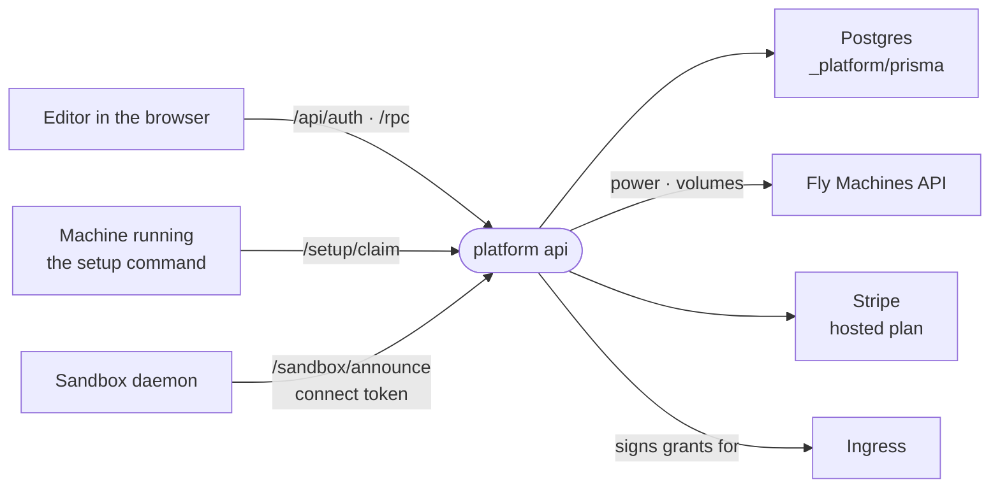

# The platform

The hosted account service: Google sign-in, the registry that tells a browser where each sandbox is, and the lifecycle and billing of the sandboxes intentic hosts.

## What it is

- [`_platform/api`](../../_platform/api) runs on Bun with Hono. Its oRPC router ([`router.ts`](../../_platform/api/src/router.ts)) serves the editor through the contract in [`_shared/api-contract`](../../_shared/api-contract), and Better Auth handles sign-in with Google as the only provider ([`auth.ts`](../../_platform/api/src/auth.ts)).
- [`app.ts`](../../_platform/api/src/app.ts) holds the plain HTTP routes the machines call: the setup claim, the daemon's announce, farewell and boot report, the ingress's reachability lookup, and the Stripe webhook.
- [`_platform/prisma`](../../_platform/prisma) owns the Postgres schema and migrations. [`_platform/ingress`](../../_platform/ingress) is the public edge a sandbox tunnels to; see [topology.md](topology.md).
- The editor itself is a static build of [`_editor/web`](../../_editor/web) served by nginx at `app.intentic.dev`, next to the api. [`_tools/selfhost/platform`](../../_tools/selfhost/platform) runs the same stack (Postgres, api, web, ingress) for an operator's own fleet.

## What it stores

[`schema.prisma`](../../_platform/prisma/schema.prisma), in four groups:

- **Accounts**: `User`, Better Auth's `Session`, `Account` and `Verification`, and `ApiToken` for provisioning from a script or an agent.
- **The registry**: `Sandbox` (the daemon's public URL, its last-seen time, the encrypted connect token, the setup code and the last boot report), `SandboxMember` for invitations, and `SandboxTrash` for a deleted sandbox that can still be restored. The daemon enforces membership; the platform only records it.
- **Hosted sandboxes**: `HostedMachine` and the warm pool `HostedPoolMachine`, image builds, migrations, cleanups, awake-minute metering, the Stripe subscription mirror (`HostedPlan`, `HostedPlanItem`) and the abuse ledgers.
- **Everything else**: the free trial's meter, the x402 wallet's custody handle and payments, APNs push devices, the desktop sign-in handoff, and admin statistics.

## How a sandbox joins

1. The owner names a sandbox in the editor. The platform writes a `Sandbox` row and mints a setup code ([`setup-code.ts`](../../_platform/api/src/sandbox/setup-code.ts)) valid for thirty minutes.
2. The setup command on the owner's machine redeems it at `/setup/claim` for the connect token, the reachability grant and the ingress address, then starts the container.
3. The daemon announces its URL and liveness with the connect token, and opens its tunnel to the ingress.
4. The editor lists the owner's sandboxes and talks to each daemon directly. The platform is never on that path.

## Hosted sandboxes

[`hosted.ts`](../../_platform/api/src/sandbox/hosted/hosted.ts) gives each hosted sandbox its own Fly app, machine and volume, booting the same public sandbox image every other lane runs, in a region chosen by where the owner is. The platform starts and stops machines (they stop when idle), resizes and moves them, keeps a pool of warm machines, and meters awake time against the hosted plan ([`hosted-plan.ts`](../../_platform/api/src/sandbox/hosted/hosted-plan.ts)): a Stripe subscription for a bigger machine than the free one. The tier ladder is in [`hosted-tiers.ts`](../../_tools/constants/src/hosted-tiers.ts).

Background jobs started in [`main.ts`](../../_platform/api/src/main.ts) reap orphaned machines, refill the pool, finish builds, meter usage, watch for abuse and check health.

## What it does not do

- It does not relay or inspect agent turns. The one exception is the optional free trial ([`trial`](../../_platform/api/src/trial)), whose turns use platform-owned model accounts.
- It holds no credential that drives a sandbox the owner runs. It can power, resize and destroy only the machines it hosts.
- It does not deploy anything for users; that is the [deployment engine](deploy-engine.md), run from inside a sandbox.
