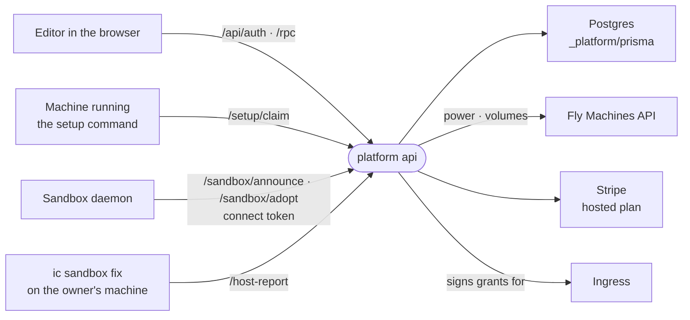

# The platform

The hosted account service: Google sign-in, the registry that tells a browser where each sandbox is, and the lifecycle and billing of the sandboxes intentic hosts.

```mermaid
flowchart LR
    browser["Editor in the browser"] -->|"/api/auth · /rpc"| api(["platform api"])
    machine["Machine running<br/>the setup command"] -->|"/setup/claim"| api
    daemon["Sandbox daemon"] -->|"/sandbox/announce · /sandbox/adopt<br/>connect token"| api
    host["ic sandbox fix<br/>on the owner's machine"] -->|"/host-report"| api
    api --> db["Postgres<br/>_platform/prisma"]
    api -->|"power · volumes"| fly["Fly Machines API"]
    api --> stripe["Stripe<br/>hosted plan"]
    api -->|"signs grants for"| ingress["Ingress"]
```

## What it is

- [`_platform/api`](../../_platform/api) runs on Bun with Hono. Its oRPC router ([`router.ts`](../../_platform/api/src/router.ts)) serves the editor through the contract in [`_shared/api-contract`](../../_shared/api-contract), and Better Auth handles sign-in with Google as the only provider ([`auth.ts`](../../_platform/api/src/auth.ts)).
- [`app.ts`](../../_platform/api/src/app.ts) holds the plain HTTP routes the machines call: the setup claim, the daemon's announce, farewell and boot report, the host report `ic sandbox fix` posts about the machine a sandbox runs on (`/host-report`, and `/host-report/claim` for the fix code the recovery panel hands out), the ingress's reachability lookup, and the Stripe webhook. Every one but the webhook is declared in api-contract's ingress table (`PLATFORM_INGRESS`): the platform serves it there through [`ingress.ts`](../../_platform/api/src/ingress.ts), reading its body with the route's schema, and the daemon calls it by name. A refusal is `{ "error": … }` with the route's status. (2026-10-05) Each side used to spell these routes by hand; the boot report's handler listed its fields one by one and dropped the two the editor's unreachable and missing-environment notices wait on.
- [`_platform/prisma`](../../_platform/prisma) owns the Postgres schema and migrations. [`_platform/ingress`](../../_platform/ingress) is the public edge a sandbox tunnels to; see [topology.md](topology.md).
- The editor itself is a static build of [`_editor/web`](../../_editor/web) served by nginx at `app.intentic.dev`, next to the api. [`_tools/selfhost/platform`](../../_tools/selfhost/platform) runs the same stack (Postgres, api, web, ingress) for an operator's own fleet.

## What it stores

[`schema.prisma`](../../_platform/prisma/schema.prisma), in four groups:

- **Accounts**: `User`, Better Auth's `Session`, `Account` and `Verification`, and `ApiToken` for provisioning from a script or an agent.
- **The registry**: `Sandbox` (the daemon's public URL, its last-seen time, the encrypted connect token, the setup code and the machine that claimed it, the last boot report, the recovery command's fix code, the newest host report of each machine that reports on it, and the last two copies of it that announced), `SandboxMember` for invitations, `SandboxTrash` for a deleted sandbox that can still be restored, `SandboxTombstone` for the deletion record of every tunnel id the registry let go of, and `PlatformIdentity`, which database this is. The daemon enforces membership; the platform only records it.
- **Convergence across owners' machines** ([`upkeep-convergence.ts`](../../_platform/api/src/admin/upkeep-convergence.ts)): a host report carries the machine agent's last upkeep pass, its counts and the agent's version. The daily sweep sums them by version, one machine counted once. When machines on the newest agent still hold leftovers their own pass could not clear, it puts one line in the admin digest. (2026-10-05) This is how intentic sees whether a release brought machines nobody is watching to the current shape, rather than assuming it did; see [convergence.md](convergence.md).
- **Hosted sandboxes**: `HostedMachine` and the warm pool `HostedPoolMachine`, image builds, migrations, cleanups, awake-minute metering, the Stripe subscription mirror (`HostedPlan`, `HostedPlanItem`) and the abuse ledgers.
- **Everything else**: the free trial's meter, the x402 wallet's custody handle and payments, APNs push devices, the desktop sign-in handoff, and admin statistics.

## How a sandbox joins

1. The owner names a sandbox in the editor. The platform writes a `Sandbox` row and mints a setup code ([`setup-code.ts`](../../_platform/api/src/sandbox/setup-code.ts)) valid for thirty minutes.
2. The setup command on the owner's machine redeems it at `/setup/claim` for the connect token, the reachability grant and the ingress address, then starts the container. A claim may name the machine making it (`host`, `os`); the first that does is kept, and the same code claimed by a different machine is refused while it lives, so one command pasted into PowerShell and into WSL cannot start two copies. The same machine running it again is let through, and so is another machine once the first copy has reported its removal.
3. The daemon announces its URL and liveness with the connect token, and opens its tunnel to the ingress. It announces again every hour while it runs, so `lastSeenAt` says when it last ran rather than when it registered, and each announce names which copy of the sandbox it is (an instance id minted once per container start, the machine's name, its side).
4. The editor lists the owner's sandboxes and talks to each daemon directly. The platform is never on that path.

(2026-10-05) A setup code used to be claimable by any number of machines for its thirty minutes, and the daemon went silent once registered. Two containers on one token were then indistinguishable from one, the last announce winning, and a sandbox stopped a month ago read as one up for a month. The platform keeps the last two distinct copies that announced (`seenInstances`), and when their running stretches overlap by ten minutes or more it records since when (`duplicateSince`); the owner's summary names both copies (`duplicateCopies`) until one of them has been silent an hour ([`announce-copies.ts`](../../_platform/api/src/sandbox/announce-copies.ts)). It is the registry's half of one copy per sandbox; netd standing down after repeated displacement is the tunnel's.

When the editor cannot reach a sandbox on the owner's own machine, the machine says why. `ic sandbox fix` checks it (Docker, WSL, disk, container, daemon, tunnel), repairs what it can, and posts what it found to `/host-report` under the sandbox's report key: HMAC-SHA256 over a fixed label keyed with the connect token, which `ic` derives from the container's env. A run started from the editor's recovery panel carries a thirty-minute fix code instead, redeemed at `/host-report/claim` for that key. The platform keeps the newest report of each reporter on the sandbox's row (the machine, its OS and the environment on it, three at most) and shows the newest of them on the owner's sandbox list, with the others beside it (`hostReporters`), so a browser on another device can say what the machine is doing. It never calls the machine; the machine only reports ([`host-report.ts`](../../_platform/api/src/sandbox/host-report.ts)). (2026-10-05) It kept one report, so a PC whose Windows agent and WSL agent both report had each overwrite the other's.

## When the platform forgets

A registry can lose rows without anyone deleting a sandbox: a restore from an older backup, an api pointed at the wrong
database, a port on a developer's machine answered by another Postgres. Everything downstream acts on the difference
between forgotten and deleted, so the platform keeps the difference explicit ([`recovery.ts`](../../_platform/api/src/sandbox/recovery.ts)):

- **Deleted is recorded, never inferred.** A trigger on `sandbox` writes a `SandboxTombstone` for the tunnel id of every
  deleted row and every rotated token, cascades included. The edge refuses a tunnel only for a recorded id
  (`/api/reachability` answers 404 for those alone, 200 with `known: false` for an id it has no record of), a daemon is
  told 410 rather than 404, and a recorded id is never adopted.
- **Which database this is.** The migration that made `platform_identity` minted one random id for its database, served
  at `GET /api/identity` and on every accepted announce. A deployment that sets `DATABASE_EXPECTED_IDENTITY` refuses to
  start on any other, before its reapers could read a foreign database as a fleet of orphans, and a running api exits
  when the identity under it changes. `pnpm db:up` checks that `DATABASE_URL` reaches the compose service's own
  Postgres before it migrates.
- **The sandbox keeps asking.** A daemon whose registration is refused or unanswered retries for as long as it runs,
  every few seconds at first and every five minutes after; only a 410 ends it. Registered, it announces again every
  hour, and a heartbeat answered 404 puts it back to asking.
- **The editor remembers.** Each device keeps, per account, where every listed sandbox answers (names and addresses,
  never a token). With the platform down it opens them directly, since a daemon checks the reader's Google sign-in
  itself; with the platform answering an empty list it offers them back instead of onboarding
  ([`recovery`](../../_editor/web/src/features/sandbox/recovery)).
- **Adoption puts a row back.** The owner presses Reconnect: the editor asks `sandbox.adoptionTicket` for a ten-minute
  ticket naming the sandbox and the account, hands it to the daemon (`POST /platform/relink`, owner-only), and the
  daemon presents it at `POST /sandbox/adopt` with its connect token and the grant this platform signed for it. The
  platform makes the row again only for an id it has no record of, at the address the token derives, for the owner the
  daemon bound. A hosted sandbox comes back as a row without its machine record; giving it a machine again adopts the
  app and the disk the provider still holds (below).
- **Destroyed only on a record.** The daily reapers act on a deletion record and on nothing less
  ([`hosted.ts`](../../_platform/api/src/sandbox/hosted/hosted.ts) `reapHostedOrphans`,
  [`cloudflare.ts`](../../_platform/api/src/sandbox/cloudflare.ts) `reapOrphanDnsRecords`). A Fly app no row names is
  destroyed only when its sandbox's tunnel id is tombstoned, or when every machine in it is warm stock this platform built
  and nobody claimed; an app a `HostedCleanup` row names is the cleanup sweep's. Any other unknown app is `forgotten`:
  left standing, and named in the hosted health log and the daily admin digest for an operator to decide. A DNS record
  keyed to a sandbox goes the same way. Each pass destroys the oldest of what it may, up to a cap, and leaves the rest
  for the next; a pass whose share of the fleet looks like a wrong database destroys nothing.
- **A lost machine is not a lost disk.** When Fly loses a machine, the row goes (`forgetHostedMachine`) and the app and
  its volume stay. The sandbox's next provision or restart computes the same app name and adopts it: it re-configures a
  machine this platform stamped there, or makes one on the newest volume, and never touches an app holding a machine
  another deployment stamped. The health sweep drops a row whose app or machine Fly answers 404 for, on that 404 alone
  ([`hosted-health.ts`](../../_platform/api/src/sandbox/hosted/hosted-health.ts)).

(2026-10-02) Absence used to mean deletion everywhere: the edge revoked on a missing row, the editor onboarded on an
empty list, and the daemon stopped registering after ten minutes. On the night that made this, a developer's platform
read a sandbox's empty database through a mirrored port, and every one of those turned an intact registry into what
looked like a wiped one.

(2026-10-05) The reapers were the exception left over: an app with no machine row was destroyed for its emptiness, a
DNS record for its missing row, and a pass with more to do than its cap refused to do any of it. So a platform restored
from an older backup would have destroyed the disks of every hosted sandbox made since, a machine Fly lost took its
volume with it at the next daily pass, and a backlog after an outage never cleared.

## Hosted sandboxes

[`hosted.ts`](../../_platform/api/src/sandbox/hosted/hosted.ts) gives each hosted sandbox its own Fly app, machine and volume, booting the same public sandbox image every other lane runs, in a region chosen by where the owner is. The platform starts and stops machines (they stop when idle; a wake also re-applies the config of a machine whose tunnel grant or edge address is missing or stale), resizes and moves them, keeps a pool of warm machines, and meters awake time ([`hosted-usage.ts`](../../_platform/api/src/sandbox/hosted/hosted-usage.ts)): every awake minute is charged either to the account's free hours, one allowance a month shared by every machine the account has off a paid slot, or to one machine's own month on a paid slot of the hosted plan ([`hosted-plan.ts`](../../_platform/api/src/sandbox/hosted/hosted-plan.ts)), a Stripe subscription for a bigger machine than the free one. A sandbox on its owner's own computer is never metered. The tier ladder is in [`hosted-tiers.ts`](../../_tools/constants/src/hosted-tiers.ts).

A hosted sandbox can be made for one folder of the owner's computer, as a sandbox on that computer can. The desktop app's "Work on this with an agent" makes a sandbox on the owner's own computer by default (the app creates the row and mints its setup code with the owner's session); a machine of ours is asked for by name in the editor's setup for the folder (`?machine=hosted`), which asks for a machine with the folder's name where `hostedOffer` answers `projects` (`hostedProvision`'s `project`). The machine boots with that folder as its project (`SANDBOX_PROJECT_DIR=/work/<name>`, as `ic` starts a project container), is built to order rather than taken from the warm pool, and keeps the folder through every config it takes later ([`hosted-project.ts`](../../_platform/api/src/sandbox/hosted/hosted-project.ts)). Once the machine is reachable, the setup page hands the desktop app a sync pairing for it and the app copies the folder in: agents work on the copy, and the owner brings their changes back from the folder's window.

Every change of image a hosted machine takes (a restart onto a new release, an environment rebuild, the wake that heals a stale tunnel, the owner's rollback) goes through one gate ([`state-gate.ts`](../../_platform/api/src/sandbox/hosted/gate/state-gate.ts)): the new image's state planner runs against the machine's volume first, and once the new version starts, the platform waits on its daemon's `/health` and its check-in ([`daemon-health.ts`](../../_platform/api/src/sandbox/hosted/gate/daemon-health.ts)) and puts the machine back on the image it ran if that version crashes, never becomes ready or cannot convert the stored files. The image before the last change is kept on the machine's row, so its owner can go back to it (`hostedRollback`) while the daemon is down; a version applied to a stopped machine is on trial until its next start is judged the same way. COMPATIBILITY.md has the promise.

A hosted machine is reached the way every sandbox is: its daemon dials the edge's tunnel with a grant the platform puts in the machine's config, and nothing on Fly routes to the machine (it declares no Fly service, and the edge terminates TLS itself, so there is no Fly proxy to replay through). A hosted sandbox that dials nothing answers the edge's `no-tunnel` verdict, and the editor's wake starts it, re-applying the config first when its grant or edge address is missing or stale. The api's health sweep ([`hosted-health.ts`](../../_platform/api/src/sandbox/hosted/hosted-health.ts)) reads the edge's `/health` for a build stamp and alarms when every hosted sandbox that checked in says its own address does not reach it. It also repairs the one fleet shape it can prove: a row whose app Fly answers 404 for is dropped and mailed once, and a row whose machine is gone inside an app that still stands (read for a rotating slice of the fleet each pass) is dropped and logged, the app kept for the sandbox's next start to adopt. Each drop holds the app's lock and skips a machine mid-build or mid-move.

Once a day the retention sweep holds every person's app to its one machine and one disk ([`hosted-app-shape.ts`](../../_platform/api/src/sandbox/hosted/hosted-app-shape.ts)): a machine of this platform's that the row does not name is destroyed (its volume stays), ten per pass at most; a machine another deployment or nobody stamped, and a volume the row does not name, are reported and left. (2026-10-05) Until then only a build checked an app's shape, and only while it ran.

Background jobs started in [`main.ts`](../../_platform/api/src/main.ts) reap orphaned machines, refill the pool, finish builds, meter usage, watch for abuse and check health.

## What it does not do

- It does not relay or inspect agent turns. The one exception is the optional free trial ([`trial`](../../_platform/api/src/trial)), whose turns use platform-owned model accounts.
- It holds no credential that drives a sandbox the owner runs. It can power, resize and destroy only the machines it hosts.
- It does not deploy anything for users; that is the [deployment engine](deploy-engine.md), run from inside a sandbox.
