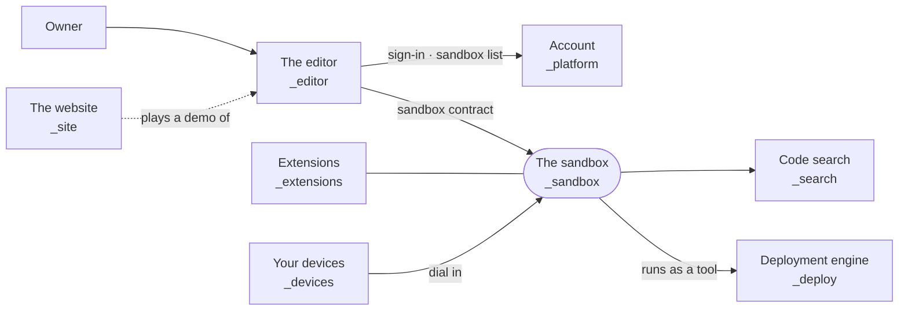
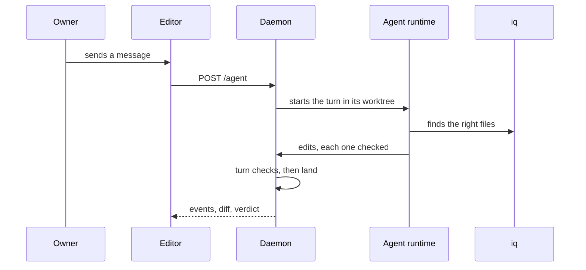
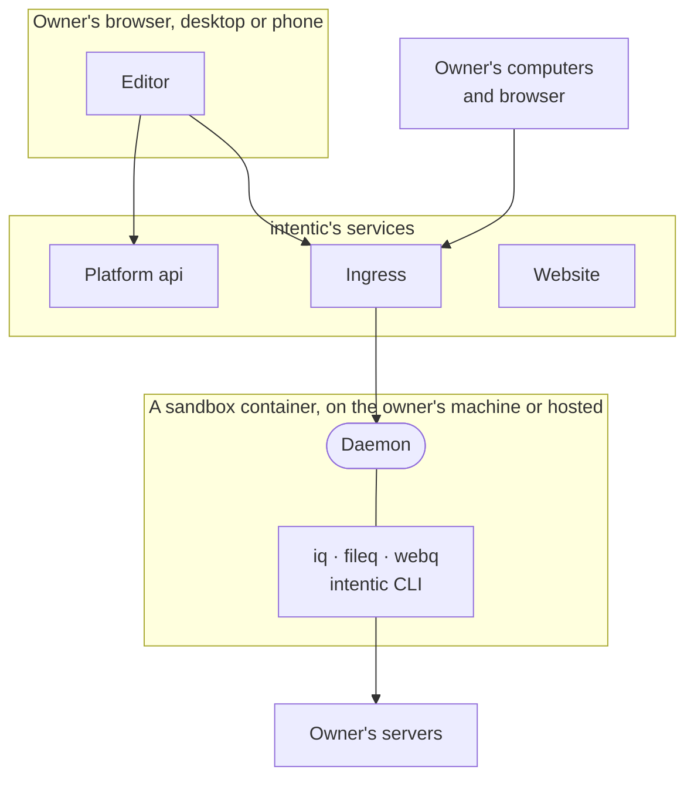

# intentic, in pictures

The parts of this repository and how they meet at runtime, drawn three ways: what talks to what, one agent turn, and where each part runs.

## What talks to what

The lines are contracts in [`_shared`](../../_shared): the sandbox contract between the editor and the daemon, the api contract between the editor and the platform, and the extension API between extensions and both. [`_tools`](../../_tools) holds no runtime part; it builds, checks and tests the others. [topology.md](topology.md) has the processes and the trust model, [app-plane.md](app-plane.md) the line between the product and the deployment engine.

## One agent turn

The turn runs detached from the browser, so closing the tab does not stop it. Landing writes the agent's changes into the main tree as uncommitted changes, and the owner's commit is the review. [sandbox.md](sandbox.md) has the details.

## Where each part runs

The platform never opens a connection to a sandbox. The sandbox dials out to the ingress, and browsers and devices reach it by its own hostname.
