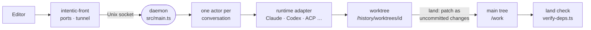

# The sandbox daemon

The Node process inside every sandbox that owns the workspace, runs each agent conversation in its own git worktree, lands the result onto the main tree, and keeps its records beyond the agents' reach.

## The process

- `docker-entrypoint.sh` starts sshd, then [`intentic-front`](../../_sandbox/front) (Rust), which owns every port and the ingress tunnel and supervises `node dist/main.js`. The daemon listens only on a Unix socket, so a daemon restart drops no connection.
- [`main.ts`](../../_sandbox/sandbox/src/main.ts) loads config, builds every service in [`composition.ts`](../../_sandbox/sandbox/src/composition.ts), runs the boot steps and opens the readiness gate.
- The wire is the oRPC contract in [`_shared/sandbox-contract`](../../_shared/sandbox-contract) (one `*.contract.ts` per route group), served by [`router.ts`](../../_sandbox/sandbox/src/router.ts). `/events` and `/agent/attach` stream; terminals and the browser view are WebSockets opened with one-shot tickets. The daemon does not serve the editor itself.

## Agents

- A conversation is the durable unit and a turn is one run inside it. One actor per conversation ([`conversation-actors.ts`](../../_sandbox/sandbox/src/agents/actor/conversation-actors.ts)) decides whether a new message starts a turn, steers the running one, or waits in the queue.
- [`runtime-table.ts`](../../_sandbox/sandbox/src/runtimes/runtime-table.ts) picks an adapter per provider and harness: the Claude Agent SDK, Codex, OpenCode, Cursor, ACP agents and pi. What each runtime supports is declared in [`agent-runtimes.ts`](../../_shared/sandbox-contract/src/models/agent-runtimes.ts), so the editor never offers a control the runtime would ignore.
- A turn runs detached from any client ([`turn-runs.ts`](../../_sandbox/sandbox/src/agent/run/turn/turn-runs.ts)). It is journaled in `/history/conversations.db` and resumed after a restart; transcripts live in `/history/conversations/<id>/`.

## Worktrees

- An isolated conversation works on branch `agent/<id>`, with one git worktree per repository under `/history/worktrees/<id>/` ([`worktrees.ts`](../../_sandbox/sandbox/src/agents/worktrees/worktrees.ts)). Parallel agents cannot collide.
- Where the runtime supports it (`isolation: "namespace"`), [`isolation.ts`](../../_sandbox/sandbox/src/agents/worktrees/isolation.ts) binds the worktree over `/work` in a mount namespace and puts the real tree at `/mnt/intentic-main`; other runtimes only start in the worktree. `node_modules`, `.venv` and `dist` are overlay mounts of the main tree's, so a worktree needs no install.

## Land

- Landing applies a conversation's changes to the main tree as **uncommitted changes**. `HEAD` never moves; the owner's commit is the review boundary ([`land.ts`](../../_sandbox/sandbox/src/agents/land/land.ts), `landAgent`).
- It rebases the branch onto main ([`sync.ts`](../../_sandbox/sandbox/src/agents/land/sync.ts)), reconciles the lockfile, and checks every repository's patch before writing any: one conflict and nothing is written. The `merge` mode writes conflict markers instead, and `measure` is a dry run.
- After a land, [`verify-deps.ts`](../../_sandbox/sandbox/src/workspace/deps/verify-deps.ts) runs the repository's `land` check, else its `verify` script, else `test`. New failures go back to the conversation whose land caused them ([`land-breakage.ts`](../../_sandbox/sandbox/src/agents/land/land-breakage.ts)).

## Checks

- A repository declares its checks in `.intentic/checks.json` for the moments `edit`, `turn` and `land` (`RepoChecksFileSchema` in [`settings.ts`](../../_shared/sandbox-contract/src/schemas/settings.ts)). The owner adopts the file, and a changed declaration waits for re-adoption.
- [`repo-checks.ts`](../../_sandbox/sandbox/src/rules/repo-checks.ts) turns them into rules. Edit checks run on every file an agent writes, and their output returns with the edit ([`file-edited.ts`](../../_sandbox/sandbox/src/rules/file-edited.ts)). Turn checks run when the agent stops and can send it back to work ([`turn-ending.ts`](../../_sandbox/sandbox/src/rules/turn-ending.ts)). A turn whose checks failed is held from landing unless a rule allows it.

## State

| Place | Holds |
| --- | --- |
| `/work` | the repositories, visible to agents, on its own volume |
| `.intentic/config` | tracked configuration: settings, personas, skills, capabilities, the environment overlay |
| `.intentic/records` | ledgers: agent sessions, land verdicts, chores |
| `.intentic/local` | rebuildable caches and browser profiles |
| `.intentic/identity`, `.intentic/secrets` | owner, members and passkeys; credentials |
| `/history` | the conversation store, transcripts, worktrees, git directories, snapshots and logs |

`/history` is a separate volume outside `/work`, so no command in the workspace can erase the recovery record. [`workspace-state.ts`](../../_shared/sandbox-contract/src/state/workspace-state.ts) lists every state file and its group, and the file API refuses the daemon's own entries.
