# The sandbox daemon

The Node process inside every sandbox that owns the workspace, runs each agent conversation in its own git worktree, lands the result onto the main tree, and keeps its records beyond the agents' reach.

```mermaid
flowchart LR
    editor["Editor"] --> front["intentic-front<br/>ports · tunnel"]
    front -->|"Unix socket"| daemon(["daemon<br/>src/main.ts"])
    daemon --> actor["one actor per<br/>conversation"]
    actor --> runtime["runtime adapter<br/>Claude · Codex · ACP …"]
    runtime --> wt["worktree<br/>/history/worktrees/id"]
    wt -->|"land: patch as<br/>uncommitted changes"| main["main tree<br/>/work"]
    main --> verify["land check<br/>verify-deps.ts"]
    verify -->|"red"| route["who fixes it<br/>land-breakage.ts"]
```

## The process

- `docker-entrypoint.sh` starts sshd, then [`intentic-front`](../../_sandbox/front) (Rust), which owns every port and the ingress tunnel and supervises `node dist/main.js`. The daemon listens only on a Unix socket, so a daemon restart drops no connection.
- [`main.ts`](../../_sandbox/sandbox/src/main.ts) loads config, builds every service in [`composition.ts`](../../_sandbox/sandbox/src/composition.ts), runs the boot steps and opens the readiness gate.
- The wire is the oRPC contract in [`_shared/sandbox-contract`](../../_shared/sandbox-contract) (one `*.contract.ts` per route group), served by [`router.ts`](../../_sandbox/sandbox/src/router.ts). `/events` and `/agent/attach` stream; the browser view is a WebSocket opened with a one-shot ticket. The daemon does not serve the editor itself.
- Terminals are served by intentic-front, one tmux control-mode client per session shared by every viewer, over a WebSocket or a stream of the editor's WebTransport session ([`term/`](../../_sandbox/front/crates/front/src/term/mod.rs)); the daemon only answers whether a socket may open and onto what ([`terminal-plan.ts`](../../_sandbox/sandbox/src/terminal/terminal-plan.ts)).
- The file tree is held in memory by the workspace watcher's thread ([`resident-tree.ts`](../../_sandbox/sandbox/src/workspace/files/resident-tree.ts)) and re-listed only in the folders a batch touched; the tree route answers from it, and `/events` carries each batch as a `treeChanged` delta tabs patch their tree with.

## Agents

- A conversation is the durable unit and a turn is one run inside it. One actor per conversation ([`conversation-actors.ts`](../../_sandbox/sandbox/src/agents/actor/conversation-actors.ts)) decides whether a new message starts a turn, steers the running one, or waits in the queue.
- [`runtime-table.ts`](../../_sandbox/sandbox/src/runtimes/runtime-table.ts) picks an adapter per provider and harness: the Claude Agent SDK, Codex, OpenCode, Cursor, ACP agents and pi. What each runtime supports is declared in [`agent-runtimes.ts`](../../_shared/sandbox-contract/src/models/agent-runtimes.ts), so the editor never offers a control the runtime would ignore.
- A turn runs detached from any client ([`turn-runs.ts`](../../_sandbox/sandbox/src/agent/run/turn/turn-runs.ts)). It is journaled in `/history/conversations.db` and resumed after a restart; transcripts live in `/history/conversations/<id>/`.

## Worktrees

- An isolated conversation works on branch `agent/<id>`, with one git worktree per repository under `/history/worktrees/<id>/` ([`worktrees.ts`](../../_sandbox/sandbox/src/agents/worktrees/worktrees.ts)). Parallel agents cannot collide.
- Where the runtime supports it (`isolation: "namespace"`), [`isolation.ts`](../../_sandbox/sandbox/src/agents/worktrees/isolation.ts) binds the worktree over `/work` in a mount namespace and puts the real tree at `/mnt/intentic-main`; other runtimes only start in the worktree. `node_modules`, `.venv` and `dist` are overlay mounts of the main tree's, so a worktree needs no install.

## Land

- Landing applies a conversation's changes to the main tree as **uncommitted changes**. `HEAD` never moves; the owner's commit is the review boundary ([`land.ts`](../../_sandbox/sandbox/src/agents/land/land.ts), `landAgent`).
- It rebases the branch onto main ([`sync.ts`](../../_sandbox/sandbox/src/agents/land/sync.ts)), reconciles the lockfile, and checks every repository's patch before writing any: one conflict and nothing is written. The `merge` mode writes conflict markers instead, and `measure` is a dry run.
- After a land, [`verify-deps.ts`](../../_sandbox/sandbox/src/workspace/deps/verify-deps.ts) runs the repository's `land` check, else its `verify` script, else `test`, on the main tree in the background. It is the one check work gets, and nothing waits on it. One project is checked at a time, and lands that arrive during a run wait and are measured together in the next. `GET /workspace/mainline` ([`mainline-status.ts`](../../_sandbox/sandbox/src/workspace/deps/mainline-status.ts)) is what the editor shows of it: a main-line strip at the top of the chat rail (what is being checked, what waits, the last verdict, who is working on a red one) and a status on each session card.

## After a red land check

[`land-breakage.ts`](../../_sandbox/sandbox/src/agents/land/land-breakage.ts) routes a red run the same way every time, in this order:

1. More work landed while it ran: wait for that check, which may already be green. At most three times per red streak.
2. A conversation still working has unlanded changes in a failing package: hold, tell it once, and route when it stops or after 45 minutes.
3. Lay the failures at a land: the one land the run covered, else the lands whose changed paths share a package with a failure, else, when the check's report names a `rerun` command, the lands whose own landed tree reproduces the failures. [`land-bisect.ts`](../../_sandbox/sandbox/src/agents/land/land-bisect.ts) checks each suspect's tip out in a scratch `git worktree` with the main tree's dependencies mirrored and re-runs only the failing tests there ([`rerun-units.mjs`](../../_tools/scripts/verify/rerun-units.mjs) in this repository).
4. Exactly one land named, and its conversation still has the work in mind (prompt cache warm, under 60% of its context window, not archived, sent fewer than two times this streak): send the failures back to it.
5. Otherwise start a fresh fix-up conversation ([`land-fix.ts`](../../_sandbox/sandbox/src/agents/land/land-fix.ts)) with the failures, each suspect's changed files, the exact `git diff <from> <tip>` and `agents show <id>` to read its conversation. Its id is `land-fix-<project>-<streak>`, so every attempt at one streak shares it, and a streak gets at most two attempts.
6. Past those limits the red waits for a person.

Every decision is filed on the run and shown in the editor. With the owner's "Repair what breaks after landing" switch (`autoRepair`) off, all of it is only reported. A red streak's end logs `mainline: red streak ended` with how long it lasted.

## Checks

- A repository declares its checks in `.intentic/checks.json` for the moments `edit` and `land` (`RepoChecksFileSchema` in [`settings.ts`](../../_shared/sandbox-contract/src/schemas/settings.ts)). The owner adopts the file, and a changed declaration waits for re-adoption. The `turn` moment is retired: a declaration naming it still parses and counts toward adoption, but runs nothing.
- [`repo-checks.ts`](../../_sandbox/sandbox/src/rules/repo-checks.ts) turns edit checks into `file.edited` rules. They run on every file an agent writes, and their output returns in that edit's result without stopping the turn ([`file-edited.ts`](../../_sandbox/sandbox/src/rules/file-edited.ts)).
- Nothing runs when a turn ends, nothing sends it back to work, and no check holds its land. The owner's `turn.ending` rules and the built-in `verify-ui-edits` are retired like `turn`. What a turn showed of its own work is recorded as its card's `proof` ([`turn-settlement.ts`](../../_sandbox/sandbox/src/agent/run/settle/turn-settlement.ts)): verified, unproven, failing or no-code from the checks it chose to run after its last edit, and how many rendered interface files it changed without looking. The editor badges it.
- A "Checks after landing" note ([`mainline-note.ts`](../../_sandbox/sandbox/src/workspace/deps/mainline-note.ts)) tells each conversation that nothing checks its work when it finishes, what runs after it lands, and which failures main already has. It goes out with the opening message, after a compaction, and whenever the main tree's reds change.

## State

| Place | Holds |
| --- | --- |
| `/work` | the repositories, visible to agents, on its own volume |
| `.intentic/config` | tracked configuration: settings, personas, skills, capabilities, the environment overlay |
| `.intentic/records` | ledgers: agent sessions, land verdicts, chores |
| `.intentic/local` | rebuildable caches and browser profiles |
| `.intentic/identity`, `.intentic/secrets` | owner, members and passkeys; credentials |
| `/history` | the conversation store, transcripts, worktrees, git directories, snapshots and logs |

`/history` is a separate volume outside `/work`, so no command in the workspace can erase the recovery record. [`workspace-state.ts`](../../_shared/sandbox-contract/src/state/workspace-state.ts) lists every state file and its group, and the file API refuses the daemon's own entries.

Every stored file is read by every later release, from sandboxes that skipped any number of them. Each is declared with the conversions its shape has had ([`documents.ts`](../../_sandbox/sandbox/src/store/documents.ts)); the stores run them on every read and keep what they do not know on writes, and the first boot after an update writes converted files back under a journal a rolled-back build undoes ([`state-convergence.ts`](../../_sandbox/sandbox/src/store/state-convergence.ts)). The promise and the rules for a change are in [COMPATIBILITY.md](../../COMPATIBILITY.md#stored-data).
