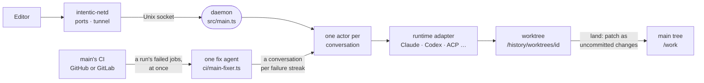

# The sandbox daemon

The Node process inside every sandbox that owns the workspace, runs each agent conversation in its own git worktree, lands the result onto the main tree, and keeps its records beyond the agents' reach.

```mermaid
flowchart LR
    editor["Editor"] --> netd["intentic-netd<br/>ports · tunnel"]
    netd -->|"Unix socket"| daemon(["daemon<br/>src/main.ts"])
    daemon --> actor["one actor per<br/>conversation"]
    actor --> runtime["runtime adapter<br/>Claude · Codex · ACP …"]
    runtime --> wt["worktree<br/>/history/worktrees/id"]
    wt -->|"land: patch as<br/>uncommitted changes"| main["main tree<br/>/work"]
    ci["main's CI<br/>GitHub or GitLab"] -->|"a run's failed jobs,<br/>at once"| fixer["one fix agent<br/>ci/main-fixer.ts"]
    fixer -->|"a conversation<br/>per failure streak"| actor
```

## The process

- `docker-entrypoint.sh` starts sshd, then [`intentic-netd`](../../_sandbox/netd) (Rust), which owns every port and the ingress tunnel and supervises `node dist/main.js`: a crashed daemon is restarted with backoff once whatever it left in its process group is ended with it, and one that has not answered netd's ping for 5 minutes is killed and restarted the same way. The daemon listens only on a Unix socket, so a daemon restart drops no connection.
- **netd owns sockets and bytes; the daemon owns policy.** Every listener, the tunnel, every upgrade splice, a terminal's WebSocket and tmux client, and a preview's relay are netd's, and none of their bytes pass through Node. Every decision about them is Node's, asked once over the control socket ([`netd-wire`](../../_sandbox/netd/crates/netd-wire/src/lib.rs)): whether a terminal may open and onto which session, created where (netd composes the tmux command), and what becomes of a preview request, an upstream to relay, a page Node rendered to write, or the outbox to hand back. Either side asks the other under one envelope, an id answered or refused within five seconds. The git change feed ([`feed.rs`](../../_sandbox/netd/crates/netd/src/feed.rs)) is the one piece of netd that is neither: a counter with no policy in it, since Node names each checkout and decides what a generation is worth, kept native because its inotify fan-out over every `.git` is cheapest there.
- [`main.ts`](../../_sandbox/sandbox/src/main.ts) loads config, builds every service in [`composition.ts`](../../_sandbox/sandbox/src/composition.ts), runs the boot steps and opens the readiness gate.
- The container's secrets arrive as environment variables, and every child inherits its parent's environment, so right after loading config the daemon deletes every secret one from its own ([`sealed-env.ts`](../../_sandbox/sandbox/src/seams/sealed-env.ts)): the names the config schema marks `secret` (`CONFIG_SECRET_ENV`) and the runner's replayed ones it classifies secret (`REPLAY_SECRET_ENV` in [`sandbox-run`](../../_shared/sandbox-run/src/index.ts)), whose overlap a test keeps in agreement. The tmux server's global environment is scrubbed of the same names. A provider fallback key reaches only the runtime it authenticates, handed over by name (`containerKeyEnv`). 2026-10-06: chosen over filtering each of the 32 sites that spread `process.env`, since a site written later is covered too.
- The wire is the oRPC contract in [`_shared/sandbox-contract`](../../_shared/sandbox-contract) (one `*.contract.ts` per route group), served by [`router.ts`](../../_sandbox/sandbox/src/router.ts). `/events` and `/agent/attach` stream; the browser view is a WebSocket opened with a one-shot ticket. The daemon does not serve the editor itself.
- Terminals are served by intentic-netd, one tmux control-mode client per session shared by every viewer, always as a WebSocket, over TCP or spoken by the editor on a stream of the edge's WebTransport session where the edge declares one ([`term/`](../../_sandbox/netd/crates/netd/src/term/mod.rs)); the daemon only answers whether a socket may open and onto what ([`terminal-plan.ts`](../../_sandbox/sandbox/src/terminal/terminal-plan.ts)).
- The sandbox's proof of life is netd's own as well: `GET /system/vitals` ([`vitals.rs`](../../_sandbox/netd/crates/netd/src/vitals.rs)) never reaches the daemon and never waits for it. It says whether the daemon's control link is starting, up or restarting, how far its event loop lags (the round trip of a ping netd sends over the control socket every 2 s, which the daemon's link answers at once), how often netd restarted it in the last 10 minutes, the container's uptime and its cgroup pressure. The heartbeat on `/events` comes from the daemon's event loop, so a sandbox too busy to send it would otherwise read as a dead one. The editor reads the body with `parseVitals` ([`vitals.ts`](../../_shared/sandbox-contract/src/protocol/vitals.ts)).
- Each top-level directory of `src/` is a subsystem, placed in one layer of [`layers.json`](../../_sandbox/sandbox/layers.json) (foundation, host, connections, agent, orchestration, composition), and imports only its own layer and those below. What a lower layer needs from above arrives as a port composition fills: the environment's fragment sources ([`environment-sources.ts`](../../_sandbox/sandbox/src/seams/environment-sources.ts)), a device gate's cards, turn and judge ([`host-guard-deps.ts`](../../_sandbox/sandbox/src/hosts/host-guard-deps.ts)), the runtime table the providers slice is handed. The sandbox definition, `sandbox.toml` ([`definition/`](../../_sandbox/sandbox/src/definition/definition.ts)), is its own subsystem among the connections: derived from the live stores for an export or a runner's hello, applied item by item on an arrival or a boot seed. What the image carries, its feature packs and the binaries on its PATH ([`image/`](../../_sandbox/sandbox/src/image/packs.ts)), is foundation. 2026-10-06: until then the definition lived in `portability/` (bundles and arrivals, orchestration), so the runner and device code that ships settings reached up into it.
- The file tree is held in memory by the workspace watcher's thread ([`resident-tree.ts`](../../_sandbox/sandbox/src/workspace/files/resident-tree.ts)) and re-listed only in the folders a batch touched; the tree route answers from it, and `/events` carries each batch as a `treeChanged` delta tabs patch their tree with.

## Agents

- A conversation is the durable unit and a turn is one run inside it. One actor per conversation ([`conversation-actors.ts`](../../_sandbox/sandbox/src/conversations/actor/conversation-actors.ts)) decides whether a new message starts a turn, steers the running one, or waits in the queue.
- A person's message may carry `sendAt` or `sendAfter`, the composer's Send later: a time the person picked (or the reopen of an account it reads as spent), or another conversation whose work it builds on. It starts no turn and reaches no provider: it waits in the queue carrying its own booking, that instant as `until` or that conversation as `after` ([`turn-admission.ts`](../../_sandbox/sandbox/src/agent/run/turn/turn-admission.ts), `bookingFor`), where every window draws it as scheduled with when it goes, a Change that re-times it (`agent.queueSchedule`, naming its `ids`), a Send now (`agent.queueResume`, naming its `ids`), and the reword and take-back every queued message has. Each booked message goes at its own time: booking another never re-times it, and neither a plain send nor a Stop touches it. The queue-level `paused: "scheduled"` with `until` or `after` is only the soonest booking, derived on every write ([`conversation-queue.ts`](../../_sandbox/sandbox/src/conversations/actor/conversation-queue.ts), `next`), for editors older than per-message bookings (an editor reads which kind of queue it has from whether any message carries a booking) and for a rollback, where an older daemon then holds everything until that soonest time rather than sending every booking at its boot. A Stop or a refusal holds only the messages with no booking (`stopped` or `refused` there, while one is left); a person's send lets that hold go, and so does a booking coming due, which takes what the hold kept with it. A message that opens its conversation writes the conversation's entry with the booking, so its card is on the board from the press and the booking survives a restart; a turn running when it is booked does not let it go when that turn ends. The resume pass lets each message go at its `until`, or once the conversation it waits on has nothing running, queued or armed, nothing left on its branch and no land broken, and either its last turn ended clean or work of it landed after the booking ([`work-landed.ts`](../../_sandbox/sandbox/src/conversations/land/work-landed.ts)); it first waits out that land's version commit, so the turn it starts reads that work committed under its own subject, and then lets go only the messages still booked as they were ([`turn-resume.ts`](../../_sandbox/sandbox/src/agent/run/turn/turn-resume.ts), `releaseBooked`). A conversation holding one is not archived (`archiveAgents` refuses it, as the board's `canArchive` does), and one archived since is reopened by the booking at its time, as the message was when it was sent: a person's words are never dropped there. An instant already past, or a conversation with nothing left to land, sends it the ordinary way; a conversation that is unknown, archived or a spawned child (whose work lands into its parent) is refused; a booking is clamped to a month ahead. A booked instant within the idle-stop window keeps a hosted machine up.
  - 2026-09-30: a scheduled send used to be an ordinary send with the limit answer set to resend. Rejected: the provider refused it, so the person who had just chosen to wait saw their message go out, a "usage limit reached" line, and only then a card saying it was scheduled.
  - 2026-10-02: a booking used to go the ordinary way for a conversation not on record yet and under a live turn, which suited a spent account and not a moment somebody chose. Waiting on another conversation by subscribing to `agent.landed` was rejected: the pass's reading of what the daemon holds answers the same after a restart, and covers a turn that ended with nothing to land.
  - 2026-10-06: the queue used to hold one booking for every message in it, the latest booked winning, so booking a second message re-timed the first, a plain send let every booking go early, and a booking held back the sandbox's own wakes. Each message now carries its own. A per-message Stop hold was rejected: a Stop still holds the unbooked messages as one, and a booking coming due lets that hold go, so there is one hold model, not two. Records written before convert on read, each message given the queue's booking ([`agents-store.ts`](../../_sandbox/sandbox/src/conversations/registry/agents-store.ts)).
- The message that opens a conversation may carry `conversationAutoLand`, its own standing answer to whether finished work lands by itself, which its entry latches as `agents.autoLand` would set it later; only a maintainer's is taken, since a collaborator's work waits for a land.
- [`runtime-table.ts`](../../_sandbox/sandbox/src/runtimes/runtime-table.ts) picks an adapter per provider and harness: the Claude Agent SDK, Codex, OpenCode, Cursor, ACP agents and pi. What each runtime supports is declared in [`agent-runtimes.ts`](../../_shared/sandbox-contract/src/models/agent-runtimes.ts), so the editor never offers a control the runtime would ignore.
- Claude Code 2.1.287 runs mods: plugins whose hooks are functions loaded into the CLI process, which can answer or rewrite any event before the daemon's SDK callbacks see it. Three settings keep a Claude turn the daemon's own:
  - The image installs managed settings ([`claude-policy/`](../../_sandbox/sandbox/claude-policy)) that load Intentic's policy mod first. It sends `tool.check` and every `classic.*` event past the mods someone installed, so the daemon's guards (the command gate, secret rewriting and redaction, action rules, persona scope) run, and their refusals hold. The same settings seat Claude Code's own guard, `sec-default`, which keeps those mods off the system prompt. [`claude-policy.integration.test.ts`](../../_sandbox/sandbox/src/runtimes/claude/claude-policy.integration.test.ts) runs both routes against the bundled CLI.
  - Every Claude process the daemon starts sets the built-in `agents-md` mod to `claude-md` ([`claude-builtins.ts`](../../_sandbox/sandbox/src/runtimes/claude/claude-builtins.ts)). The daemon composes AGENTS.md for every runtime itself, and the mod would load it a second time and attach nested ones only Claude sees.
  - The CLI's `plugin-authoring` skill is hidden, since nothing a mod draws shows under the Agent SDK.
  - 2026-10-04: Claude Code's `sec-default` guard alone was rejected. It holds only hooks that managed settings declare, and the daemon's are SDK callbacks, so a mod answering `tool.check` with allow still ran a refused command.
- A turn nobody is watching when it starts (an automation, a loop, a spawned child) carries `policy.unattended`: the safety judge and the prompt are told, and nothing else changes. Every card it raises, a question, a plan, a held command, a credential's release, an install, waits for the owner like any other (conventions.md, A person's answers).
- A scheduled automation whose moment passed while the daemon was down (a hosted sandbox stops itself when idle, and nothing wakes it for a cron) fires once as the scheduler starts, however many moments it missed, late and saying so, through the same sessions bar, guard and hold as any fire ([`scheduler.ts`](../../_sandbox/sandbox/src/automations/scheduler.ts) `catchUp`). What it owed is measured from the later of its last run and how far the scheduler has accounted for its clock (`.intentic/records/automation-schedule.json`), so one created or switched back on while nothing ran owes nothing from before.
- A watch is an automation with a check that decides, with no model, whether anything happened: a guard command, or a ready-made source the daemon checks itself, the newest version of an npm package, a GitHub repository's newest release, or a web page's text ([`watch-sources.ts`](../../_sandbox/sandbox/src/automations/watch/watch-sources.ts)). Only a passing check spends anything, and what it saw goes with the wake ([`watch-condition.ts`](../../_sandbox/sandbox/src/automations/watch/watch-condition.ts)).
  - What each check saw last is kept in `.intentic/records/automation-watch.json`. `fireOn: change` fires only when that differs, and its first check only records a baseline. A quiet check writes nothing into the run history, so a watch every few minutes does not bury the runs that mattered.
  - A guard keeps its own file between runs (`$AUTOMATION_STATE`, under `.intentic/records/automation-state/`), reads what it printed last time (`$AUTOMATION_LAST`), and runs with the connector credentials an unattended turn of the same automation would have, narrowed by its persona, with gated ones left out ([`guard-env.ts`](../../_sandbox/sandbox/src/automations/watch/guard-env.ts)).
  - It retires on its own: `until: first-fire` switches it off as it fires, the way a one-time wake does, and `expiresAt` switches it off at a deadline and tells whoever it was for, since a watch that stops silently reads like one still waiting.
  - What a passing check sets off is its `target` ([`fire-targets.ts`](../../_sandbox/sandbox/src/automations/watch/fire-targets.ts)): a new agent (the default), an existing conversation continued on its own model with the same notice a condition watch wakes it with, or only a push to the owner with what the check saw, which runs no model at all.
  - An agent proposes one with `automations propose`, which raises an `automation` need; a person's approval saves it, held to the Automations page's own rules (needs.md). The conversation watch (`watch start`) stays the short form: up to a day, held by one conversation.
  - 2026-10-07: chosen over a model that checks on every tick (Claude Code routines, ChatGPT tasks, Grok automations), which made a frequent watch the most expensive thing a sandbox could run while nothing happened; OpenClaw and Hermes Agent arrived at the same split of a script that decides and a model that acts.
- A turn runs detached from any client ([`turn-runs.ts`](../../_sandbox/sandbox/src/agent/run/turn/turn-runs.ts)). It is journaled in `/history/conversations.db` and resumed after a restart when the owner's **Resume turns after a restart** is on, or when the owner asked that one restart to pick up what it cut (the rebuild dialog, or a rebuild the sandbox held until its agents were idle; [`restart-resume.ts`](../../_sandbox/sandbox/src/system/restart-resume.ts)); otherwise it is recorded as interrupted. Transcripts live in `/history/conversations/<id>/`.
- (2026-10-05) `ic` writes the same ask before every restart it makes, so the turns a keeper's restart cuts come back too. A boot that is the third within 30 minutes (`/history/boot-history.json`, [`boot-history.ts`](../../_sandbox/sandbox/src/system/boot/boot-history.ts), written before anything can fail, a boot that dies before the gate included) honours neither the ask nor the setting: every cut turn stays interrupted, the log says why, and the owner's settings-problems card names the boot record until the next boot. A turn parked on a card is put back at every boot, but one whose cards cannot come back (its conversation archived) spends a try each time and is given up as interrupted after three.
- A turn the provider's safety classifier stops (Claude Code's "safeguards flagged this message/session", `stop_reason: "refusal"`) is coded `safeguard-flagged` and held for a person, never re-run by a clock ([`refusal-fork.ts`](../../_sandbox/sandbox/src/agent/run/refusal-fork.ts), [`classify-failure.ts`](../../_sandbox/sandbox/src/agent/run/frames/classify-failure.ts)). The turn interrupts the CLI as the flag lands: left alone, a CLI whose stopped response held a tool call answers it and asks again into the same refusal, over and over. The hold keeps the last session entry before the stopped responses, and the chat's card offers **Retry on** the same model or **Continue on…** another one, which the conversation then stays on. Either press resumes the same session with `resumeSessionAt` at that entry, so the model never reads what was stopped. The CLI's own automatic switch to another model is off (`CLAUDE_CODE_DISABLE_REFUSAL_FALLBACK`); its single same-model retry within the turn stays.
- 2026-09-30: a flagged turn used to read as an uncoded death, so the stop ladder and Continue resent it into the session still carrying the stopped response (one conversation was flagged twelve times running). Automatic switching to a fallback model and re-seeding a fresh session were considered and rejected: the owner asked to choose each time, and changing the model by hand already covers both.

## Worktrees

- An isolated conversation works on branch `agent/<id>`, with one git worktree per repository under `/history/worktrees/<id>/` ([`worktrees.ts`](../../_sandbox/sandbox/src/conversations/worktrees/worktrees.ts)). Parallel agents cannot collide.
- A conversation may move its copy to another branch (a CI branch to push, a pull request it was asked to work on), and it stays there. Review and land read only `agent/<id>`, so each turn's close copies the commits that turn made there onto `agent/<id>` without moving the copy ([`stray-work.ts`](../../_sandbox/sandbox/src/conversations/worktrees/stray-work.ts)). A commit counts as the turn's own when no branch or remote-tracking ref named it as the turn opened, so the other branch's own history never lands. Sync leaves such a copy alone rather than rebasing that branch onto the owner's HEAD. A commit that will not copy cleanly moves nothing: the review says the work there is not carried, and the `stray-work-reaches-its-own-branch` invariant names it. Uncommitted edits there are not carried until they are committed.
- 2026-09-30: a copy standing elsewhere used to be reported and never repaired, and its work was stranded (a CI fix committed on a branch the agent cut from `origin/main` never reached Land). Refusing the switch was rejected, since an owner may ask an agent to work on another branch. Pulling the copy back at the turn's end was rejected for the same reason.
- Where the runtime supports it (`isolation: "namespace"`), [`isolation.ts`](../../_sandbox/sandbox/src/conversations/worktrees/isolation.ts) binds the worktree over `/work` in a mount namespace and puts the real tree at `/mnt/intentic-main`; other runtimes (OpenCode, ACP agents, pi) only start in the worktree. Each namespace runtime's process is born there through `nsenter`: the Claude CLI, Codex's app-server, and for Cursor, whose SDK runs its shell and edits files in whatever process loads it, a runtime process ([`cursor-host.ts`](../../_sandbox/sandbox/src/runtimes/cursor/cursor-host.ts)) that drives the SDK while the daemon keeps its tools and hook gate. A container that cannot build a namespace runs every runtime cwd'd in, Cursor's SDK back in the daemon. `node_modules`, `.venv` and `dist` are overlay mounts of the main tree's, so a worktree needs no install.
- A fenced conversation, one started by a member who holds areas, has a sparse checkout cut to those areas, and runs in a bubblewrap sandbox rather than a mount namespace ([`turn-sandbox.ts`](../../_sandbox/sandbox/src/conversations/worktrees/turn-sandbox.ts)). The sandbox's user is unprivileged and holds no capabilities, it has its own pid namespace, and it cannot create user namespaces. Its filesystem holds only what is listed, and every workspace part of the list is decided by the fence's folders rather than by what the checkout holds ([`isolation.ts`](../../_sandbox/sandbox/src/conversations/worktrees/isolation.ts) `planFor`): the system read-only; the conversation's checkout at `/work`, with every directory in it the fence neither admits nor leads to covered by an empty layer (whatever a failed narrowing or an area edit left there); build-output mirrors only inside the fence, and dependency mirrors on the way down to it; the conversation's own session store; the reference shelf read-only, only as far as the fence names folders in it; the package store behind a layer of the conversation's own; a private home with a few dotfiles; and one directory of its own for temp files, its tmux socket and terminal logs. Every `.git` pointer in the checkout reads as empty, since a repository holds every folder's history; the daemon commits for the turn as it already does at checkpoint, sync and land. Processes enter through the same helpers as an unfenced turn's ([`namespace-entry.ts`](../../_sandbox/sandbox/src/workload/namespace-entry.ts)), joining as the sandbox's user. Its Bash panes run on a tmux server inside the sandbox, so they do not show in the owner's terminal list. When its turn ends the sandbox is released, not killed: it ends once nothing the turn started is still running.
- A fenced turn is refused rather than run unfenced: on a runtime other than Claude Code (Codex and Cursor keep one home holding every conversation's sessions, and OpenCode, ACP and pi never enter a namespace), on a runner (it is told nothing of the fence), and in a container where bubblewrap cannot build the sandbox. A fenced watch check runs in a sandbox of its own.
- Known gaps: the sandbox shares the container's network, loopback included, so a service listening there is reachable from a fenced turn. Cone mode keeps the files at the top of each folder on the way to an area. The sandbox's user maps to root outside, so a path it reaches is readable and writable as root's; its view of the filesystem is what keeps everything else out. That makes every directory it shares with root a place it can plant links: the daemon reaches its own files in a run's capture dir through the directory as opened and never through a link ([`run-files.ts`](../../_sandbox/sandbox/src/agent/tools/jobs/run-files.ts)), and `bin/queue-run` never opens a slot through one. Other daemon reads of what a fenced turn wrote (its session store, its checkout) still follow links.
- 2026-10-07: the sandbox's workspace mounts were derived from the checkout (any folder the sparse checkout left, every mirror whose parent existed, the whole shelf) and the package store was bound writable, where the turn owns its files and they are hard links into every checkout's dependencies. Now they are derived from the fence, the store is layered, and the daemon's run files and the queue's slots refuse links.
- 2026-10-06: a fenced turn used to run in the same mount namespace as any other, as root with every capability, so the fence held only for an agent that did not try to leave it. A container per turn was considered and rejected: it is the same kernel boundary with far more plumbing to cross (stdio, tmux panes, hooks, previews).

## Land

- Landing applies a conversation's changes to the main tree as **uncommitted changes**. `HEAD` never moves; the owner's commit is the review boundary ([`land.ts`](../../_sandbox/sandbox/src/conversations/land/land.ts), `landAgent`).
- It rebases the branch onto main ([`sync.ts`](../../_sandbox/sandbox/src/conversations/land/sync.ts)), reconciles the lockfile, and checks every repository's patch before writing any: one conflict and nothing is written. The `merge` mode writes conflict markers instead, and `measure` is a dry run.
- A land that breaks rather than refuses (git fails, or the checkout lost its link to its repository) is kept on the conversation's record (`landing.failure`, the card's `landFailure`) by every door a land goes through: the turn's own, a press of Land, the books a stopped or remote turn settles, a child's land into its parent. It stands until a land runs to a verdict, whatever turns run meanwhile. Before 2026-09-29 it lived only as the turn's failure, which the next turn cleared, so the card went back to a check mark with the work still stuck on its branch. One kind is kept apart (`check`): the end-of-turn pass that only measures held work failing to read it (a passing `index.lock`) is cleared by the next pass that reads it, and never replaces a land's own failure.
- Landed work later taken out of the main tree is read live ([`landed-presence.ts`](../../_sandbox/sandbox/src/conversations/land/landed-presence.ts)), and the reading names who took it out when one party acted on the tree between two readings: a person noted by a discard in the Changes panel, or a main-tree conversation at work. Two candidates, or none, name nobody. The name is kept on the record (`landing.removedBy`) until a reading finds nothing missing, and the card offers no Land again when an agent took the work out.
- After a land the one thing that runs is the dependency reconciler ([`reconcile-deps.ts`](../../_sandbox/sandbox/src/workspace/deps/reconcile-deps.ts)), which installs when the land moved a manifest or the lockfile, and installs a project the land brought that the main tree has never installed (one whose manifest the land carried; a project dropped in by hand waits to be asked for). Nothing measures the main tree: the owner commits and pushes, and CI measures the commit. A boot step deletes what the retired check after landing left behind (`.intentic/records/verify.json`, `.intentic/local/verify/`).
- A spawned child works for its parent the way the parent's in-process subagents do ([`land-target.ts`](../../_sandbox/sandbox/src/conversations/land/land-target.ts)). Its worktree is cut from a checkpoint of the parent's current work (`placement.parent`), every sync rebases it onto the parent's checkout instead of main (the parent's remainder committed first, only the child's own commits replayed), and its delta is measured from the parent commit it stands on. Its land goes into the parent's own checkout as uncommitted changes, with no landing rule asked and none of the main tree's after-land (`placement.landedInto`, which origins, presence and the version commit skip), under the child's land lease and then the parent's. The whole family reaches the main tree with the parent's one land. A clash with the parent's edits holds the land whole; the parent's report and `wait` answer say so (`childLandingWords`), and its `merge` tool (`agents merge <id>`) writes the work with conflict markers. A child of a parent in the main tree lands there with no rule asked; a parent archived, gone or on a runner leaves the child to land as any conversation does. A child on a runner is cut from the main line, since the runner rebases it onto its own copy, and still lands into its parent once the runner delivers it.
- A parent whose turn is live hears when a child's work lands in the main tree and when a press of Land on one meets a conflict ([`child-lands.ts`](../../_sandbox/sandbox/src/agent/subagents/child-lands.ts)). A parent with no live turn is not woken for either. A turn that starts on a child without its parent (the sandbox's own re-run of a failed turn, a watch it left, another conversation's message) is announced as `run.started` and taken into the parent's supervision ([`children.ts`](../../_sandbox/sandbox/src/agent/subagents/children.ts) `adoptChildTurn`): its roster row reopens and counts as live, and its ending reaches the parent like any other. A failed child turn the sandbox has booked a re-run for settles as `paused` rather than failed, so the parent's `wait` keeps covering it and a parent that hands the task elsewhere cancels it first (`cancelChild`, which drops the hold); a pause whose hold goes away without a run ends as failed. Child turns start through the turn port's `run` door with `journalled: true`, so a container recreate resumes them; only a loop's iterations run unjournalled, marked so for the `live-turns-are-journalled` invariant.
- A child that stops on a question its parent can answer wakes that parent, unless a `wait` the parent has parked took the move ([`children.ts`](../../_sandbox/sandbox/src/agent/subagents/children.ts) `askParent`): the questions, their options and the `answer` call go into its live turn, or a turn of its own when it has none, and the move is filed as handed over so a later `wait` does not return it again. A permission or plan card is the owner's and never wakes the parent.

### Delivery to the owner's folder

A folder attached to this computer's own sandbox is copied one way into `/work/<name>`, so a land there would otherwise reach the owner only when they pressed "Bring back changes" in the folder's window. The daemon delivers it instead ([`project-delivery.ts`](../../_sandbox/sandbox/src/conversations/land/project-delivery.ts)), on the projects host only and only from the daemon that owns the container.

- It reacts to `agent.landed`, so a turn's own land and a press of Land are both covered, and a child's land into its parent, which announces nothing, is not delivered. For each repository of the land whose name is a project folder's, it looks for a connected machine reporting a pairing with `remoteDir` `/work/<name>`, `deliver: "auto"` and this sandbox's id (the sanitized host of its public address, the id a machine pairs it under).
- What it sends is the land's change read off git, file by file (`git diff --raw --no-renames` from the land's start to its landed tip): both sides whole, base64, binary-safe, with the executable bit. A link or a submodule is not sent and is named with reason `link`. Past 32 MB in one delivery nothing is sent (`too-large`).
- The machine decides and writes (`deliverProject` on the device contract): a restore point first, then each file the owner left alone as landed, a three-way merge where they edited it too, and the rest left as they are and named. What it merged comes back and is written into `/work/<name>` as well, so both copies hold the same bytes, unless that file changed there since the land (a later land is never undone by an earlier one's merge).
- The outcome is kept on the conversation's record (`landing.delivery`, the card's `delivery`): delivered, partial with the paths kept out, waiting, failed in the machine's words, or too large. The next land that moves the tips clears it.
- A computer that is away, or whose agent does not advertise `project-delivery`, makes the land wait in `/history/project-deliveries.json`. It goes when a machine that can take it connects, and is tried again every five minutes. A later land of the same conversation into the same folder carries a waiting one: one delivery from the first land's start to the newest tip. A waiting land whose folder its computer no longer reports reads as failed rather than waiting for good.
- 2026-10-05: a subscriber on `agent.landed` rather than a step inside each door, so no door can be missed; the machine decides what to write rather than the daemon, since only it can see the owner's own edits; and an offline computer waits rather than failing, since it is a laptop asleep far more often than a folder gone.

## Dependency installs

- An agent's own project install (`pnpm add`, `npm install`, `uv sync`) is judged by where it writes, not by being an install ([`project-installs.ts`](../../_sandbox/sandbox/src/agent/providers/project-installs.ts); [`agent-installs.ts`](../../_sandbox/sandbox/src/agent/providers/agent-installs.ts) works out which directory each install works on). In an isolated turn it writes to the conversation's own copy: an overlay's upper layer for a directory the main tree has, the worktree's own directory for a project the branch created. Both last until the conversation is removed or archived.
- It is decided in one place for every runtime: the command gate ([`command-guard.ts`](../../_sandbox/sandbox/src/guard/command-guard.ts)) asks it first, before the safety tiers, whichever door the command came through: Claude Code's Bash hook, Codex's approval request (Codex asks for anything that is not read-only), Cursor's shell hook. The rule, the owner's safety policy, its judge, the image-install ledger and the heavy table are set on the turn once, above the provider split ([`turn-safety.ts`](../../_sandbox/sandbox/src/agent/run/turn/turn-safety.ts)). OpenCode and ACP consult the gate only on their own permission asks, which name no installs; Pi never consults it.
- An allowed install says so in the chat as it starts (the `install` event: where it writes and which projects), and, where the runtime carries text back on allow (Claude Code, Cursor), tells the model once per turn what outlasts it.
- Before an isolated install runs, a project whose install directory nothing ignores gets it added to its repo's `info/exclude`, anchored to the project (`/<project>/**/node_modules/`), so the land never carries it. Without a namespace, the install root's mirror links into the main tree are replaced with the worktree's own empty directories first.
- A main-tree turn's install writes the tree every conversation reads, so it runs in the heavy table's `dependency-install` lane (pool `install`, one at a time). The reconciler's own installs run in the same lane, so two installs never rewrite one tree at once, and a fleet of conversations installing together does not pin the sandbox's memory. Codex's app-server and Cursor's session get the heavy table as environment variables for their own shells ([`vendor-shell-env.ts`](../../_sandbox/sandbox/src/agent/run/vendor-shell-env.ts)), so their programs queue as a Claude Code line's do.
- The namespace binds the main tree's `/work/.pnpm-store` back in when there is one ([`isolation.ts`](../../_sandbox/sandbox/src/conversations/worktrees/isolation.ts) `PACKAGE_STORE`), and the root repo's `info/exclude` names it, so a conversation's first install reuses what the main tree already downloaded and `git add -A` inside the namespace never stages it.
- The owner's `projectInstalls` setting (Safety → Project installs) only decides whether a person is asked. `automatic` runs it; `ask` raises a permission card in the turn and the install waits on it for as long as the answer takes, whoever is watching; `never` refuses. "Allow installs for this conversation" is kept in the conversation's grants ([`conversation-grants.ts`](../../_sandbox/sandbox/src/personas/conversation-grants.ts) `installs`), read at every install, listed on Needs you → What you have allowed and taken back there. A persona without write and shell power is always refused, and a runtime that cannot pause is refused rather than asked.
- A permission card's Allow is one split control: the press is Allow once, and its caret folds the wider yeses, narrowest first: what the card's own gate can remember (its `alwaysLabel`: a policy line, a tool, installs, a secret past its host guard), then "Allow everything in this conversation". That last one is kept in the conversation's grants (`everything`) and enforced once, in the card registry ([`parked-cards.ts`](../../_sandbox/sandbox/src/conversations/actor/parked-cards.ts) `StandingYes`): while it stands, every permission card raised in that conversation settles at once as `everything`, still drawn and frozen in the transcript. It never answers a card that says `alwaysAsks` (an owner's hard rule on the sandbox or a device, a restart other conversations would feel) or one addressed to a named person, and since a refused call raises no card, it never turns a refusal into a yes. 2026-10-02: chosen over a per-gate "allow all" because each gate would have had to read the grant itself, and the registry is the one place every card passes.
- What lasts is settled at the land: the manifest and lockfile travel with the work, the review lists the dependencies it adds, and the reconciler installs them in the main tree.
- `mcp__deps__install` asks the reconciler for a main-tree project's install and waits up to ten minutes for the outcome; for a project that exists only on the conversation's branch it names the command to run instead.
- 2026-09-29: installs used to be refused inside every turn and queued for "after the turn". Rejected: the queue never waited for turns (the reconciler starts within seconds), a project that existed only on a branch had no route at all, and the refusal sent the owner to run the same command by hand in the conversation's own worktree. The first cut gated Claude Code turns alone and held "allow for this conversation" in memory; both rejected the same day: the meta-harness answers every runtime alike, and a person's answer is never forgotten by a restart.

## When main's CI fails

Main's CI has one fix agent ([`main-fixer.ts`](../../_sandbox/sandbox/src/ci/main-fixer.ts)). It watches the main line of every workspace repository mapped to a connected GitHub or GitLab account: its default branch, as one resolver ([`main-line.ts`](../../_sandbox/sandbox/src/ci/main-line.ts)) answers it. The forge's own word comes first (the repository read at each hook reconcile, and every delivery, kept in `.intentic/secrets/ci.json` as `forges`), then the clone's `origin/HEAD`, and `main` or `master` only when neither says.

- A delivery is matched to its repository by the forge's id, not its name. A rename or a transfer changes the name every delivery carries, while git and the API keep working through redirects, so a name match would drop every delivery and raise no warning. The reconcile learns the id, and logs `ci: the repository's remote names it by an old path` when the forge's path differs from the remote's. A repository whose id is not known yet is matched by name.
- A spent API rate limit is told apart from a refusal (GitHub's 403 with `X-RateLimit-Remaining: 0` or `Retry-After`, a 429 on either forge), worded as a limit, not as missing admin rights, and the account is not asked again until it lifts: the poller, the hook reconcile and the Pipelines view's backfill all share one token with the agents' own `gh`.
- It hears each failed job as it fails and hands a run's failed jobs over together. GitHub sends a `workflow_job` webhook and GitLab a `Job Hook`, where a job allowed to fail is ignored; the webhook the daemon registers subscribes to them, and one registered before learns them. Where no webhook is live, the two-minute poller also lists the failed jobs of main's runs still in flight, and when a run finishes, any failed job not yet seen. Each heard job's log is read whole and kept as an excerpt ([`failure-digest.ts`](../../_sandbox/sandbox/src/ci/failure-digest.ts): the errors its failed steps printed, and their last lines), and parked with its run.
- A run's parked jobs are handed over as one, when the run finishes or `RUN_SETTLE_CAP_MS` (45 minutes) after its first failure if it is still going; what fails after that follows at its end. No verification job in this repository's `ci.yml` waits on another's success, so a finished run is everything wrong with its commit. The handover is a digest: every error once, with every job that printed it, then each failed step's last lines, within 32 KB. A job is `heard` only once it is handed over, so a restart loses nothing: the boot's replay of the runs since the streak began parks and hands over again what the process held. (2026-10-02: per run rather than per job. Started at the first failed job, the agent got preflight's two minutes of checks while the verify groups were still building, ended its turn, and was woken once per job that failed after; it spent its three turns that way five times in three days. The wait costs about seven minutes at the median, the time between a run's first failed job and its last. Rejected: the 09-23 repair gate's quiet window, which waited for pushes to stop and so could hold the agent back for as long as main kept moving. This waits for one run, and never past the cap.)
- A failure streak on a branch begins at its first failed job and ends once a later run of every workflow that failed on it passes: a push to GitHub starts several workflows, and one passing says nothing of another. A failure from a run older than its workflow's newest pass is not main's word, and starts nothing. The streak is kept in `.intentic/secrets/ci.json` (`failures`, beside `passes`), so a restart keeps it, and at boot the runs since it began are read again, so a webhook missed while the daemon was down is not a missed failure.
- A streak gets one conversation, `ci-fix-<repo>-<runId>`, named after the run the streak began in. It starts with that run's digest, is told whether the run had finished or its clock ran out, that one cause often fails several jobs, and that every later failure on main will be sent to it, so it never watches a run itself. Its work lands like any conversation's, as uncommitted changes on the main tree. The owner commits and pushes, and the next run measures it.
- Each later run's failures go to that conversation as one message: said into its live turn, as a new turn when it is idle, and queued otherwise. Each job of each run is sent once.
- It gets at most three turns the sandbox starts per streak, not counting words steered into a live turn: one run's failures cost one turn however many jobs failed. Once they are spent, the failure waits for the owner (decision `spent`).
- When the fix agent finished without changing anything (a failure that is not in the code: the runner's environment, a tool version, a secret), or failed, was stopped or archived, the failure waits for the owner and the next failure is not sent (decision `spent`, activity row `ci.repair_needs_you`). A lockfile or pnpm drift reaches the owner after one turn. A turn that changes nothing after an earlier one changed something found nothing left to do, and only counts against its turns.
- A failed job whose failing step is the runner's own, or whose log names the fleet, is never sent to the agent. A run whose every failure is the fleet's is re-run once, kept in the CI store (`fleetReruns`), so a restart that hears of it again does not re-run it twice.
- A person pressing Fix on a main-line run inside a streak opens or continues the streak's one fix agent and gives it its turns back.
- The Agent tab's Repair switch (`autoRepair`) governs this alone: off, main's failure is only reported (decision `reported`). On, a failing main line is the fix agent's alone: its `pipeline_failed` and `pipeline_broken` events reach no `ci` automation that listens on every branch ([`events.ts`](../../_sandbox/sandbox/src/ci/events.ts)), so the "Fix failing CI" template cannot start a second agent pushing to main. An automation that names the branch asked for exactly those events (a notice when main fails) and still hears them, and passes and every other branch's events reach all of them. (2026-10-02: skipped by the trigger's branch scope rather than by template, since an automation does not record the template it was made from; skipping every automation was rejected, since it silenced an owner's own main-failure notice.)
- The poller records a run as heard only after the fix agent has it on file, so a restart between the two hears it again rather than losing it.
- When a streak ends the daemon logs `ci repair: streak ended` with the repository, the branch, how long it lasted, its runs and turns, and the fix agent's cost and tokens, and writes the activity row `ci.repair_retired`, so what a fix agent costs can be measured. A fix agent still working then is told it may stop.
- `GET /ci/runs` serves each failing main-line branch as `failures` (`CiMainFailure` in [`ci.ts`](../../_shared/sandbox-contract/src/schemas/ci.ts): repository, branch, since, the newest failed run, the jobs failing, the fixer and the latest decision). The Pipelines view shows it above the runs.

## The owner's folders

A folder on the owner's computer can be synced into the workspace as `/work/<name>`, never into `/work` itself, which is the daemon's own. A sandbox takes such folders in one of two shapes, both set by `ic` when it creates the container and replayed by every later swap.

- A project sandbox is made for one folder (`SANDBOX_PROJECT_DIR=/work/<name>`, [`project-dir.ts`](../../_sandbox/sandbox/src/system/project-dir.ts)). Its boot makes the folder a repo with its git dir on `/history` and nothing committed ([`project-repo.ts`](../../_sandbox/sandbox/src/git/remote/project-repo.ts)), and writes a fenced note into the workspace's `AGENTS.md` telling agents the folder is the owner's and syncs both ways ([`project-note.ts`](../../_sandbox/sandbox/src/bootstrap/project-note.ts)).
- A projects host is the desktop app's one sandbox per computer (`SANDBOX_PROJECTS_HOST=1`). It is made with no folder, and any number of folders attach to it later. The machine agent's sync report, filed under its own sync token, lists every pairing it holds for this sandbox; each one that syncs files into `/work/<name>` and is not attached yet is made a repo as above, then its name is added to `/history/projects.json` ([`projects-registry.ts`](../../_sandbox/sandbox/src/system/projects-registry.ts)). After that the one note is rewritten to name every attached folder, and the editor is sent a `reposChanged` frame, since a `.git` pointer is a write the workspace watcher never sees ([`projects-host.ts`](../../_sandbox/sandbox/src/bootstrap/projects-host.ts)). Attaches run one at a time, so two reports a few seconds apart cannot init one repo twice. The report is answered only once its attach settled (at most 30 s, `REPORT_LISTENER_WAIT_MS` in [`desktop-sync.ts`](../../_sandbox/sandbox/src/peers/desktop-sync.ts)), and the machine agent starts copying a newly attached folder only after a report naming it was answered, so the folder's repo stands before its first file arrives and the root repo never reads those files as its own. A report that arrives mid-boot is held until the boot's steps are done. Every boot does the same for every name in the registry (the `attachedProjects` step, placed where a project sandbox's `projectRepo` step is).
- Neither shape gets the starter site, and a sandbox given both variables refuses to boot.
- 2026-10-05: the daemon learns of an attached folder from the sync report it already receives, not from a route of its own. The report is already authenticated and arrives every few seconds, so a folder whose repo could not be made is simply tried again by the next one; for that reason a name is recorded only once its repo stands. The registry only grows: a folder detached on the computer leaves its copy, its repo and its history in the sandbox. The `/events` hello still names only a project sandbox's folder, and the editor opens an attached folder by its address (`?project=<name>`).

## Keeping up with the remote

Every workspace repository on a branch that tracks a remote one follows it ([`follow-origin.ts`](../../_sandbox/sandbox/src/git/remote/follow-origin.ts)), so what another writer pushes (a second sandbox, a colleague) reaches the main tree within minutes instead of at the owner's next pull. An agent whose work clashes with it then meets the clash in its own worktree, at its own land, where it knows why it wrote what it wrote.

- Every two minutes each repository fetches the one remote its branch tracks, bounded at 90 seconds and never prompting. What arrived is fast-forwarded when the branch has no commits of its own, and otherwise merged, with a merge commit authored `intentic <agent@intentic.dev>` ([`follow-upstream.ts`](../../_sandbox/sandbox/src/git/remote/follow-upstream.ts)).
- The merge is built in memory (`git merge-tree`, `git commit-tree`), and the checkout moves only by a fast-forward onto it. So a conflict, an uncommitted or untracked file the move would change, or a HEAD that moved in the meantime leaves the main tree exactly as it was, and never mid-merge. The repository is tried again on the next round, and the same refusal is logged once.
- It waits while a turn works in the main tree and while the owner has a merge, rebase or cherry-pick open. It moves under the repository's lock, queueing with lands and commits, and takes a history checkpoint before moving. It never pushes.
- The Agent tab's Keep up with the remote switch (`followOrigin`, on by default) governs it. Off, nothing is fetched.
- 2026-09-30: the pull used to be the owner's, by hand. A day's CI fixes pushed from elsewhere then met two hours of local commits at once, as a conflict in the owner's terminal and a merge that had silently broken an import. The Pull button's replay (rebasing local commits onto the remote) was rejected for this: agents' worktrees are cut from main's local commits and measure their work from there, so rewriting those commits would make every idle conversation's review show the owner's commits as its own work.

## A push

Nothing the sandbox runs checks a push, and nothing is kept about one. The app pushes with plain `git push` in a terminal of its own ([`push-run.ts`](../../_sandbox/sandbox/src/git/ops/push-run.ts)), so a repository's own pre-push hook still runs, and a push it refuses settles as refused by the hook, with git's last words and the terminal it ran in. The push card shows that, with Try again. What a push broke is CI's to say: this repository's `quick` job runs the push check over the pushed range ([`verify-push.mjs`](../../_tools/scripts/verify/verify-push.mjs)), and on main a failed run's jobs go to the one fix agent above, together. The record the retired push checks kept, `.intentic/records/push-checks.json`, is deleted at boot (the `push-checks-leftovers` step).

## Checks

- A repository declares its checks in `.intentic/checks.json` for the moment `edit` (`RepoChecksFileSchema` in [`settings.ts`](../../_shared/sandbox-contract/src/schemas/settings.ts)). The owner adopts the file, and a changed declaration waits for re-adoption. The `turn` and `land` moments are retired: a declaration naming one still parses and is shown, but runs nothing and is no part of what the owner adopts (a repository adopted while it counted stays adopted).
- [`repo-checks.ts`](../../_sandbox/sandbox/src/rules/repo-checks.ts) turns edit checks into `file.edited` rules. They run on every file an agent writes, and their output returns in that edit's result without stopping the turn ([`file-edited.ts`](../../_sandbox/sandbox/src/rules/file-edited.ts)).
- Nothing runs when a turn ends, nothing sends it back to work, and no check holds its land. The owner's `turn.ending` rules and the built-in `verify-ui-edits` are retired like `turn`: the settings still read them, their stored conversion drops them, and a save refuses a new one (`SandboxSettingsWriteSchema`). What a turn showed of its own work is recorded as its card's `proof` ([`turn-settlement.ts`](../../_sandbox/sandbox/src/agent/run/settle/turn-settlement.ts)): verified, unproven, failing or no-code from the checks it chose to run after its last edit, and how many rendered interface files it changed without looking. The editor badges it.
- A "Checks after landing" note ([`checks-note.ts`](../../_sandbox/sandbox/src/agent/prompt/checks-note.ts)) goes out with each conversation's opening message and again after a compaction, and says the same every time. Nothing checks the work when it finishes or after it lands, so run checks scoped to what you changed and never the whole repository. CI checks what the owner pushes, and one fix agent handles main's failures. A failure in code you did not touch may be main's own.

## Heavy work elsewhere

- A program is heavy by what it is, not by what an agent typed. Every line an agent runs carries the heavy-command table down ([`heavy-commands.ts`](../../_sandbox/sandbox/src/workload/heavy-commands.ts)): each node program it starts loads a hook first ([`heavy-hook.cjs`](../../_tools/constants/src/heavy/heavy-hook.cjs), through `NODE_OPTIONS`), and pnpm's own binary, bun and cargo are reached through thin wrappers first on its PATH (`bin/heavy-shims`). Both name the program that really runs (`vitest` under `pnpm test`, `tsc` under a make target) and match `<program> <args…>` against the table ([`heavy-rules.cjs`](../../_tools/constants/src/heavy/heavy-rules.cjs), which the repository's own scripts read too). A heavy program takes the toolchain class at once, then becomes the same run behind `bin/queue-run` (a slot, and memory first); nothing it starts is judged again. Switching the queue off leaves the class. `bin/tmux-run` ends everything a command started, in every process group, when it returns.
- `.intentic/config/heavy-commands.json` holds only the owner's overrides (settings, edits to a shipped rule by its id, the owner's own rules, `queue: false`), on top of the shipped table, so a fix to a shipped rule reaches every sandbox. A file of the earlier shape (the whole table, seeded once) is converted on read into what differs from anything a release shipped. A slot held past half of its own rule's max-hold is named in the daemon log.
- An agent's command reaches its pane by file: the hook writes the line, the command and its window name into a run directory and hands `tmux-run -f <dir>/line`, so no process's command line carries the agent's words and `pkill -f` on a pattern in them cannot kill its own call.
- The owner can send a kind of heavy work to a runner on one of their machines instead (settings `offload`, Agent → Tools → Where heavy work runs). A heavy program of such a kind becomes `bin/offload-run` as it starts, keeping the queue's own prefix for when the runner cannot take it.
- `offload-run` snapshots the repository's working tree as one commit under `refs/intentic-offload/<run>`, uncommitted and untracked work included, and relays the run through [`offload.routes.ts`](../../_sandbox/sandbox/src/offload/offload.routes.ts) to the runner. The runner fetches it through the git door into `/history/offload/<repo>` ([`runner-command.ts`](../../_sandbox/sandbox/src/runners/runner-command.ts)), which it keeps between runs with its ignored files, reinstalls only when a lockfile or manifest moved, runs the repository's `offload:prepare` script when the tree changed, and runs the line behind its own queue. Output streams back as it comes, and the exit brings every file the line changed back as a patch.
- A runner that is offline, predates offloading, stays full, or cannot fetch or install hands the line back, and it runs here with one line saying why. A line that resolved a secret never leaves.

## Priority and memory

- Every process the daemon starts for a purpose gets a workload class from whoever started it, never from its command line ([`workload-class.ts`](../../_sandbox/sandbox/src/workload/workload-class.ts)). The class sets its niceness, its IO class and its `oom_score_adj`, and children inherit all three, so the whole tree carries it. When memory runs out the kernel takes, in order: builds a heavy-command rule matched (800), agent commands and dependency installs (600), services, gateways, backends and panels, the owner's browser with its display and screen video among them (500), then agent runtimes, 100 plus 100 per spawn level, so a child goes before its parent. The daemon and whatever it starts without a class stay at 0.
- `spawnAs` applies the class in the same call that spawns the child: runtimes (Claude, Codex, ACP, pi), service processes, the translator, the extension and browser backends. The iq engine is classed as it forks, and `opencode serve` is spawned by the daemon itself, stamped like the rest. A pane shell (a panel, an install) is classed before the command is typed into it. An agent's command gets the command class as a shell prefix (`nice`, `ionice`, `choom`) inside `tmux-run`, and a heavy program within it takes the toolchain class as it starts. netd still lowers every direct child of the daemon to nice 10 and never raises one: it is the floor for the plain spawns that have no class (the git fork broker, rules, runner commands, the JS tool). Process metrics still label processes by command line ([`process-scan.ts`](../../_sandbox/sandbox/src/system/resources/process-scan.ts)), and that label ranks nothing.
- Whether there is room for more work is one formula ([`memory-room.mjs`](../../_tools/constants/src/memory-room.mjs)): the limit is `memory.high` (the entrypoint sets it to 90% of the cap, and past it the kernel throttles the whole sandbox into reclaim), else `memory.max`, else the machine's memory; used is the working set plus swap (the machine's own figures at a root cgroup, which keeps neither); free is the limit less the resident part, since the limit bounds resident pages and idle swap leaves that room free, and never exceeds what the machine has available; the stall is memory pressure `full`, which holds work while swap is paged back in. Starting one more of a class needs its cost free (an agent runtime or a build 1 GiB, a test run aimed at named files 512 MiB), and work nobody waits on needs a person's turn on top. An admission that names its process (queue-run passes its own pid) hands its reservation back when that process exits, instead of holding it 90 seconds.
- The daemon's [`ResourceBudget`](../../_sandbox/sandbox/src/workload/resource-budget.ts) is the only judge. One sampler takes the reading (every ten seconds, and fresh within a second when asked), and one ledger holds what admitted work takes for ninety seconds, until the reading shows it, keyed by where the work runs: a child sent to a runner holds nothing here and never waits on this box. `admit` answers run, wait or refuse. A person on a short box is told once a spell and then let through. A turn nobody waits on (a child, an automation) is held at the door until there is room, for up to ten minutes, and then turned away. A child is admitted while it shows as waiting, and the door takes that admission instead of judging the same turn again.
- `GET /system/metrics` serves the budget's snapshot: the gauge's used and limit are the gate's, and it turns amber exactly where a person's turn would be held (below the free memory that turn needs, or at the stall limit). A killed child is blamed on memory when the OOM count moved or the sampler saw the box short in the last five minutes.
- Heavy commands and test fan-outs ask the budget on a Unix socket of their own, `/run/intentic/room.sock` ([`room-socket.ts`](../../_sandbox/sandbox/src/workload/room-socket.ts)), never the daemon's public socket: `bin/queue-run` runs `memory-room --class toolchain --wait N` before it takes a slot, and `test-workers.mjs` sizes itself to the free memory the budget reports. Where no daemon answers (CI, a plain checkout), both apply the same formula to the same files.

## Privacy shield

- Off unless the owner turns it on (Sandbox ▸ Agent ▸ Safety). Its policy is a document under the credentials root
  ([`privacy-policy.ts`](../../_sandbox/sandbox/src/privacy/privacy-policy.ts)), off the agent-editable workspace, and only the
  owner's session changes it: `watch` records what it would mask, `on` masks for every provider not on the owner's
  trusted list. A model this machine serves is trusted whatever the list says; the free trial never is, though the
  platform tunnel it is reached through listens on loopback
  ([`privacy-trust.ts`](../../_sandbox/sandbox/src/privacy/privacy-trust.ts)): only the owner's switch trusts it.
- It stands at the one place every route to a model shares, the request itself. A runtime whose model requests go to a
  base URL the daemon names is pointed at `ALL /privacy/gateway/<session>/*`
  ([`gateway-route.ts`](../../_sandbox/sandbox/src/privacy/gateway/gateway-route.ts)): the Claude Code loop for every
  provider and its helper jobs ([`harness-route.ts`](../../_sandbox/sandbox/src/privacy/harness-route.ts)), native Codex,
  and OpenCode's shared server for Grok and Gemini, booted again once idle when the policy changes under it. The
  session in the URL is signed and names the provider and the only upstream the gateway forwards to, so the runtime's
  own credential travels where it always went and nothing else can be aimed elsewhere.
- For an untrusted provider the gateway walks the wire format (Anthropic Messages, OpenAI Responses, Chat
  Completions; [`protocols/`](../../_sandbox/sandbox/src/privacy/gateway/protocols)) and masks every string that carries
  conversation: system prompt, messages, tool results and tool inputs, documents. Signed thinking and encrypted
  reasoning pass untouched. What it finds becomes a typed token (`⟦PERSON_3⟧`) from one vault per workspace
  ([`privacy-vault.ts`](../../_sandbox/sandbox/src/privacy/privacy-vault.ts)), written to disk before the request leaves, and
  the answer's tokens are turned back into values as it streams, so the agent's commands, edits and replies use the real
  data while the provider reads none of it. Every value in the vault is matched from then on, re-cased or re-spaced
  too (one plain word only as written), under the token it already has; `privacy learn` teaches a dataset's values the
  same way. An image still goes as an image: its text is read on this machine by
  PaddleOCR's PP-OCRv6 ([`_sandbox/ocr`](../../_sandbox/ocr), the `privacy` image pack's models run by
  onnxruntime-node) and every stretch the detectors find is painted over with its token
  ([`image-mask.ts`](../../_sandbox/sandbox/src/privacy/image-mask.ts)), so the model still sees the picture and can name
  what it cannot read. One that cannot be read (no pack yet, bytes that do not decode) is held back with a note, never
  sent unchecked, and an animation goes as the one frame that was read. The reader runs on a worker thread, so the half
  minute a phone photo takes to read no longer stalls the rest of the daemon. A PDF goes as its masked text where it can be read, and is otherwise withheld.
- (2026-10-07) A name is masked only as a name: a first name with a surname that is no ordinary word, in either order
  ([`names.ts`](../../_sandbox/sandbox/src/privacy/detect/names.ts)), or what a title, a field for a part of a name
  (`lastName`, `nazwisko`) or a personal mail address vouches for. No single word is masked by the lists alone, and no
  single word found once is matched from the vault again ([`standalone.ts`](../../_sandbox/sandbox/src/privacy/detect/standalone.ts));
  the local name model's finds are held to the same rule. Nearly every first name is a word in some language, and the
  shield's log showed list items, tool descriptions and sentence openings masked across ordinary text. An ordinary word
  is one on the hand-written lists or in [`common-words.ts`](../../_sandbox/sandbox/src/privacy/detect/data/common-words.ts):
  the names the Leipzig corpora of 33 languages write in lowercase, rebuilt by `generate-common-words.mjs` beside it.
- A runtime it cannot read at all (an ACP agent, Pi, Codex on the container's own key) is
  turned away on an untrusted provider before it starts (`privacy-unshielded`), a
  child agent stays off runners, and a conversation placed on a runner runs there only on a trusted provider, since a
  runner calls its provider from its own machine. A native app's push and a public share carry the kind of data instead of the data; a share's
  pictures are painted over with it, or left out where they cannot be read, and published under numbers rather than
  their file names.
- (2026-10-02) That refusal is decided by the runtime alone, so it is said as one: the chat shows it above the composer
  before the send ([`ChatPrivacyStrip.vue`](../../_editor/web/src/features/chat/panel/privacy/ChatPrivacyStrip.vue)), and the
  daemon's sentence opens with "before reading anything". Said only after the send, as a shield finding, it read as a
  false alarm over a message that held no personal data, while the turn it would have run (a Cursor turn asked about
  sessions) went on to read `agents show` and the conversation store, which print the owner's name and email. The way
  through is narrower than trusting the provider everywhere: the owner lets it read one conversation as it is, a grant
  kept in the policy (`conversations`) and read by the turn's door, the runner gate and the gateway alike, since the
  gateway session already names its conversation. Admitting such a runtime on a clean message and stopping it at the
  first tool result carrying personal data (Cursor's `postToolUse` hook is awaited before a result goes back) was
  considered and not built: unproven against Cursor's own wire, and a conversation about sessions would have tripped it
  anyway.
- (2026-10-08) Cursor is no longer refused by its runtime: the shield reads it by content, channel by channel, through
  the hooks the daemon already owns (`privacy: "hooks"` in
  [`agent-runtimes.ts`](../../_shared/sandbox-contract/src/models/agent-runtimes.ts);
  [`cursor-shield.ts`](../../_sandbox/sandbox/src/runtimes/cursor/cursor-shield.ts)). The prompt, steering and the
  instructions the daemon hands over are masked before they are sent; Cursor's `beforeReadFile` hook refuses a file
  that holds personal data (a read can be refused, not changed) and points the model at the shell; `preToolUse` reads
  tokens in every tool input back to their values and rewrites each shell command to run through the hook script,
  which hands its output to the daemon to mask a stretch at a time
  ([`cursor-hook-script.ts`](../../_sandbox/sandbox/src/runtimes/cursor/cursor-hook-script.ts)); the built-in tools
  that read past both (grep, glob, ls, semantic search, fetch, lints) are withheld; a whole-file write over a file
  holding personal data is refused, since its result would echo the lines it replaced; `afterFileEdit` reads tokens in
  an edit's new lines back; every MCP server is reached through a masking proxy,
  `ALL /privacy/mcp/<session>` ([`mcp-route.ts`](../../_sandbox/sandbox/src/privacy/gateway/mcp-route.ts)); and the
  transcript shows Cursor's tokens restored. The one thing it can only refuse is what Cursor loads itself (AGENTS.md,
  `.cursor/rules`): read before the turn, a finding there refuses it (`privacy-instructions`), naming the files, and
  only then does the strip above the composer speak for Cursor. Both sealed requests and these channels go through one
  reader (`privacyShield` `seal` and `forTurn`). The strip had warned before a word was written that Cursor would be
  turned away, which made the shield read as a gate on a provider rather than a guard on data; the reading the
  2026-10-02 note set aside became buildable once the hooks proved to cover reads, commands and edits.
- (2026-10-07) A helper job (a title, a commit subject, a verdict) is a sealed request: the turn's own arm and loop with
  `policy.sealed`, no tool, no session, nothing read past its prompt
  ([`sealed-request.ts`](../../_sandbox/sandbox/src/agent/run/sealed/sealed-request.ts)). The shield reads it whole
  instead of refusing its runtime ([`privacy-shield.ts`](../../_sandbox/sandbox/src/privacy/privacy-shield.ts) `seal`):
  where the gateway covers the runtime's wire it masks the request there as it masks a turn's; where it cannot
  (Cursor), what the prompt holds is masked here and the answer's tokens restored, logged with protocol `sealed`, and
  a prompt holding nothing goes as it is. A conversation's grant counts for the jobs about it (its land's subject, its
  title). Refused by runtime, as a turn is, Composer was turned away from every commit subject over diffs that held no
  personal data, and the refusal's "nothing was flagged" was true because nothing had been read.
- (2026-10-01) The gateway rejected masking at each source (a tool hook, a prompt composer, a channel's inbound
  message), which is how stored secrets are masked: only the Claude Code loop can rewrite a tool's result before the model
  reads it, and a source-side filter misses every door nobody listed (resume, compaction, a runtime handoff's replayed
  transcript, files a CLI loads itself, helper prompts). At the request the doors no longer matter.
- The same gateway clears old tool results from a long native Claude conversation (`toolResultClearing`,
  [`tool-result-clearing.ts`](../../_sandbox/sandbox/src/privacy/gateway/tool-result-clearing.ts)). A conversation that
  drew that arm has `clearing` in its signed session and goes through the gateway even with the shield off, as a relay
  that masks and logs nothing and leaves the CLI's own reporting on, so the two arms differ in clearing alone. Past an
  estimated 100k tokens the oldest results become a one-line placeholder, keeping the last 20 whole, and the boundary
  moves only once 40k more tokens of results have piled up behind them. It is a pure function of the history the
  request carries, so a subagent, a side request and a daemon restart each get the body their own history implies, and
  the cached prompt stays the same from call to call until the next chunk. The usage ledger stamps the arm
  (`clearingArm`), and the savings report reads prompt tokens per call, round trips and failed calls between the arms.
- (2026-10-04) Clearing in chunks rejected the API's own `clear_tool_uses_20250919`, which the CLI does not expose
  anyway (its `USE_API_CONTEXT_MANAGEMENT` switch is compiled out). The API's version is stateless: above its trigger it
  clears all but the last N results on every request, so every call rewrites the kept tail into the cache, at 12.5
  times the price of reading it. Simulated on 543 sessions from the week to 2026-10-04, that raised prompt cost by 20% at
  ten kept results and 196% at fifty. It only came out ahead at three, a window too small to work in. The chunked
  boundary read 11 to 18% less prompt cost, and a mean prompt of about 190k to 205k tokens instead of 255k.

## Leftovers and housekeeping

(2026-10-05, from the self-healing audit.) What a run of the daemon starts is either retired by a sweep with an owner,
or is meant to outlive it and is adopted; nothing is left to whoever happens to notice.

- **Every process carries the run that started it.** The daemon puts a fresh `INTENTIC_DAEMON_GEN` on its own
  environment at boot, so everything it starts inherits it, and the children it detaches into process groups of their
  own (out of netd's reach when it dies) also say what they are, `INTENTIC_DETACHED`: an isolation anchor, a watch
  check, an edit rule's command, the sign-in window's Chromium, the last three with their deadline (`INTENTIC_DEADLINE`)
  where they have one ([`workload-stamp.ts`](../../_sandbox/sandbox/src/seams/workload-stamp.ts)).
- **The boot sweep ends what an earlier run left** ([`generation-sweep.ts`](../../_sandbox/sandbox/src/system/boot/generation-sweep.ts)):
  a stamped process of an older generation goes, except what tmux holds (its sessions have their own sweep) and the
  programs meant to survive (the X displays and openbox, VPN and exit clients, dockerd and containerd, model servers).
  An isolation anchor of an older run always goes; one from before the stamp is known by its shape. Unstamped
  processes are never judged.
- **The kept stay kept.** A job an agent kept running for the person keeps its terminal across a restart (the boot's
  session sweep adopts it, as it adopts dockerd and the model panels) and never expires; before, the restart killed it
  and six hours forgot it. A conversation's subagents are cancelled with it when it is archived, purged or discarded.
- **The reaper's gaps** ([`reaper.ts`](../../_sandbox/sandbox/src/system/boot/reaper.ts), [`leftovers.ts`](../../_sandbox/sandbox/src/system/boot/leftovers.ts)):
  Pi turns carry their conversation, not `daemon`, so they are reaped like Claude's; a `one-shot` helper is live while
  its parent is; a forced reap (archive, discard) remembers the owner past the registry, so its SIGKILL still follows;
  an armed watch keeps its conversation for the wake but no longer shields its finished turn's processes; a watch
  check or an edit rule past its deadline is ended by the minute sweep; a tmux session an agent made by hand carries
  its conversation (tmux copies `INTENTIC_TURN_OWNER` from the creating shell) and goes once that conversation is gone,
  and a session nobody can name is left alone but shields a stamped process for a day, not for ever. `opencode serve`
  stops after 30 idle minutes, and it and the Cursor runtimes stop with the daemon.
- **Housekeeping runs on one clock that remembers across restarts** ([`chore-clock.ts`](../../_sandbox/sandbox/src/system/chore-clock.ts),
  `/history/chore-clock.json`, wired in [`boot-chores.ts`](../../_sandbox/sandbox/src/bootstrap/boot-chores.ts)): git
  maintenance hourly, which now says when a stale `maintenance.lock` stands in its way; stale `*.lock`, `tmp_pack_*`
  and `tmp_idx_*` files in the history git dirs at boot and hourly, only with no git running; `gc` with two weeks'
  grace daily while idle; parked `refs/agent/*` of conversations archived more than 90 days ago, daily; `/history/trash`
  past 14 days, hourly; checkouts and overlays no conversation owns, daily, only on the registry's word; and stopped
  containers and dangling images of the agents' dockerd, daily, only when it already runs.
- **The host sees a restart storm too.** `/run/intentic/work.json` keeps `liveTurns` (since 2026-10-05 everything a restart would cut: turns, lands, running subagents, workflow steps; [`working-now.ts`](../../_sandbox/sandbox/src/bootstrap/working-now.ts)) and `at`, and adds `bootedAt`,
  `previousBootAt`, `bootsInWindow`, `restartStorm` and `lastRestartAt` (when the restart this boot follows was asked
  for) ([`work-signal.ts`](../../_sandbox/sandbox/src/workload/work-signal.ts)).
- **Children do not inherit netd's sockets.** Once the netd door has dialled them, `INTENTIC_NETD_SOCKET` and
  `INTENTIC_NODE_SOCKET` leave the daemon's environment and the tmux server's, so no agent shell can start a second
  Node that takes them over.

## State

| Place | Holds |
| --- | --- |
| `/work` | the repositories, visible to agents, on its own volume |
| `.intentic/config` | tracked configuration: settings, personas, skills, capabilities, the environment overlay |
| `.intentic/records` | ledgers: agent sessions, automation runs, chores |
| `.intentic/local` | rebuildable caches and browser profiles |
| `.intentic/identity`, `.intentic/secrets` | the workspace's id; credentials |
| `/history` | the conversation store, transcripts, worktrees, git directories, snapshots and logs; the owner, the access roster, the passkeys and the control tokens (`identity/`); the owner's approval decisions |

`/history` is a separate volume outside `/work`, so no command in the workspace can erase the recovery record. Who owns the sandbox, who else may reach it and the control tokens programs present sit there too, off the workspace every turn writes: until 2026-10-06 they were in `.intentic/identity`, where any member's agent could grant its person a tier ([`identity-off-workspace.ts`](../../_sandbox/sandbox/src/auth/members/identity-off-workspace.ts) copies them over once). Passkeys followed on 2026-10-07, since a passkey row an agent wrote there with the owner's email and its own key signed in as the owner; so did the owner's yes on an approval queue item, kept as a digest of what was approved so an agent can neither approve its own item nor change one after the owner said yes. [`workspace-state.ts`](../../_shared/sandbox-contract/src/state/workspace-state.ts) lists every state file and its group, and the file API refuses the daemon's own entries.

The Personas and capability pages commit their own writes to `.intentic/config` as they make them, exactly those paths and under the root repo's lock ([`settings-versions.ts`](../../_sandbox/sandbox/src/seams/settings-versions.ts)). Left uncommitted they read as the owner's edits, and a land touching the same file was refused as work only the owner could move (2026-09-29; leaving them for the owner's next save was the rejected alternative, since the owner never edited those files). The Agent tab's saves to `settings.json` and `safety.md` (and the checks list's, and a browser adopting its clock) are committed the same way, except when the file already held uncommitted edits before the save: both are also files an owner edits by hand, and those edits are theirs to commit.

Every stored file is read by every later release, from sandboxes that skipped any number of them. Each is declared with the conversions its shape has had ([`documents.ts`](../../_sandbox/sandbox/src/store/evolution/documents.ts)); the stores run them on every read and keep what they do not know on writes, so a store's next save persists the converted shape, and the first boot after an update moves documents and runs structural steps under a journal a rolled-back build undoes ([`state-convergence.ts`](../../_sandbox/sandbox/src/store/evolution/state-convergence.ts)). A step that throws partway is put back at once and `/health` reports the journal `failed`, and a build stamps itself the newest run only when its boot commits, so a failed update never makes the version put back look like a downgrade. The promise and the rules for a change are in [COMPATIBILITY.md](../../COMPATIBILITY.md#stored-data).

The conversation database never keeps the daemon down: one found missing or damaged at boot is set aside (never deleted), salvaged or made again, and reported to the owner (a sound one this build cannot upgrade is the exception: it is left as it is and the boot fails, for the host to put the previous version back), and the boot's sweep of conversation directories no row owns moves them to `/history/trash/conversations` for 14 days instead of deleting them, holding off altogether when the database was just made again or names no conversation at all.
