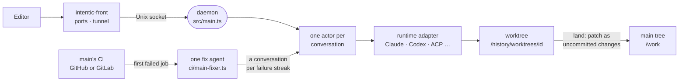

# The sandbox daemon

The Node process inside every sandbox that owns the workspace, runs each agent conversation in its own git worktree, lands the result onto the main tree, and keeps its records beyond the agents' reach.

```mermaid
flowchart LR
    editor["Editor"] --> front["intentic-front<br/>ports · tunnel"]
    front -->|"Unix socket"| daemon(["daemon<br/>src/main.ts"])
    daemon --> actor["one actor per<br/>conversation"]
    actor --> runtime["runtime adapter<br/>Claude · Codex · ACP …"]
    runtime --> wt["worktree<br/>/history/worktrees/id"]
    wt -->|"land: patch as<br/>uncommitted changes"| main["main tree<br/>/work"]
    ci["main's CI<br/>GitHub or GitLab"] -->|"first failed job"| fixer["one fix agent<br/>ci/main-fixer.ts"]
    fixer -->|"a conversation<br/>per failure streak"| actor
```

## The process

- `docker-entrypoint.sh` starts sshd, then [`intentic-front`](../../_sandbox/front) (Rust), which owns every port and the ingress tunnel and supervises `node dist/main.js`. The daemon listens only on a Unix socket, so a daemon restart drops no connection.
- **The front owns sockets and bytes; the daemon owns policy.** Every listener, the tunnel, every upgrade splice, a terminal's WebSocket and tmux client, and a preview's relay are the front's, and none of their bytes pass through Node. Every decision about them is Node's, asked once over the control socket ([`front-wire`](../../_sandbox/front/crates/front-wire/src/lib.rs)): whether a terminal may open and onto which session, created where (the front composes the tmux command), and what becomes of a preview request, an upstream to relay, a page Node rendered to write, or the outbox to hand back. Either side asks the other under one envelope, an id answered or refused within five seconds. The git change feed ([`feed.rs`](../../_sandbox/front/crates/front/src/feed.rs)) is the one piece of the front that is neither: a counter with no policy in it, since Node names each checkout and decides what a generation is worth, kept native because its inotify fan-out over every `.git` is cheapest there.
- [`main.ts`](../../_sandbox/sandbox/src/main.ts) loads config, builds every service in [`composition.ts`](../../_sandbox/sandbox/src/composition.ts), runs the boot steps and opens the readiness gate.
- The wire is the oRPC contract in [`_shared/sandbox-contract`](../../_shared/sandbox-contract) (one `*.contract.ts` per route group), served by [`router.ts`](../../_sandbox/sandbox/src/router.ts). `/events` and `/agent/attach` stream; the browser view is a WebSocket opened with a one-shot ticket. The daemon does not serve the editor itself.
- Terminals are served by intentic-front, one tmux control-mode client per session shared by every viewer, always as a WebSocket, over TCP or spoken by the editor on a stream of the edge's WebTransport session where the edge declares one ([`term/`](../../_sandbox/front/crates/front/src/term/mod.rs)); the daemon only answers whether a socket may open and onto what ([`terminal-plan.ts`](../../_sandbox/sandbox/src/terminal/terminal-plan.ts)).
- The file tree is held in memory by the workspace watcher's thread ([`resident-tree.ts`](../../_sandbox/sandbox/src/workspace/files/resident-tree.ts)) and re-listed only in the folders a batch touched; the tree route answers from it, and `/events` carries each batch as a `treeChanged` delta tabs patch their tree with.

## Agents

- A conversation is the durable unit and a turn is one run inside it. One actor per conversation ([`conversation-actors.ts`](../../_sandbox/sandbox/src/conversations/actor/conversation-actors.ts)) decides whether a new message starts a turn, steers the running one, or waits in the queue.
- [`runtime-table.ts`](../../_sandbox/sandbox/src/runtimes/runtime-table.ts) picks an adapter per provider and harness: the Claude Agent SDK, Codex, OpenCode, Cursor, ACP agents and pi. What each runtime supports is declared in [`agent-runtimes.ts`](../../_shared/sandbox-contract/src/models/agent-runtimes.ts), so the editor never offers a control the runtime would ignore.
- A turn runs detached from any client ([`turn-runs.ts`](../../_sandbox/sandbox/src/agent/run/turn/turn-runs.ts)). It is journaled in `/history/conversations.db` and resumed after a restart; transcripts live in `/history/conversations/<id>/`.

## Worktrees

- An isolated conversation works on branch `agent/<id>`, with one git worktree per repository under `/history/worktrees/<id>/` ([`worktrees.ts`](../../_sandbox/sandbox/src/conversations/worktrees/worktrees.ts)). Parallel agents cannot collide.
- Where the runtime supports it (`isolation: "namespace"`), [`isolation.ts`](../../_sandbox/sandbox/src/conversations/worktrees/isolation.ts) binds the worktree over `/work` in a mount namespace and puts the real tree at `/mnt/intentic-main`; other runtimes (OpenCode, ACP agents, pi) only start in the worktree. Each namespace runtime's process is born there through `nsenter`: the Claude CLI, Codex's app-server, and for Cursor, whose SDK runs its shell and edits files in whatever process loads it, a runtime process ([`cursor-host.ts`](../../_sandbox/sandbox/src/runtimes/cursor/cursor-host.ts)) that drives the SDK while the daemon keeps its tools and hook gate. A container that cannot build a namespace runs every runtime cwd'd in, Cursor's SDK back in the daemon. `node_modules`, `.venv` and `dist` are overlay mounts of the main tree's, so a worktree needs no install.

## Land

- Landing applies a conversation's changes to the main tree as **uncommitted changes**. `HEAD` never moves; the owner's commit is the review boundary ([`land.ts`](../../_sandbox/sandbox/src/conversations/land/land.ts), `landAgent`).
- It rebases the branch onto main ([`sync.ts`](../../_sandbox/sandbox/src/conversations/land/sync.ts)), reconciles the lockfile, and checks every repository's patch before writing any: one conflict and nothing is written. The `merge` mode writes conflict markers instead, and `measure` is a dry run.
- After a land the one thing that runs is the dependency reconciler ([`reconcile-deps.ts`](../../_sandbox/sandbox/src/workspace/deps/reconcile-deps.ts)), which installs when the land moved a manifest or the lockfile. Nothing measures the main tree: the owner commits and pushes, and CI measures the commit. A boot step deletes what the retired check after landing left behind (`.intentic/records/verify.json`, `.intentic/local/verify/`).
- A spawned child works for its parent the way the parent's in-process subagents do ([`land-target.ts`](../../_sandbox/sandbox/src/conversations/land/land-target.ts)). Its worktree is cut from a checkpoint of the parent's current work (`placement.parent`), every sync rebases it onto the parent's checkout instead of main (the parent's remainder committed first, only the child's own commits replayed), and its delta is measured from the parent commit it stands on. Its land goes into the parent's own checkout as uncommitted changes, with no landing rule asked and none of the main tree's after-land (`placement.landedInto`, which origins, presence and the version commit skip), under the child's land lease and then the parent's. The whole family reaches the main tree with the parent's one land. A clash with the parent's edits holds the land whole; the parent's report and `wait` answer say so (`childLandingWords`), and its `merge` tool (`agents merge <id>`) writes the work with conflict markers. A child of a parent in the main tree lands there with no rule asked; a parent archived, gone or on a runner leaves the child to land as any conversation does. A child on a runner is cut from the main line, since the runner rebases it onto its own copy, and still lands into its parent once the runner delivers it.
- A parent whose turn is live hears when a child's work lands in the main tree and when a press of Land on one meets a conflict ([`child-lands.ts`](../../_sandbox/sandbox/src/agent/subagents/child-lands.ts)). A parent with no live turn is not woken for either. A turn that starts on a child without its parent (the sandbox's own re-run of a failed turn, a watch it left, another conversation's message) is announced as `run.started` and taken into the parent's supervision ([`children.ts`](../../_sandbox/sandbox/src/agent/subagents/children.ts) `adoptChildTurn`): its roster row reopens and counts as live, and its ending reaches the parent like any other. A failed child turn the sandbox has booked a re-run for settles as `paused` rather than failed, so the parent's `wait` keeps covering it and a parent that hands the task elsewhere cancels it first (`cancelChild`, which drops the hold); a pause whose hold goes away without a run ends as failed. Child turns start through the turn port's `run` door with `journalled: true`, so a container recreate resumes them; only a loop's iterations run unjournalled, marked so for the `live-turns-are-journalled` invariant.

## When main's CI fails

Main's CI has one fix agent ([`main-fixer.ts`](../../_sandbox/sandbox/src/ci/main-fixer.ts)). It watches the main-line branches (`main`, `master`) of every workspace repository mapped to a connected GitHub or GitLab account.

- It acts on the first failed job, not the finished run. GitHub sends a `workflow_job` webhook and GitLab a `Job Hook`, where a job allowed to fail is ignored; the webhook the daemon registers subscribes to them, and one registered before learns them. Where no webhook is live, the two-minute poller also lists the failed jobs of main's runs still in flight, and when a run finishes, any failed job not yet seen.
- A failure streak on a branch begins at its first failed job and ends once a later run of every workflow that failed on it passes: a push to GitHub starts several workflows, and one passing says nothing of another. A failure from a run older than its workflow's newest pass is not main's word, and starts nothing. The streak is kept in `.intentic/secrets/ci.json` (`failures`, beside `passes`), so a restart keeps it, and at boot the runs since it began are read again, so a webhook missed while the daemon was down is not a missed failure.
- A streak gets one conversation, `ci-fix-<repo>-<runId>`, named after the run the streak began in. It starts with that job's log tail and is told that the run may still be going and that every later failure on main will be sent to it, so it never watches the run itself. Its work lands like any conversation's, as uncommitted changes on the main tree. The owner commits and pushes, and the next run measures it.
- Every later failed job, in the same run or a later one, goes to that conversation: said into its live turn, as a new turn when it is idle, and queued otherwise. Each job of each run is sent once.
- It gets at most three turns the sandbox starts per streak, not counting words steered into a live turn. Once they are spent, the failure waits for the owner (decision `spent`).
- When the fix agent finished without changing anything (a failure that is not in the code: the runner's environment, a tool version, a secret), or failed, was stopped or archived, the failure waits for the owner and the next failure is not sent (decision `spent`, activity row `ci.repair_needs_you`). A lockfile or pnpm drift reaches the owner after one turn. A turn that changes nothing after an earlier one changed something found nothing left to do, and only counts against its turns.
- A failed job whose failing step is the runner's own, or whose log names the fleet, is never sent to the agent. A run whose every failure is the fleet's is re-run once.
- A person pressing Fix on a main-line run inside a streak opens or continues the streak's one fix agent and gives it its turns back.
- The Agent tab's Repair switch (`autoRepair`) governs this alone: off, main's failure is only reported (decision `reported`).
- When a streak ends the daemon logs `ci repair: streak ended` with the repository, the branch, how long it lasted, its runs and turns, and the fix agent's cost and tokens, and writes the activity row `ci.repair_retired`, so what a fix agent costs can be measured. A fix agent still working then is told it may stop.
- `GET /ci/runs` serves each failing main-line branch as `failures` (`CiMainFailure` in [`ci.ts`](../../_shared/sandbox-contract/src/schemas/ci.ts): repository, branch, since, the newest failed run, the jobs failing, the fixer and the latest decision). The Pipelines view shows it above the runs.

## A push

Nothing the sandbox runs checks a push, and nothing is kept about one. The app pushes with plain `git push` in a terminal of its own ([`push-run.ts`](../../_sandbox/sandbox/src/git/ops/push-run.ts)), so a repository's own pre-push hook still runs, and a push it refuses settles as refused by the hook, with git's last words and the terminal it ran in. The push card shows that, with Try again. What a push broke is CI's to say: this repository's `quick` job runs the push check over the pushed range ([`verify-push.mjs`](../../_tools/scripts/verify/verify-push.mjs)), and on main a failed job goes to the one fix agent above. The record the retired push checks kept, `.intentic/records/push-checks.json`, is deleted at boot (the `push-checks-leftovers` step).

## Checks

- A repository declares its checks in `.intentic/checks.json` for the moment `edit` (`RepoChecksFileSchema` in [`settings.ts`](../../_shared/sandbox-contract/src/schemas/settings.ts)). The owner adopts the file, and a changed declaration waits for re-adoption. The `turn` and `land` moments are retired: a declaration naming one still parses and is shown, but runs nothing and is no part of what the owner adopts (a repository adopted while it counted stays adopted).
- [`repo-checks.ts`](../../_sandbox/sandbox/src/rules/repo-checks.ts) turns edit checks into `file.edited` rules. They run on every file an agent writes, and their output returns in that edit's result without stopping the turn ([`file-edited.ts`](../../_sandbox/sandbox/src/rules/file-edited.ts)).
- Nothing runs when a turn ends, nothing sends it back to work, and no check holds its land. The owner's `turn.ending` rules and the built-in `verify-ui-edits` are retired like `turn`: the settings still read them, their stored conversion drops them, and a save refuses a new one (`SandboxSettingsWriteSchema`). What a turn showed of its own work is recorded as its card's `proof` ([`turn-settlement.ts`](../../_sandbox/sandbox/src/agent/run/settle/turn-settlement.ts)): verified, unproven, failing or no-code from the checks it chose to run after its last edit, and how many rendered interface files it changed without looking. The editor badges it.
- A "Checks after landing" note ([`checks-note.ts`](../../_sandbox/sandbox/src/agent/prompt/checks-note.ts)) goes out with each conversation's opening message and again after a compaction, and says the same every time. Nothing checks the work when it finishes or after it lands, so run checks scoped to what you changed and never the whole repository. CI checks what the owner pushes, and one fix agent handles main's failures. A failure in code you did not touch may be main's own.

## Heavy work elsewhere

- A program is heavy by what it is, not by what an agent typed. Every line an agent runs carries the heavy-command table down ([`heavy-commands.ts`](../../_sandbox/sandbox/src/system/resources/heavy-commands.ts)): each node program it starts loads a hook first ([`heavy-hook.cjs`](../../_tools/constants/src/heavy/heavy-hook.cjs), through `NODE_OPTIONS`), and pnpm's own binary, bun and cargo are reached through thin wrappers first on its PATH (`bin/heavy-shims`). Both name the program that really runs (`vitest` under `pnpm test`, `tsc` under a make target) and match `<program> <args…>` against the table ([`heavy-rules.cjs`](../../_tools/constants/src/heavy/heavy-rules.cjs), which the repository's own scripts read too). A heavy program takes the toolchain class at once, then becomes the same run behind `bin/queue-run` (a slot, and memory first); nothing it starts is judged again. Switching the queue off leaves the class. `bin/tmux-run` ends everything a command started, in every process group, when it returns.
- `.intentic/config/heavy-commands.json` holds only the owner's overrides (settings, edits to a shipped rule by its id, the owner's own rules, `queue: false`), on top of the shipped table, so a fix to a shipped rule reaches every sandbox. A file of the earlier shape (the whole table, seeded once) is converted on read into what differs from anything a release shipped. A slot held past half of its own rule's max-hold is named in the daemon log.
- An agent's command reaches its pane by file: the hook writes the line, the command and its window name into a run directory and hands `tmux-run -f <dir>/line`, so no process's command line carries the agent's words and `pkill -f` on a pattern in them cannot kill its own call.
- The owner can send a kind of heavy work to a runner on one of their machines instead (settings `offload`, Agent → Tools → Where heavy work runs). A heavy program of such a kind becomes `bin/offload-run` as it starts, keeping the queue's own prefix for when the runner cannot take it.
- `offload-run` snapshots the repository's working tree as one commit under `refs/intentic-offload/<run>`, uncommitted and untracked work included, and relays the run through [`offload.routes.ts`](../../_sandbox/sandbox/src/offload/offload.routes.ts) to the runner. The runner fetches it through the git door into `/history/offload/<repo>` ([`runner-command.ts`](../../_sandbox/sandbox/src/runners/runner-command.ts)), which it keeps between runs with its ignored files, reinstalls only when a lockfile or manifest moved, runs the repository's `offload:prepare` script when the tree changed, and runs the line behind its own queue. Output streams back as it comes, and the exit brings every file the line changed back as a patch.
- A runner that is offline, predates offloading, stays full, or cannot fetch or install hands the line back, and it runs here with one line saying why. A line that resolved a secret never leaves.

## Priority and memory

- Every process the daemon starts for a purpose gets a workload class from whoever started it, never from its command line ([`workload-class.ts`](../../_sandbox/sandbox/src/workload/workload-class.ts)). The class sets its niceness, its IO class and its `oom_score_adj`, and children inherit all three, so the whole tree carries it. When memory runs out the kernel takes, in order: builds a heavy-command rule matched (800), agent commands and dependency installs (600), services, gateways, backends and panels (500), then agent runtimes, 100 plus 100 per spawn level, so a child goes before its parent. The daemon and whatever it starts without a class stay at 0.
- `spawnAs` applies the class in the same call that spawns the child: runtimes (Claude, Codex, ACP, pi), service processes, the translator, the extension and browser backends. The iq engine is classed as it forks, and `opencode serve`, which its SDK spawns with no hook, is found by a stamp set across that spawn. A pane shell (a panel, an install) is classed before the command is typed into it. An agent's command gets the command class as a shell prefix (`nice`, `ionice`, `choom`) inside `tmux-run`, and a heavy program within it takes the toolchain class as it starts. The front still lowers every direct child of the daemon to nice 10 and never raises one: it is the floor for the plain spawns that have no class (the git fork broker, rules, runner commands, the JS tool). Process metrics still label processes by command line ([`process-scan.ts`](../../_sandbox/sandbox/src/system/resources/process-scan.ts)), and that label ranks nothing.
- Whether there is room for more work is one formula ([`memory-room.mjs`](../../_tools/constants/src/memory-room.mjs)): the limit is `memory.high` (the entrypoint sets it to 90% of the cap, and past it the kernel throttles the whole sandbox into reclaim), else `memory.max`, else the machine's memory; used is the working set plus swap (the machine's own figures at a root cgroup, which keeps neither); free never exceeds what the machine has available; the stall is memory pressure `full`. Starting one more of a class needs its cost free (an agent runtime or a build 1 GiB), and work nobody waits on needs a person's turn on top.
- The daemon's [`ResourceBudget`](../../_sandbox/sandbox/src/workload/resource-budget.ts) is the only judge. One sampler takes the reading (every ten seconds, and fresh within a second when asked), and one ledger holds what admitted work takes for ninety seconds, until the reading shows it, keyed by where the work runs: a child sent to a runner holds nothing here and never waits on this box. `admit` answers run, wait or refuse. A person on a short box is told once a spell and then let through. A turn nobody waits on (a child, an automation) is held at the door until there is room, for up to ten minutes, and then turned away. A child is admitted while it shows as waiting, and the door takes that admission instead of judging the same turn again.
- `GET /system/metrics` serves the budget's snapshot: the gauge's used and limit are the gate's, and it turns amber exactly where a person's turn would be held (below the free memory that turn needs, or at the stall limit). A killed child is blamed on memory when the OOM count moved or the sampler saw the box short in the last five minutes.
- Heavy commands and test fan-outs ask the budget on a Unix socket of their own, `/run/intentic/room.sock` ([`room-socket.ts`](../../_sandbox/sandbox/src/workload/room-socket.ts)), never the daemon's public socket: `bin/queue-run` runs `memory-room --class toolchain --wait N` before it takes a slot, and `test-workers.mjs` sizes itself to the free memory the budget reports. Where no daemon answers (CI, a plain checkout), both apply the same formula to the same files.

## State

| Place | Holds |
| --- | --- |
| `/work` | the repositories, visible to agents, on its own volume |
| `.intentic/config` | tracked configuration: settings, personas, skills, capabilities, the environment overlay |
| `.intentic/records` | ledgers: agent sessions, automation runs, chores |
| `.intentic/local` | rebuildable caches and browser profiles |
| `.intentic/identity`, `.intentic/secrets` | owner, members and passkeys; credentials |
| `/history` | the conversation store, transcripts, worktrees, git directories, snapshots and logs |

`/history` is a separate volume outside `/work`, so no command in the workspace can erase the recovery record. [`workspace-state.ts`](../../_shared/sandbox-contract/src/state/workspace-state.ts) lists every state file and its group, and the file API refuses the daemon's own entries.

Every stored file is read by every later release, from sandboxes that skipped any number of them. Each is declared with the conversions its shape has had ([`documents.ts`](../../_sandbox/sandbox/src/store/evolution/documents.ts)); the stores run them on every read and keep what they do not know on writes, so a store's next save persists the converted shape, and the first boot after an update moves documents and runs structural steps under a journal a rolled-back build undoes ([`state-convergence.ts`](../../_sandbox/sandbox/src/store/evolution/state-convergence.ts)). A step that throws partway is put back at once and `/health` reports the journal `failed`, and a build stamps itself the newest run only when its boot commits, so a failed update never makes the version put back look like a downgrade. The promise and the rules for a change are in [COMPATIBILITY.md](../../COMPATIBILITY.md#stored-data).

The conversation database never keeps the daemon down: one found missing or damaged at boot is set aside (never deleted), salvaged or made again, and reported to the owner, and the boot's sweep of conversation directories no row owns moves them to `/history/trash/conversations` for 14 days instead of deleting them, holding off altogether when the database was just made again or names no conversation at all.
