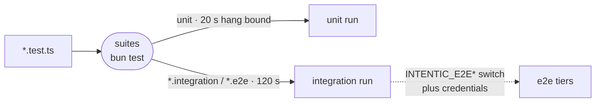

# Testing

Tests are split into tiers by file name, run through one `suites` wrapper over Bun, and checked at an agent's turn end, after every land, at the push and in CI.

## Suites

- Every package's `test` script is `suites` ([`_tools/testing/bin/suites.mjs`](../../_tools/testing/bin/suites.mjs)). It runs `bun test --conditions=@intentic/src --isolate` twice, because one run has one timeout: unit files with a 20-second hang detector, then `*.integration.test.*` and `*.e2e.test.*` files with room for real work.
- The kind comes from the file name alone (`suiteKindOf` and `SUITE_TIMEOUTS` in [`test-suites.mjs`](../../_tools/constants/src/test-suites.mjs)). Each package's `bunfig.toml` preloads [`bun-preload.ts`](../../_tools/testing/src/bun-preload.ts), so a plain `bun test` gets the same budget.
- A suite that reaches the machine (temp directories, subprocesses, real git, Docker) must be named `*.integration.test.ts`. [`test-programs.mjs`](../../_tools/checks/test-programs.mjs) recognizes one by what it imports, fixtures included. The same check requires every test file to be inside a type-check program and every `jest.mock` of a workspace package to supply every name the code under test imports.
- [`@intentic/testing`](../../_tools/testing) holds the shared seams: `unstubbed` (a fake whose unstubbed members throw with their own name), Bun helpers such as `waitFor` and `freshImport`, a DOM, and Fly and Stripe fakes. A package's own fixtures live in its `src/testing.ts`. The rules for writing tests are in [`AGENTS.md`](../../AGENTS.md).
- Other runners: Playwright for the browser and onboarding tiers, `cargo test` for the Rust crates, and `node:test` for the scripts in `_tools/scripts`.

## Tiers

| Tier | What it needs | Where it runs |
| --- | --- | --- |
| Unit | nothing outside the process | turn end, after a land, CI |
| Integration | temp trees, git, subprocesses, Docker | turn end, after a land, CI |
| `pnpm e2e` | Docker for the daemon image, plus Cloudflare, Discord, Stripe or Fly credentials; `e2eTier` makes a suite stand down without them | nightly |
| `e2e:hermetic` | a Docker-in-Docker host from [`_tools/dind-host`](../../_tools/dind-host), Postgres, faked Stripe | CI |
| `e2e:providers` | the real agent CLIs against [`_tools/fake-model`](../../_tools/fake-model), no network | CI before a release; nightly with the newest CLIs |
| `e2e:browser` | Playwright ([`_tools/e2e`](../../_tools/e2e)) against a localhost Postgres, API, Vite and daemon container | a developer machine |
| `e2e:mobile` | Chromium over the demo build, checking every mobile route's geometry | `pnpm e2e:mobile` |
| Onboarding | Playwright ([`_tools/onboarding`](../../_tools/onboarding)) with [`_tools/fake-upstream`](../../_tools/fake-upstream) standing in for model endpoints | nightly |
| Desktop smoke | installed desktop builds ([`_tools/desktop-smoke`](../../_tools/desktop-smoke), [`_tools/desktop-smoke-windows`](../../_tools/desktop-smoke-windows)) | CI, release, nightly |
| Mutation | [`stryker.conf.mjs`](../../stryker.conf.mjs) over unit suites of the daemon and its contract | the daemon's `test-strength` chore |

## Where they run

- **Turn end**, `pnpm verify:turn` ([`verify-turn.mjs`](../../_tools/scripts/verify/verify-turn.mjs)): typecheck and tests on the packages the turn affected, re-run once on failure. [`failure-units.mjs`](../../_tools/scripts/verify/failure-units.mjs) sets aside failures main already had, and [`flakes.mjs`](../../_tools/scripts/verify/flakes.mjs) logs a test that passes on the re-run as a flake. The assertion ratchet refuses a test file made weaker without a `test!:` subject or `Test-Note:` trailer.
- **After a land**, `pnpm verify` ([`verify.mjs`](../../_tools/scripts/verify/verify.mjs)): the whole repository, recorded as a verdict for the next turn and the push.
- **Pre-push**, [`verify-push.mjs`](../../_tools/scripts/verify/verify-push.mjs): replays typecheck and test from a recorded verdict for the same tree, or leaves them to CI; `--suite` runs them locally.
- **CI**, [`.github/workflows`](../../.github/workflows): `ci.yml` builds and tests each affected area through `verify.yml`, runs the provider tier, re-runs a subset of suites under unusual time zones (`verify-clocks`), and runs the hermetic, billing and desktop tiers. `nightly.yml` runs `pnpm e2e`, onboarding and the desktop update tiers. Jobs run on self-hosted runners in the `ci-base` image.
- `pnpm test` fans out through `turbo run test --only`, with `TEST_WORKERS` sized to the machine's memory by [`test-workers.mjs`](../../_tools/scripts/verify/test-workers.mjs).
