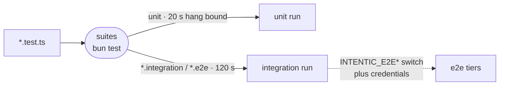

# Testing

Tests are split into tiers by file name, run through one `suites` wrapper over Bun, and run in CI on every push and by hand.

```mermaid
flowchart LR
    file["*.test.ts"] --> suites(["suites<br/>bun test"])
    suites -->|"unit · 20 s hang bound"| unit["unit run"]
    suites -->|"*.integration / *.e2e · 120 s"| integ["integration run"]
    integ -.->|"INTENTIC_E2E* switch<br/>plus credentials"| e2e["e2e tiers"]
```

## Suites

- Every package's `test` script is `suites` ([`_tools/testing/bin/suites.mjs`](../../_tools/testing/bin/suites.mjs)). It runs `bun test --conditions=@intentic/src --isolate` twice, because one run has one timeout: unit files with a 20-second hang detector, then `*.integration.test.*` and `*.e2e.test.*` files with room for real work.
- The kind comes from the file name alone (`suiteKindOf` and `SUITE_TIMEOUTS` in [`test-suites.mjs`](../../_tools/constants/src/test-suites.mjs)). Each package's `bunfig.toml` preloads [`bun-preload.ts`](../../_tools/testing/src/bun-preload.ts), so a plain `bun test` gets the same budget.
- A suite that reaches the machine (temp directories, subprocesses, real git, Docker) must be named `*.integration.test.ts`. [`test-programs.mjs`](../../_tools/checks/test-programs.mjs) recognizes one by what it imports, fixtures included. The same check requires every test file to be inside a type-check program and every `jest.mock` of a workspace package to supply every name the code under test imports.
- [`@intentic/testing`](../../_tools/testing) holds the shared seams: `unstubbed` (a fake whose unstubbed members throw with their own name), Bun helpers such as `waitFor` and `freshImport`, a DOM, and Fly and Stripe fakes. `requires(condition, why)` gates a test on something of the machine: it stands down locally, with `suites` counting what stood down, and fails on CI unless `absentOnCi` says why CI goes without it; a requirement only one CI job provides names that job's `lane` (`INTENTIC_CI_LANE`), fails there, and stands down in every other CI job. A suite takes `describe`, `test` and `expect` from the globals `bun test` defines; a value import from `bun:test` hides it from the `jest/*` lint rules, and `.oxlintrc.json` refuses one. A package's own fixtures live in its `src/testing.ts`. The rules for writing tests are in [`AGENTS.md`](../../AGENTS.md).
- Other runners: Playwright for the browser and onboarding tiers, `cargo test` for the Rust crates, and `node:test` for the scripts in `_tools/scripts` and `_tools/checks`, which no turbo task reaches and `pnpm verify` runs.

## Tiers

| Tier | What it needs | Where it runs |
| --- | --- | --- |
| Unit | nothing outside the process | CI, by hand |
| Integration | temp trees, git, subprocesses, Docker | CI, by hand |
| `pnpm e2e` | Docker for the daemon image, plus Cloudflare, Discord, Stripe or Fly credentials; `e2eTier` makes a suite stand down without them | nightly |
| `e2e:hermetic` | a Docker-in-Docker host from [`_tools/dind-host`](../../_tools/dind-host), Postgres, faked Stripe | CI |
| `e2e:providers` | the real agent CLIs against [`_tools/fake-model`](../../_tools/fake-model), no network | CI before a release; nightly with the newest CLIs |
| `e2e:browser` | Playwright ([`_tools/e2e`](../../_tools/e2e)) against a localhost Postgres, API, Vite and daemon container | a developer machine |
| `e2e:mobile` | Chromium over the demo build, checking every mobile route's geometry | `pnpm e2e:mobile` |
| `e2e:signin` | Chromium over the web build, the api ([`browser-api.ts`](../../_platform/api/src/e2e/browser-api.ts)) and a Postgres testcontainer, with only Google stood in for ([`_tools/e2e/signin`](../../_tools/e2e/signin)): a new person signs in on the web and through the desktop app, whose half of the handoff the tier plays as `auth.rs` does | CI (`e2e-signin`), when a change reaches the api or the web, and it gates the platform deploy; `pnpm e2e:signin` |
| `e2e:local` | Chromium over the desktop app's built local face and the real intentic-files sidecar on a temp folder, no Tauri ([`_tools/e2e/local-face`](../../_tools/e2e/local-face)): the boot, the tree, a save reaching the disk, and no sidecar route answering 404 | CI (`local-face`), when a change reaches the desktop app; `pnpm e2e:local` |
| Onboarding | Playwright ([`_tools/onboarding`](../../_tools/onboarding)) with [`_tools/fake-upstream`](../../_tools/fake-upstream) standing in for model endpoints | nightly |
| Desktop smoke | installed desktop builds ([`_tools/desktop-smoke`](../../_tools/desktop-smoke), [`_tools/desktop-smoke-windows`](../../_tools/desktop-smoke-windows)) | CI, release, nightly |
| Mutation | [`stryker.conf.mjs`](../../stryker.conf.mjs) over unit suites of the daemon and its contract | the daemon's `test-strength` chore |
| Perf | Valgrind for instruction counts, Chromium over the demo for render, call, layout and mutation counts ([`_tools/perf`](../../_tools/perf)) | CI, when a change reaches `@intentic/perf` or the demo |

## Where they run

- **By hand**, `pnpm verify` ([`verify.mjs`](../../_tools/scripts/verify/verify.mjs)): the whole repository, the way CI's verify groups measure it. Nothing runs it unasked, and nothing runs the tests inside a turn or after a land. A failed test is re-run alone before it counts, and [`flakes.mjs`](../../_tools/scripts/verify/flakes.mjs) logs one that passes then as a flake.
- **The push check**, [`verify-push.mjs`](../../_tools/scripts/verify/verify-push.mjs): CI's `quick` job runs it on every push, and `pnpm verify:push` by hand. It runs no suite. Its assertion ratchet fails a test file the pushed range made weaker without a `test!:` subject or `Test-Note:` trailer.
- **CI**, [`.github/workflows`](../../.github/workflows): `ci.yml` builds and tests each affected area through `verify.yml`, runs the provider tier, re-runs a subset of suites under unusual time zones (`verify-clocks`), runs the suites that need a privileged container, a browser, the iq models or the canonical template checkout in their own lane (`verify-machine`), runs the front's feed suite against the binary `front-check` just built, and runs the hermetic, billing, sign-in, desktop and local face tiers. The billing and sign-in tiers are the two the platform deploy (`images-platform`) waits on. Its `quick` job type-checks the packages a push changed and runs the push check, a few minutes after the push, so a failing main's one fix agent starts early ([`sandbox.md`](sandbox.md#when-mains-ci-fails)). It gates nothing. `nightly.yml` runs `pnpm e2e`, onboarding and the desktop update tiers. Jobs run on self-hosted runners in the `ci-base` image.
- **Perf**, the `perf-instr` and `perf-browser` jobs in `ci.yml`: each publishes its counts against the baseline in [`_tools/perf/baselines`](../../_tools/perf/baselines) as the job summary, a report that never fails the job. What fails it is a declared budget, a one-directional claim with headroom such as "an idle clock tick redraws at most eight components" ([`browser/browser-budgets.ts`](../../_tools/perf/src/browser/browser-budgets.ts), [`instr/instr-budgets.ts`](../../_tools/perf/src/instr/instr-budgets.ts)). A baseline is re-recorded only by [`perf-record.yml`](../../.github/workflows/perf-record.yml), dispatched by hand on the CI runner class, which uploads the diff as a patch to commit with the change it describes.
- `pnpm test` fans out through `turbo run test --only`, with `TEST_WORKERS` and the task count sized to the memory free when it starts by [`test-workers.mjs`](../../_tools/scripts/verify/test-workers.mjs); `pnpm typecheck` sizes its task count the same way.
