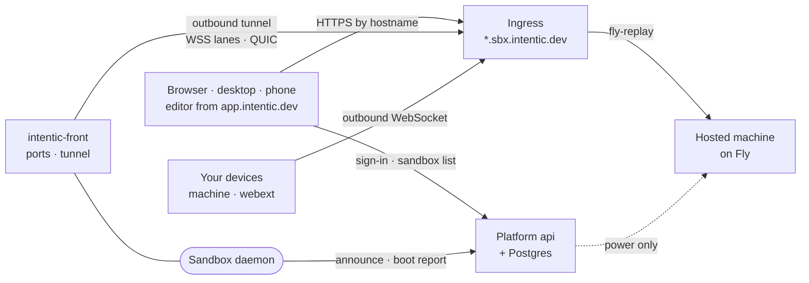

# Topology

The processes and machines intentic runs on, which way each connection is opened, and who can reach what.

## The pieces

- **The editor** ([`_editor/web`](../../_editor/web)) is a static Vue app served from `app.intentic.dev`. The desktop app ([`_editor/desktop-app`](../../_editor/desktop-app)) and the phone apps load the same URL in a webview. It reads the sandbox list from the platform, then talks to each sandbox's daemon directly.
- **The platform** ([`_platform/api`](../../_platform/api), Postgres through [`_platform/prisma`](../../_platform/prisma)) is sign-in, the sandbox registry and the hosted plan. See [platform.md](platform.md).
- **The ingress** ([`_platform/ingress`](../../_platform/ingress)) is a reverse proxy on Fly. A sandbox dials it, a WebSocket per lane and a QUIC connection beside them where the edge declares it serves QUIC, and it routes each browser request to the tunnel registered for that request's `Host` (`sandbox-<id>.sbx.intentic.dev`, plus `preview-`, `port-` and `public-` hostnames from [`hostnames.ts`](../../_shared/sandbox-contract/src/ids/hostnames.ts)).
- **A sandbox** is one Docker container plus two volumes. Inside it, [`intentic-front`](../../_sandbox/front) (Rust) owns every port and the ingress tunnel and supervises the Node daemon ([`_sandbox/sandbox`](../../_sandbox/sandbox)) over a Unix socket, so connections stay open across a daemon restart. See [sandbox.md](sandbox.md).
- **Where a sandbox runs**: on the user's own computer or server (started by the setup command, the desktop app or the [`ic`](../../_sandbox/ic) CLI), or on a hosted machine: one Fly app, machine and volume per sandbox. On the user's own machine `ic` is the one authority over its containers: what runs, and the shape saved for the next restart (in its channel record). The machine agent, the desktop app and the web's pasted fallback lines all call `ic`'s verbs (`list --json`, `start`/`stop`/`restart`, `shape`) rather than docker, so a restart through any of them applies a saved shape; Docker restarting a container by itself does not. A hosted sandbox dials the same tunnel, with a grant the platform puts in its machine's config; one that has not dialled in yet is answered with `fly-replay`, and Fly's edge delivers the request.
- **Which transports the edge serves** is its own declaration, read off what it binds, never probed for: on its answer to every tunnel's upgrade (`x-intentic-transports`, which fronts read before dialling QUIC) and on its `/health`, which the platform reads each minute and relays on every sandbox row it fronts (`edgeTransports`, which the editor reads before opening WebTransport). Undeclared means not served. While Fly's HTTP proxy terminates TLS, the edge declares nothing, since no UDP reaches it; [`fly.edge-tls.toml`](../../_platform/ingress/fly.edge-tls.toml) and the ingress README's runbook are the switch.
- **Your devices** ([`_devices/machine`](../../_devices/machine), the browser extension [`_devices/webext`](../../_devices/webext)) dial the sandbox's own hostname over one WebSocket each, or its loopback address when they share a machine.

## Which way connections go

The platform never opens a connection to a sandbox:

- The sandbox dials out: the tunnel to the ingress, and `POST /sandbox/announce` to tell the platform its URL and liveness ([`announce.ts`](../../_sandbox/sandbox/src/platform/boot/announce.ts)). No inbound port or router rule is needed.
- The browser and the devices dial the sandbox, through the ingress or on loopback.
- The platform never calls a user's daemon. It flips a hosted machine's power through Fly's API, and nothing more.

## Trust model

| Party | Can | Cannot |
| --- | --- | --- |
| Platform | know accounts, sandbox addresses and liveness; sign reachability grants; start, stop and destroy hosted machines | relay or read ordinary agent turns; hold the credential that drives a daemon |
| Ingress | route traffic for a sandbox holding a valid grant; read the traffic it carries, since TLS ends there | make a sandbox reachable or claim a hostname without a grant signed by the platform |
| Daemon | authenticate its owner and members itself; run agents with the workspace's credentials | reach a device beyond the scopes that device grants |
| Device | act on its own machine within the switches its owner set | be widened by the sandbox: scopes are enforced on the device |

- The daemon verifies the owner's Google ID token itself, binds the first owner, and mints its own session ([`auth.ts`](../../_sandbox/sandbox/src/auth/auth.ts)). Membership and role are checked on every request. Every other credential it accepts (control tokens, agent, extension and panel tokens, device enrollments) is in [`grants.ts`](../../_sandbox/sandbox/src/auth/grants.ts). A door that checks its own credential, such as the MCP door's per-conversation mount bearer, is declared `auth: "door"` beside its route.
- The platform's grant is an Ed25519 signature the ingress checks with the public key alone ([`ingress-contract.ts`](../../_shared/sandbox-contract/src/protocol/ingress-contract.ts)). Deleting the sandbox's registry row revokes it.
- Hosted machines are the exception: intentic's Fly token keeps access to every machine it creates ([`fly.ts`](../../_platform/api/src/sandbox/hosted/fly/fly.ts)), so a platform breach can reach hosted sandboxes and no other kind. The optional free trial also routes its turns through platform-owned model accounts.
- A device enforces its scopes (`shell`, `write`, `screen`, `control` and the rest) in [`policy.ts`](../../_devices/machine/src/device/policy.ts) and logs every call on the device.
