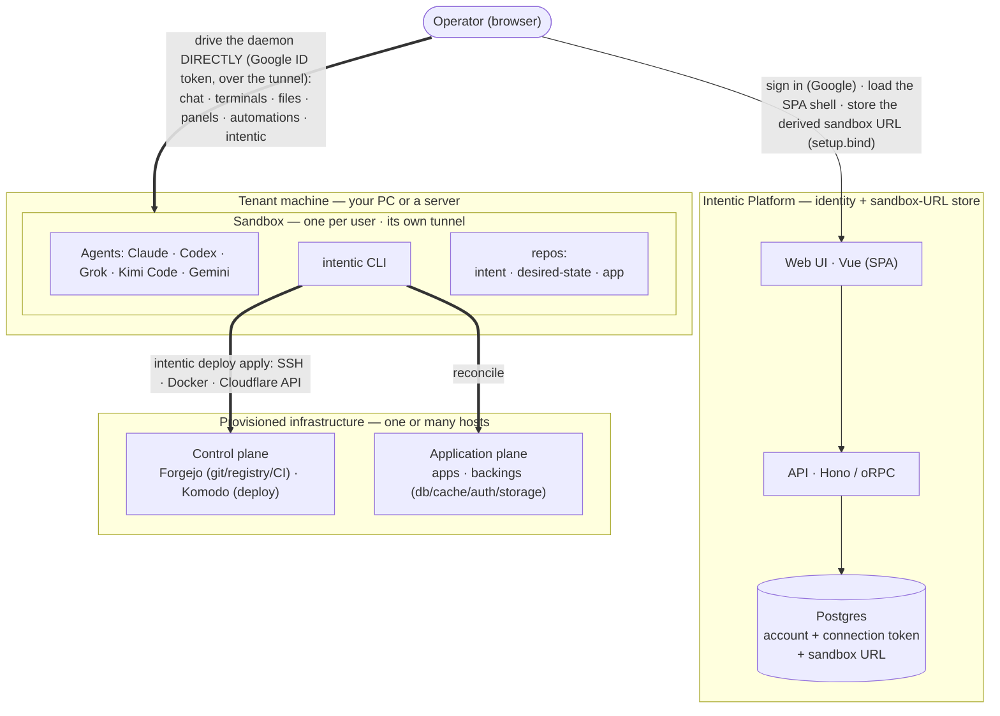
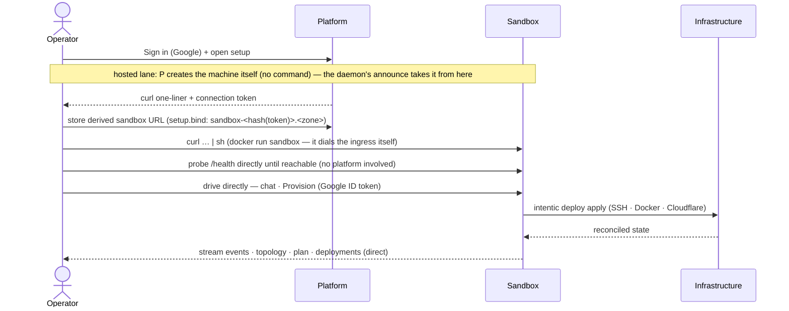

# The shape of the running system

Two tiers and what each one is for: a thin platform that knows where your sandbox is, the sandbox itself, and
the DNS that makes both reachable.

At runtime the product is two tiers: a thin **Platform** (identity + sandbox-URL store) and a per-user
**Sandbox** (where the agent runs, reached by the browser directly). A sandbox can *also* stand up real
**infrastructure** on hosts you own (the third tier below) by running the bundled deployment engine, one
of its tools; that path is optional. The engine flow shown later is what runs *inside* one `intentic deploy apply`.

- **Platform (identity + sandbox-URL store)**: Vue SPA + Hono/oRPC API. Persists the
  operator's account (Better Auth), one secret-free per-user connection token, the sandbox's public `daemonUrl` (announced
  by the **daemon** on boot), member invites (a discovery mirror: the daemon is the enforcer), and
  a pool of pre-provisioned tunnels (`ReservedSandbox`) so setup pays no Cloudflare round-trips
  inline. It never probes the sandbox, owns no infrastructure, and sits **off the command path: with
  one exception, the free trial**. The trial ([_platform/api/src/trial/](../../_platform/api/src/trial/)) lets
  someone chat before connecting any AI account, on intentic's own free-tier keys, metered per
  signed-in account per day; those turns therefore pass *through* the platform, which no other turn in
  this product does. It is off unless the operator configures keys, every surface that offers it says so
  in the same words (`TRIAL_NOTICE`), and connecting any account moves the user onto the direct path
  permanently. Nothing else changes: the trial holds no ability to drive a sandbox, so the blast radius
  below is unchanged. The **push relay** ([_platform/api/src/push-relay/](../../_platform/api/src/push-relay/))
  is a narrower pass-through of the same kind, for notifications rather than turns: browsers get web push
  straight from the daemon, but Apple only accepts pushes from the app's vendor, so the iOS shell's
  notifications (a title and a body, never content: the daemon's payloads are pointers back into the
  workspace) route daemon → relay → APNs. Off unless the operator configures the Apple key; it too can
  drive nothing.
- **Sandbox**: one per user, run **unprivileged by default**; container privileges come only from
  `# intentic:runtime` directives in the owner-approved overlay, applied by the allowlisted rebuild executors
  (the `docker` capability's `--privileged` wakes the image-baked, otherwise-dormant isolated Docker Engine so
  `pnpm db:up` / `docker compose` work in the workspace, and its optional GPU switch adds `--gpus=all` plus the
  container toolkit that nested engine needs. A directive on the run contract's OPTIONAL list: the ones whose
  absence leaves a working sandbox: is probed on the host first and dropped rather than failing the launch; its
  engine settings (registry mirror, address pool) are a different family again, living in `daemon.json` and
  costing a dockerd restart instead of a rebuild. The HOST's Docker socket is
  never mounted, so the agent's containers can only live inside the sandbox's own engine; the tunnel that makes
  it reachable is a connection the daemon itself dials, not a sidecar). Runs the coding agents (Claude via the agent
  SDK, Codex app-server, Grok, Kimi Code, Gemini: spawned per turn, not resident) and the `intentic` CLI over the three repos
  (`intent` = `deploy.config.ts`, the IaC; `desired-state` = resolved artifact + status; `app` =
  the application code), and exposes its daemon through the platform's own edge, **`@intentic/ingress`**
  ([_platform/ingress](../../_platform/ingress)). A box on the user's own machine dials ONE outbound WebSocket to
  it, presenting a platform-signed Ed25519 **reachability grant** that says which sandbox it is, and from then
  on serves its daemon and previews under that sandbox's hostnames. A hosted box (below) dials nothing: it is
  a Fly app already on the internet, and the edge answers a request for its hostname with a Fly replay
  (`fly-replay: app=<its app>`) that Fly's proxy carries straight to the machine, caching the route per
  hostname so the edge is off the path of everything that follows. Nothing else is provisioned in either case,
  because every public name a sandbox answers to already ends in its own 12-hex id: the ingress decides who
  may serve a request by parsing the `Host` header, and a hosted sandbox's app is named after the same id, so
  there are no accounts, no name claims and no namespace to reconcile
  ([ingress-contract.ts](../../_shared/sandbox-contract/src/protocol/ingress-contract.ts) is what the three parties agree
  on). A reconnecting box DISPLACES its own previous tunnel, which is why recreating a container heals itself
  instead of fighting over names its dead predecessor still held. The platform can mint and revoke that
  reachability — revoking is deleting the sandbox row — but cannot impersonate the daemon's own auth: the
  credential that binds an owner is born inside the box. TLS terminates at Fly's proxy, under ONE wildcard
  certificate for `*.sbx.intentic.dev`, so the ingress and the hosted machine's front door both handle
  plaintext requests: the proxy is a trusted hop, and what makes that acceptable is that the daemon verifies
  every credential it accepts inside the box instead of trusting a header. Cloudflare is DNS only now, and
  every record it still holds is a wildcard or a transient:
  the wildcard aimed at the ingress's anycast addresses, `*.local.<zone>` for the loopback shortcut, and one
  ACME TXT per loopback certificate being issued. Nothing per-sandbox is left, which is the point — the
  loopback name was the last thing minting a record each, and enough of them filled the zone's quota and
  stopped issuance for everyone. SSH keys, Cloudflare and agent tokens ride straight into it and never reach
  the platform.
- **Trust root = browser Google Sign-In**: the browser proves its identity to the daemon with a
  Google ID token, verified against Google's JWKS, and the daemon binds its owner **on first use**:
  the first authenticated request must carry the `x-intentic-connect` connect token (and, when setup
  seeded an expected owner, match that account's email), then the owner email persists in
  `/work/.intentic/identity/owner.json` ([auth.ts](../../_sandbox/sandbox/src/auth/auth.ts)). Because a Google ID token
  lives ~an hour and renewing it needs Google UI, it is only the **sign-in** credential: the browser
  exchanges it at `system.session` for a **daemon-minted session** (HMAC-signed with a secret that
  never leaves the sandbox, [session.ts](../../_sandbox/sandbox/src/auth/session.ts)) and presents that on
  every call, renewing it silently: Google reappears only for a first visit, an account switch, or a
  long-idle return. First-bind always takes a fresh Google proof, never a session, with one lane's exception
  below: on a HOSTED machine the daemon also takes the platform's **owner ticket**
  ([owner-ticket.ts](../../_shared/sandbox-contract/src/policy/owner-ticket.ts)), a minutes-long Ed25519 claim signed
  with the reachability key and verified offline against the public half the provisioner put in the machine's
  env, naming this sandbox's id and the owner `OWNER_EMAIL` already names, so the platform sign-in is the only
  one a hosted user makes. It adds no power the hosted exception below does not already grant. Additional
  collaborators are granted via `/work/.intentic/identity/members.json`, and owner/membership are re-checked
  per request, so revoking a member kills their live sessions too. A PROGRAM (a CI job, a script, an editor
  bridge) holds a **control token** instead ([control-tokens.ts](../../_sandbox/sandbox/src/auth/control-tokens.ts)):
  owner-minted on Sandbox ▸ Access, presented as `x-intentic-control`, hashed at rest, optionally expiring, and
  scoped at mint to a rung derived from the same role floors (`read` = a viewer's reads, `drive` = a
  collaborator's routes, `land` = + merge/discard; the sandbox's own trust surface is closed to every rung). A
  turn a token starts is attributed to `token:<label>` in the activity log and on the card. The platform never
  holds or forges any of these credentials, so a platform breach can read the stored URL but **cannot drive
  any sandbox**: a breach's blast radius is bounded to identity + the sandbox URL.

  **The HOSTED lane is the stated exception to that boundary**, and since onboarding stopped asking it is
  what every browser arrival gets: the setup page starts one on arrival rather than opening on a picker
  (`setupArrival.ts`), and the desktop app is the surface that installs locally instead. Such a user gets a
  sandbox whose machine the platform creates on
  intentic's own provider account (Fly, one microVM + one persistent volume per sandbox, each app on its
  own private network: [_platform/api/src/sandbox/hosted/](../../_platform/api/src/sandbox/hosted/)) and
  deliberately keeps the way back into: wake on the next visit, stop, destroy on delete. The command
  path is unchanged: the browser still drives the daemon directly — browser, Fly's proxy, machine, with no
  tunnel and no intentic process carrying bytes, since the edge only names the app to replay to — and the
  platform still never proxies a request or holds a daemon credential: but existence and power are now
  the platform's, and an operator (or a breach) holding the provider credential could reach inside a
  hosted machine the way any cloud provider can reach inside a rented VM. Every other lane keeps the
  full boundary; a self-hosted platform has the lane off unless it configures its own provider token
  (`hosted` in [config.ts](../../_platform/api/src/config.ts): the third documented exception to the
  platform's secret-free model). The machine also puts itself to sleep when nobody is connected and
  nothing is running (the daemon's idle-stop, [idle-stop.ts](../../_sandbox/sandbox/src/system/idle-stop.ts))
  and the platform wakes it on the next visit: which is what makes a free hosted starter economically
  honest, at the stated cost that scheduled automations run only while the box is awake. The platform is
  also this lane's rebuild executor: an owner-approved environment overlay is built on a builder machine
  the platform creates inside the sandbox's own app and applied as a config replacement
  ([hosted-build.ts](../../_platform/api/src/sandbox/hosted/build/hosted-build.ts)), with the builder's minutes metered
  to the owner like awake minutes and platform-wide ceilings behind every per-owner limit.

The lifecycle, from first sign-in to a reconciled deployment the operator can watch:

### Cloudflare: DNS for the sandbox, required for everything it deploys

Two different jobs wear the same vendor's name, and keeping them apart is the point of this section.

**Reaching a sandbox no longer involves Cloudflare at all** beyond the DNS it answers with. The zone holds one
wildcard record aimed at the ingress, one `*.local.<zone>` record answering `127.0.0.1` for the loopback
shortcut, and a transient TXT per loopback certificate being issued over DNS-01
([cloudflare.ts](../../_platform/api/src/sandbox/cloudflare.ts)). No tunnel is created per sandbox, no record is
minted per name, and the platform is off the naming path completely.

**For the infrastructure a sandbox provisions, Cloudflare carries the traffic and is required.** Every app,
service and workspace the engine deploys is exposed through a Cloudflare tunnel on its host, and nothing else
is offered. The operator never needs to open `git.<zone>` / `deploy.<zone>`; the **browser reads the control
plane through the sandbox daemon directly**. How each piece is reached is asymmetric:

| Reached over | Who / what |
| --- | --- |
| **SSH** (loopback port-forward to `:3000` / `:9120`) | The **engine's entire control path**: every Forgejo API call (repo/ci/users/orgs/teams/hooks) and every Komodo API call (deployments/users/alerters/servers), plus `intentic deploy adopt`'s REST calls and git pushes. The engine never dials a public route it may itself be reconciling, apply and adopt work with the tunnel down, or before DNS exists at all. |
| **Cloudflare tunnel** (public `*.<zone>`) | Everything genuinely cross-host or external: browsers/operators, every worker host's Komodo Periphery dialing Core (`deploy.<zone>`), registry pulls (`git.<zone>`), and hosted-forge CI runners' notify step. |

Why a tunnel, rather than "just use SSH and make Cloudflare optional":

- **Outbound-only, NAT-traversing.** `cloudflared` dials out, so it works behind NAT/firewalls with no
  inbound ports: the same bet the sandbox already makes to expose its daemon.
- **Cross-host coordination needs stable, routable names.** Worker→Core registration and image pulls are
  host-to-host; SSH from the sandbox only reaches *sandbox→service*, so an SSH-only design would still have
  to add an overlay network to serve them.
- **The registry forces a global name anyway.** Image refs (`git.<zone>/owner/app:tag`) must resolve
  identically from every host that pulls: that alone mandates a stable domain.
- **One uniform primitive** (`<name>.<zone>`, TLS'd, reachable from anywhere) keeps the model trivially
  reason-about-able; a second internal/SSH mode would mean two reachability models and a combinatorial matrix.

This is enforced in code, not just convention: the SDK types require `expose: Cloudflare`, and both
`resolveNeeds` ([needs.ts](../../_deploy/need-resolver/src/needs.ts)) and `emit`
([emit.ts](../../_deploy/state-resolver/src/emit/emit.ts)) throw when it is missing: there is no second way to expose
a deployment.
The Cloudflare API token is supplied at **connect** time (it rides `connect.sh` into the sandbox) and consumed
at **provision** time by `intentic deploy apply`. It never reaches the platform except for one request-scoped
call: the platform lists the token's zones so the user can pick which one their DEPLOYMENTS live under, because
the browser can't call Cloudflare directly, then drops the token: never persisted, never logged. That call has
nothing to do with reaching the sandbox any more, which is the ingress's job and needs no token from anyone.

> The sections from here through **Packages** document the **bundled deployment engine**: a standalone
> infra tool that ships in this monorepo and is one of the many tools an agent can run. It is **not part of
> the intentic product** (the product is the app plane, covered below).
