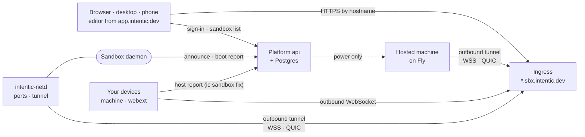

# Topology

The processes and machines intentic runs on, which way each connection is opened, and who can reach what.

```mermaid
flowchart LR
    browser["Browser · desktop · phone<br/>editor from app.intentic.dev"]
    api["Platform api<br/>+ Postgres"]
    ingress["Ingress<br/>*.sbx.intentic.dev"]
    netd["intentic-netd<br/>ports · tunnel"]
    daemon(["Sandbox daemon"])
    device["Your devices<br/>machine · webext"]
    fly["Hosted machine<br/>on Fly"]
    browser -->|"sign-in · sandbox list"| api
    browser -->|"HTTPS by hostname"| ingress
    netd -->|"outbound tunnel<br/>WSS · QUIC"| ingress
    netd --- daemon
    daemon -->|"announce · boot report"| api
    device -->|"outbound WebSocket"| ingress
    device -->|"host report (ic sandbox fix)"| api
    fly -->|"outbound tunnel<br/>WSS · QUIC"| ingress
    api -.->|"power only"| fly
```

## The pieces

- **The editor** ([`_editor/web`](../../_editor/web)) is a static Vue app served from `app.intentic.dev`. The desktop app ([`_editor/desktop-app`](../../_editor/desktop-app)) and the phone apps load the same URL in a webview. It reads the sandbox list from the platform, then talks to each sandbox's daemon directly.
- **The platform** ([`_platform/api`](../../_platform/api), Postgres through [`_platform/prisma`](../../_platform/prisma)) is sign-in, the sandbox registry and the hosted plan. See [platform.md](platform.md).
- **The ingress** ([`_platform/ingress`](../../_platform/ingress)) is a reverse proxy on Fly. A sandbox dials it, two WebSockets carrying yamux (one for transfers, the routes the daemon announces on the upgrade) and a QUIC connection beside them where the edge declares it serves QUIC, and it routes each browser request, as a stream of its own, to the tunnel registered for that request's host (`sandbox-<id>.sbx.intentic.dev`, plus `preview-`, `port-` and `public-` hostnames from [`hostnames.ts`](../../_shared/sandbox-contract/src/ids/hostnames.ts)). One copy of a sandbox holds its tunnel (2026-10-05): each netd names an instance minted once per container start, which its daemon also announces (`INTENTIC_INSTANCE`), and the edge refuses a second live copy started with the same grant rather than letting the two take the tunnel from each other every minute; the refused netd backs off, and after three refusals dials every 15 minutes and has its daemon say where the other copy runs.
- **A sandbox** is one Docker container plus two volumes. Inside it, [`intentic-netd`](../../_sandbox/netd) (Rust) owns every port and the ingress tunnel and supervises the Node daemon ([`_sandbox/sandbox`](../../_sandbox/sandbox)) over a Unix socket, so connections stay open across a daemon restart. See [sandbox.md](sandbox.md).
- **Where a sandbox runs**: on the user's own computer or server (started by the setup command, the desktop app or the [`ic`](../../_sandbox/ic) CLI), or on a hosted machine: one Fly app, machine and volume per sandbox. On the user's own machine `ic` is the one authority over its containers: what runs, and the shape saved for the next restart (in its channel record). The machine agent, the desktop app and the web's pasted fallback lines all call `ic`'s verbs (`list --json`, `start`/`stop`/`restart`, `shape`) rather than docker, so a restart through any of them applies a saved shape; Docker restarting a container by itself does not. A hosted sandbox dials the same tunnel, with a grant the platform puts in its machine's config, and is reached only down it: nothing on Fly routes to the machine. One that has not dialled in yet (stopped, or still booting) is answered with the `no-tunnel` verdict, which is what the editor wakes it on.
- **Which transports the edge serves** is its own declaration, read off what it binds, never probed for: on its answer to every tunnel's upgrade (`x-intentic-transports`, which netd instances read before dialling QUIC) and on its `/health`, which the platform reads each minute and relays on every sandbox row it netd instances (`edgeTransports`, which the editor reads before opening WebTransport). Undeclared means not served. The edge terminates TLS itself with the certificate the platform issues, with UDP 443 beside it ([`fly.toml`](../../_platform/ingress/fly.toml)), so it declares `quic`, `h3` and `webtransport`; behind Fly's HTTP proxy (the fallback, [`fly.edge-proxy.toml`](../../_platform/ingress/fly.edge-proxy.toml)) no UDP would reach it and it would declare nothing.
- **Your devices** ([`_devices/machine`](../../_devices/machine), the browser extension [`_devices/webext`](../../_devices/webext)) dial the sandbox's own hostname over one WebSocket each, or its loopback address when they share a machine. A machine agent carries a stable `machineId`, minted at install and shared by every OS install of one computer; a sandbox stores each device enrollment as `{ machineId, environment, card }` and joins its device doors, its sync enrollments and the rows the Devices view draws on that id, never on a hostname. The card is the grant and the name: removing or renaming it is one write over the enrollments that name it.

## Which way connections go

The platform never opens a connection to a sandbox:

- The sandbox dials out: the tunnel to the ingress, and `POST /sandbox/announce` to tell the platform its URL and liveness ([`announce.ts`](../../_sandbox/sandbox/src/system/boot/announce.ts)), with `POST /sandbox/adopt` when its owner reconnects it to a platform that lost its record. No inbound port or router rule is needed.
- The machine a sandbox runs on reports on it when the sandbox cannot: `ic sandbox fix` (run by the machine agent by itself, by the recovery panel's command, or by the desktop app) posts what it found to `POST /host-report`, which is how a browser elsewhere learns that the machine is starting Docker Desktop or is out of disk. It is a report, never a request for instructions.
- The browser and the devices dial the sandbox, through the ingress or on loopback.
- The platform never calls a user's daemon. It flips a hosted machine's power through Fly's API, and nothing more.

## Trust model

| Party | Can | Cannot |
| --- | --- | --- |
| Platform | know accounts, sandbox addresses and liveness, and what a sandbox's own machine reports about it; sign reachability grants; start, stop and destroy hosted machines | relay or read ordinary agent turns; hold the credential that drives a daemon |
| Ingress | route traffic for a sandbox holding a valid grant; read the traffic it carries, since TLS ends there | make a sandbox reachable or claim a hostname without a grant signed by the platform |
| Daemon | authenticate its owner and members itself; run agents with the workspace's credentials | reach a device beyond the scopes that device grants |
| Device | act on its own machine within the switches its owner set | be widened by the sandbox: scopes are enforced on the device |

- The daemon verifies the owner's Google ID token itself, binds the first owner, and mints its own session ([`auth.ts`](../../_sandbox/sandbox/src/auth/auth.ts)). Membership and role are checked on every request. Every other credential it accepts (control tokens, agent, extension and panel tokens, device enrollments) is in [`grants.ts`](../../_sandbox/sandbox/src/auth/grants.ts). A door that checks its own credential, such as the MCP door's per-turn mount bearer, is declared `auth: "door"` beside its route.
- The platform's grant is an Ed25519 signature the ingress checks with the public key alone ([`ingress-contract.ts`](../../_shared/sandbox-contract/src/protocol/ingress-contract.ts)). A deletion record revokes it: the registry writes one for every deleted row and rotated token, and the ingress refuses a tunnel for that alone, never for an id the platform merely has no row for ([platform.md](platform.md#when-the-platform-forgets)).
- Hosted machines are the exception: intentic's Fly token keeps access to every machine it creates ([`fly.ts`](../../_platform/api/src/sandbox/hosted/fly/fly.ts)), so a platform breach can reach hosted sandboxes and no other kind. The optional free trial also routes its turns through platform-owned model accounts.
- A device enforces its scopes (`shell`, `write`, `screen`, `control` and the rest) in [`policy.ts`](../../_devices/machine/src/device/policy.ts) and logs every call on the device.
