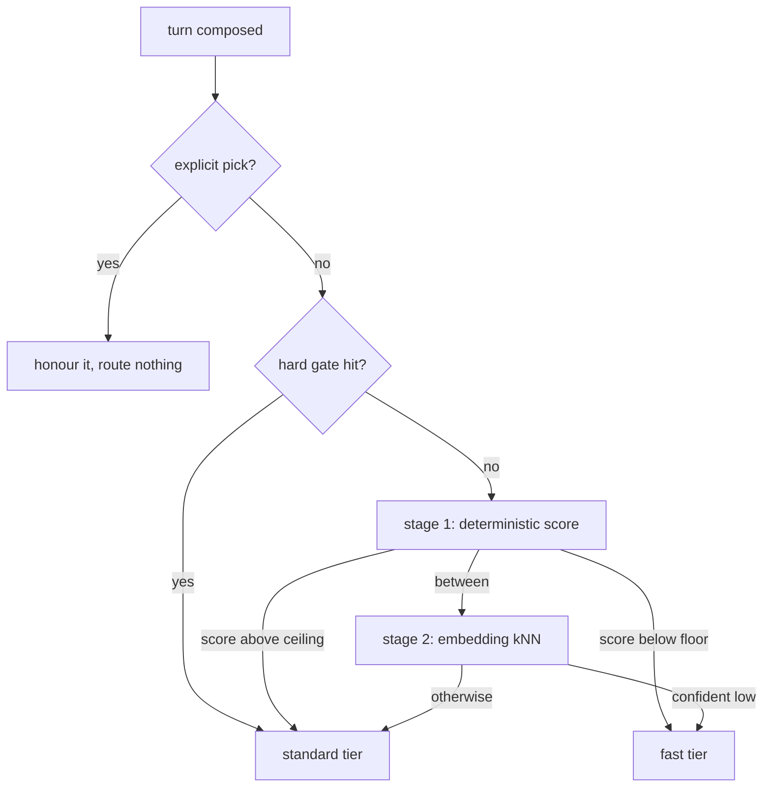

# Automatic tier selection — judging prompt complexity before the turn

Whether this app can pick between a **fast tier** and a **standard tier** on the user's behalf, without
paying an LLM to decide. What the 2024–2026 literature actually establishes, which parts of it survive
contact with a *multi-turn agentic coding* workload, and where the mechanism attaches to what this repo
already has.

Scope: two tiers, as asked. Everything below generalises to three, but two is where the evidence is
strongest and the calibration burden smallest.

---

## 1. What already exists here

Three pieces are already in place, and they shape the answer more than the research does.

**An ordered ladder is the established unit of model configuration.** `quickModel` and `agentRunModels`
(`_sandbox/sandbox-contract/src/schemas.ts:1838`, `:1874`) are both *lists* of `${provider}:${model}` keys
resolved by `resolveQuickModels` / `resolveAgentRunModels`. The comment in `quick-model.ts` states the rule
plainly:

> IT IS AN ORDER, NOT A MODEL … A single pick is a single point of failure.

The two resolvers differ on exactly one thing: what an empty list means. `quickModel` derives an Auto ladder
from whatever is connected; `agentRunModels` resolves to nothing and defers to the user's own chat pick,
because *"nothing here can judge whether a job is worth the frontier tier."*

That last sentence is the thing this design changes. A router **is** the something that judges it.

**Both sides must agree on the answer before it is spent.** The resolvers live in the contract, not in the
daemon, because the browser has to *name* the model in the settings row before anything runs. Any routing rule
inherits that constraint, which is why the judge is in the contract even though only the daemon spends it
today: the composer can say "Auto → fast" before send whenever that is worth building (§6).

**A model swap inside a provider is free.** `resumes()` (`_editor/web/src/composables/chat/turnRequest.ts:50`)
compares `provider`, `account` and `harness` — **not `model`**. Switching tiers between turns of one
conversation keeps the SDK session alive. Switching *provider* retires it and cuts a new segment.

> Per-turn tier routing is cheap **within a provider** and expensive **across** one. The router is therefore
> provider-scoped, always — see §3.5 for why "only on turn one" was not worth the exception.

**An embedding model is already in the box.** `_search/iq-engine/src/embed/embedder.ts` loads
`Xenova/bge-small-en-v1.5` at `dtype: "q8"` over onnxruntime, offline, thread-capped at 4
(`onnx-threads.ts`), 384 dimensions. The sandbox daemon already depends on `@intentic/iq-engine`
(`_sandbox/sandbox/package.json:36`). A semantic router stage therefore costs **no new model, no new
runtime, no new download** — single-digit to low-tens of milliseconds on a warm extractor.

**A "we did not do what you asked" notice already exists.** `ChatModelPicker.vue:69` renders a line under
the toggle *"only when the answer DISAGREES with the ask."* That is precisely the surface an automatic pick
needs, and it is already built.

---

## 2. What the research establishes

### 2.1 The families, and their price

The 2026 survey on dynamic routing and cascading sorts difficulty estimation into three families —
heuristic (length, word rarity, idiomatic language, syntactic complexity), learned classifier, and
LLM-as-judge — and is blunt that heuristics are *"simple and lightweight but limited in flexibility."*

| Family | Typical overhead | Well-benchmarked? |
| --- | --- | --- |
| Keyword / structural rules | ~0 ms | Floor baseline in every benchmark |
| Embedding + kNN / linear head | 10–50 ms CPU | **Yes** — RouterBench, RouterEval, LLMRouterBench |
| Small encoder classifier (DeBERTa/ModernBERT) | 10–50 ms | Yes — BEST-Route, vLLM Semantic Router |
| Small generative router (Arch-Router 1.5B) | <200 ms | Preference benchmarks only |
| LLM-as-judge | 100–500 ms **+ tokens** | Yes, and consistently not worth it |

The headline production numbers, for calibration of expectations rather than as promises: RouteLLM reports
**85% cost reduction at 95% of GPT-4 quality on MT-Bench** (matrix-factorisation router, 14% of calls to
the strong model once augmented with LLM-judge labels); BEST-Route reports **up to 60% cost cut with under
1% quality drop** using a multi-head DeBERTa-v3-small; AWS Bedrock's managed two-model router reports
**~30% average** on mixed workloads. The spread — 30% to 85% — is entirely a function of query mix, and the
30% figure is the one from a two-model-same-family setup, which is the shape proposed here.

### 2.2 Complexity does not pay

This is the most useful finding for a team that wants to ship something small.

*Rethinking Predictive Modeling for LLM Routing: When Simple kNN Beats Complex Learned Routers* (2505.12601)
tunes a plain k-nearest-neighbours router over L2-normalised BERT-base embeddings, k=100, predicting a
utility score as the weighted average of neighbours' performance and cost. Its text-average AUC:

| Router | Text AUC | VLM AUC |
| --- | --- | --- |
| Oracle | 64.91 | 85.69 |
| Linear | 53.14 | 71.68 |
| **kNN (k=100)** | **52.68** | **72.12** |
| Graph NN | 51.82 | 71.75 |
| MLP | 51.71 | 68.11 |
| Random | 40.35 | 56.25 |

Read it honestly: kNN does **not** beat a linear head on text — it ties it, and both beat the graph and
attention models that cost 13–14× more (65.7 s vs 866 s to route all of RouterBench). The finding is not
"kNN is magic", it is **"nothing sophisticated beats a simple predictor over a good embedding, and the
gap to Oracle stays enormous for everyone."**

A separate sweep across 1,300+ configurations found IRT/MIRT-2PL, GNN routing, LLM-judge soft labels,
disagreement-weighted training and two-stage tiered routing all produced improvements indistinguishable
from noise. Build the cheap thing.

### 2.3 Route before generating; do not cascade

The tempting alternative is a cascade — run the fast model, score its answer, escalate if unconfident.
FrugalGPT's numbers (50–98% savings) make it look like the better deal. For this product it is the worse
one, and 2026 work says so directly.

*Is Escalation Worth It? A Decision-Theoretic Characterization of LLM Cascades* (2605.06350) evaluates over
MATH, MMLU, TriviaQA, SimpleQA and LiveCodeBench across eight models: **a lightweight pre-generation router
exceeded the best cascade policy on four of five datasets** — not because its routing signal was better,
but because it avoids paying the cheap model's generation cost on everything that escalates. A separate
benchmark found both cascade baselines scoring *below* always-strong accuracy while paying for extra
sequential calls.

The agentic case is worse still on two counts. Latency compounds: a cascade pays both models' latency on
every hard turn, once per step in a multi-step loop. And the confidence signal is unreliable exactly where
this app lives — self-reported confidence is a known-bad deferral signal, and structured tool-use turns
have a *binary* failure mode (a malformed `tool_use` block aborts the loop) that no soft score models well.

> **Cascades are for verifiable subtasks.** Where there is a hard oracle — tests pass, the file compiles,
> the diff applies — escalate-on-failure is correct and cheap. Where the output is prose or a plan, route
> up front.

### 2.4 The agentic caveat that constrains everything

*SWE-Router* (2607.00053) is the closest work to this product: routing weak/strong pairs on SWE-Smith and
SWE-Bench. Its central claim is uncomfortable and worth stating in full — **prompt-only routers inherit an
information-theoretic Bayes-error floor.** Intermediate observations (a failed test, a stack trace, the
contents of the file that was actually retrieved) carry difficulty signal *the prompt cannot contain*.
Their router runs the weak model for K≈3 turns, then reads the partial trajectory with a LoRA'd
Qwen2.5-Coder-7B value head, gaining **+15.3 pp Route-AUC** over non-temporal baselines.

We are not going to run a 7B value model per turn. But the finding transfers as a design rule:

> A conversation's *history* is a better complexity signal than its current prompt. "now do the same for
> the other file" is lexically trivial and carries the whole weight of the task before it.

This is the single largest failure mode of naive prompt-only routing in an agent loop, and section 3.3's
stickiness rule is the cheap answer to it.

---

## 3. The mechanism

A **pre-generation, two-stage, non-generative router**. Nothing in it makes a network call.

Stages 0 and 1 are built (§7 records where). Stage 2 is deferred until shadow data says the ambiguous band is
wide enough to be worth it. Three things in this section changed on contact with the implementation and are
marked **[revised]** where they appear; §8 collects them.

**[revised] There is no "standard tier" setting.** The standard tier is whatever model the user already picked
for the conversation, so the router can only ever route *down*, and every ambiguous case resolves to "run what
they asked for". That collapses the fail-up rule from §3.3 into a tautology and removes the only way this
feature could ever produce a bill nobody asked for. It also means one new ordered list, not two.

### 3.1 Stage 0 — hard gates

Deterministic, non-negotiable, evaluated first because they are also the cheapest.

- **Images present.** Standard. The cheap rung is the one most likely to misread a screenshot, on the turn
  least likely to notice that it did.
- **Plan mode.** Standard. The turn is being asked to think before it acts; that *is* the request.
- **A surface-started agent run.** Standard. `agentRunModels` exists precisely because *"an agent run is a full
  session with a worktree, billed whole"* — the router should not be the thing that guesses on the most
  expensive kind of run this app starts.
- **Three or more attachments**, **a long prompt**, **pasted code or a stack trace**, **a hard word**, **a
  second job**, **a cross-cutting scope.** Escalating rules rather than situational gates, but they end the
  question the same way.

Above all of these sits the one that is not a rule at all: **the user named a model this turn**, so there is a
ceiling and the router may only look below it. Gates alone are worth shipping before any scoring exists.

### 3.2 Stage 1 — the deterministic scorer

Pure, synchronous, in the contract, so the composer and the daemon compute the same number. Features drawn
from the survey's heuristic family plus the primitive route-state fields LiteLLM's auto-router uses:

| Signal | Direction |
| --- | --- |
| Prompt token count | ↑ complexity |
| Attached / `@`-mentioned file count | ↑ |
| Distinct imperative verbs, numbered or bulleted sub-asks | ↑ |
| Code fences, diffs, stack traces present | ↑ |
| Cross-cutting markers — "across", "everywhere", "all the", "and then" | ↑ |
| Low lexicon — "what is", "explain", "rename", "typo", "format this", "list", "summarise" | ↓ |
| High lexicon — "refactor", "design", "debug", "why does", "root cause", "migrate", "architecture" | ↑ |
| Bare question with no workspace reference | ↓ |

Three rules keep this honest. **Monotone escalation:** when several rules fire, the highest tier wins, so rule
*order* can never silently change behaviour — LiteLLM's `SIMPLE < MEDIUM < COMPLEX` convention. Adding a rule
tomorrow can therefore only move turns *up* a tier. **Unmatched defaults up:** a prompt no rule recognises is
medium, not simple, matching the keyword-mode reference implementation in the self-hosted-orchestration work.

**[revised] Absence of complexity is not evidence of simplicity.** The two features that fire on what a prompt
*lacks* — short, and naming no file — are deliberately too light to reach the ceiling together, so a downgrade
always needs something positive to have been said. Weighted the obvious way, they crossed on their own and the
judge downgraded every terse request in the product: "fix the bug" is four words naming no file and is not a
cheap turn. This was caught by a test, not by review, and it is the failure mode most likely to come back
during a refit.

The scorer emits a number plus the rules that fired. The second half is not decoration: Routesplain (COLM
2026) makes the case that a router extracting human-interpretable concepts equals or beats black-box
baselines on software tasks *while being intervenable*. Here it is what lets the picker tooltip say **why**
it chose fast, and what makes a bad decision reportable rather than mysterious.

### 3.3 Stage 2 — kNN over the existing embedder

Only for scores in the ambiguous band. Embed the prompt with the `bge-small-en-v1.5` extractor already
loaded for search, k-nearest against a labelled bank of past turns, distance-weighted vote.

- k≈20–100, tuned on held-out traffic. The literature's k=100 assumes a large bank; start lower.
- **Predict a label, not a quality score.** We have no per-model utility numbers, only "did the fast tier
  suffice".
- **Fail up.** A vote inside a margin band resolves to standard. Asymmetric on purpose: a wrong downgrade
  in an agent loop costs a retry, an escalation, and possibly a bad edit; a wrong upgrade costs the
  difference in token price on one turn.
- **Daemon-side only, and escalate-only relative to stage 1.** The browser cannot embed. Constraining
  stage 2 so it can only move a decision *up* means the composer's pre-send label is never wrong in the
  expensive direction, and the existing disagreement notice covers the rest.

### 3.4 Stickiness — the answer to §2.4

**[revised] It raises the bar; it does not lock the door.** The design called for a hard lock: once a
conversation runs a standard turn, every later turn in that segment stays standard. That reads well and is
close to useless. Opening messages are substantive, so nearly every conversation takes standard on turn one and
is never eligible again — a mechanism carrying all of the risk and saving nothing.

So the previous turn's verdict is the heaviest single weight in the score instead. A follow-up that scores near
the base cannot afford the penalty, which is exactly the deceptive "now do the same for the other file" case;
a genuinely trivial aside inside a hard conversation still gets through, and that aside is a real and common
turn. It is the *judgement* that carries forward, never what ran: a turn judged fast that ran standard anyway
(nothing cheaper published, feature off) says nothing about the difficulty of the work.

This is still the cheap answer to §2.4's problem — one boolean where SWE-Router spends a 7B value model.

### 3.5 Provider is never crossed

`resumes()` compares provider, account and harness, **not model**. So a tier swap inside one provider keeps the
conversation's session; a cross-provider swap retires it and cuts a new segment, discarding the context that
made the follow-up cheap to answer. A pinned fast model naming another provider is therefore dropped rather
than honoured. Saving a fraction of a cent by starting the conversation over is not a saving.

**[revised] An unrecognised pick is never downgraded either.** If the user's model carries no tier word this
build knows, nothing can be *shown* to be cheaper than it, and the safety argument for the whole feature is
that it only routes down. Swapping it for something merely known to be cheap is how a saving turns into a bill.

### 3.6 Where the pieces live

| Piece | Home |
| --- | --- |
| The judge: features, gates, score | `sandbox-contract/src/prompt-complexity.ts` |
| Which cheaper model, and whether one exists | `sandbox-contract/src/fast-tier.ts` |
| "Is this a cheaper rung" on the tier ladder | `model-order.ts` (`isCheaperRung`) |
| Settings: mode + the fast ladder | `schemas.ts` (`autoTier`, `autoFastModels`) |
| Spending the judgement, catalogs, modes | `sandbox/src/agent/turn-tier.ts` |
| Applying it + the shadow record | `sandbox/src/agent/agent.routes.ts` |
| The previous turn's verdict | `agents-store.ts` / `agents-registry.ts` (`tier`, `recordTier`) |
| The settings row | `AgentModels.vue` |

The judge lives in the contract for the reason `quick-model.ts` does: a settings row has to be able to say what
a turn will run on before it runs. Configuration mirrors `quickModel` — one ordered list, empty means derive
from what is connected — and `model-order.ts` already answers "which row is the cheap rung", so Auto's
derivation is a function that already existed.

### 3.7 What it costs to decide

Nothing, and in the default mode not even an I/O. The judge is a pure function over the turn's own words. The
catalog read that Auto needs happens only when routing is switched **on** *and* this particular turn was judged
cheap *and* the user named a model — a small fraction of a small fraction. A mechanism that exists to save
money must not spend any to decide, and that property is pinned by a test rather than asserted here.

---

## 4. Calibration — the part that decides whether this works

**No threshold can be chosen before traffic exists.** This is why shadow is the default and not a debug mode:
every turn is scored, and the score, the rules that fired, the model that actually ran and what it cost land on
one ledger row. Route nothing. Then fit.

**Labels are nearly free here, and better than a benchmark's.** This product observes things a router paper
cannot. In rough order of how much they are worth and how much work they are:

| Signal | Reading | Available today |
| --- | --- | --- |
| The user bumps the model right after a fast turn | **strong negative** | **Yes** — two ledger rows for one conversation, no new plumbing |
| The turn ran, nothing was bumped, the conversation moved on | weak positive | **Yes**, same source |
| The user stops the turn mid-stream | negative | Needs the ending on the row |
| The user re-prompts on the same subject | weak negative | Needs transcript comparison |
| The edit landed and checks stayed green | positive | Needs joining to the land books |

The first row is the one to build the whole calibration around, and it is already recordable: it is the user
telling us, inside the product, that the router was wrong, in the direction that matters. The bottom three are
refinements, not prerequisites.

**Two traps, both documented, both easy to fall into.**

*Label collapse.* One 2026 study found routers degenerating to majority-class prediction with ~79% of
queries labelled smallest-tier-optimal, and confirmed with random-feature and shuffled-label controls that
the collapse was driven by the label marginal rather than by anything the features contained. A router that
answers "fast" for everything will score well on accuracy and be worthless. **Evaluate only on the
disagreement regime** — turns where the two tiers actually produce different outcomes — and always run a
shuffled-label control.

*Stale thresholds.* Prices move and models are replaced; a threshold calibrated on one pair is wrong for
the next. Given how fast the catalog here turns over (`model-order.ts` derives tier from the id precisely
so nobody has to curate it), the threshold needs the same treatment: re-fit on a schedule, on traffic that
resembles real traffic, not on a benchmark mix.

**Ship one knob, not many.** RouteLLM exposes aggressiveness as a single threshold in the model name
(`router-mf-0.3` vs `router-mf-0.7`). One user-facing slider from "save money" to "prefer quality", mapping
to the stage-1 cutoff. Everything else stays internal.

**Publish three numbers**, or the feature cannot be defended: share of turns on the fast tier, estimated
spend avoided, and **escalation rate** — the share of fast turns the user manually bumped. The third is the
guardrail. Past a few percent, the router is costing more in retries and trust than it saves in tokens.

---

## 5. Explicitly rejected

| Option | Why not |
| --- | --- |
| **LLM-as-judge router** | 100–500 ms serial hop plus tokens on every turn. The mechanism is supposed to produce savings, not consume them. |
| **Pure cascade / escalate-after** | Pre-generation routing beat the best cascade on 4 of 5 datasets (2605.06350); confidence signals are weakest exactly on open-ended and tool-use turns; latency compounds per step in an agent loop. |
| **RouteLLM's pretrained routers, dropped in** | Trained on Chatbot Arena *human preference* over open-ended chat. Useful as a reference implementation and a baseline to beat — not a predictor of "will the fast tier complete this coding task". |
| **Arch-Router-1.5B** | Right instincts (policy-editable in plain language, new models need no retraining) but a 1.5B generative pass where an encoder or a dot-product suffices. Revisit only if routing *policies* become a user-facing feature. |
| **Trajectory value model (SWE-Router)** | Best-in-class signal, 7B model per decision. Its finding is adopted as the stickiness rule instead. |
| **Fine-tuning our own classifier now** | Nothing sophisticated beat a linear head over good embeddings across 1,300+ configurations. Revisit only if the kNN bank plateaus with real labels in it. |

---

## 6. Build order

1. ~~**Gates and ladders, no scoring.**~~ **Built.** One ordered list (`autoFastModels`) beside `quickModel`;
   gates; explicit picks always win.
2. ~~**Shadow scoring.**~~ **Built, and it is the default.** `autoTier: "shadow"` judges every turn and writes
   the verdict — score, the rules that fired, and whether anything came of it — onto the spend ledger beside
   what the turn actually cost. Routes nothing.
3. ~~**Stage 1 live.**~~ **Built, switched off.** `autoTier: "on"` applies the downgrade. Shipping it dark is
   the point: the cutoff in §3.2 is fitted to nothing, and step 2 is what turns it into a number.
4. **Stage 2 kNN** — not built. Over the existing embedder, escalate-only, for the ambiguous band, and *only
   if* shadow data shows a band wide enough to be worth it. It may not be.
5. **Verifiable-subtask cascade** — not built, and separate work: escalate on a hard oracle (tests failed,
   patch did not apply) where one exists. The one place a cascade is the right tool, orthogonal to the above.

Still open, and deliberately so:

- **The escalation-rate metric is recorded but not drawn.** The ledger carries what is needed (§4); no screen
  reads it yet. Nobody should switch step 3 on before that exists — it is the guardrail, not a nice-to-have.
- **The composer does not preview the decision.** The judge is in the contract so it can, and the picker
  already renders a line when the answer disagrees with the ask. Worth doing when step 3 goes live, not before.
- **One aggressiveness knob.** Today the cutoff is a constant. Exposing it (RouteLLM's `router-mf-0.3` vs
  `router-mf-0.7`) is a step-3 concern and needs shadow data to be meaningful.

An honest expectation to set against step 3: the Oracle-to-best-router gap in every benchmark above is
large (64.91 vs 53.14 AUC), and the closest thing to a like-for-like production figure — a managed
two-model, same-family router — is **~30%**. That is the number to plan around, not 85%.

---

## 7. What the implementation changed about the design

Three things, each caught while building or testing rather than in review. All three make the mechanism more
conservative.

| Design said | Built instead | Why |
| --- | --- | --- |
| Two tier ladders, fail up on ambiguity | One ladder; the standard tier *is* the user's pick | Removes any path to overspending. "Fail up" becomes "do what was asked". |
| Once standard, always standard for the segment | The previous verdict is the heaviest score weight | The lock made nearly every conversation ineligible after turn one — all of the risk, none of the saving. |
| Weight the easing features naturally | The two *absence* features cannot cross the ceiling alone | "Short and naming no file" downgraded every terse request. "Fix the bug" is not a cheap turn. |

And one case the design did not consider: **a pick whose family carries no tier word is never downgraded.**
Nothing can be shown to be cheaper than an unknown, and the entire safety argument is that this only routes
down.

---

## Sources

- [Dynamic Model Routing and Cascading for Efficient LLM Inference: A Survey](https://arxiv.org/abs/2603.04445)
- [Rethinking Predictive Modeling for LLM Routing: When Simple kNN Beats Complex Learned Routers](https://arxiv.org/abs/2505.12601)
- [Is Escalation Worth It? A Decision-Theoretic Characterization of LLM Cascades](https://arxiv.org/abs/2605.06350)
- [SWE-Router: Routing in Multi-turn Agentic Software Engineering Tasks](https://arxiv.org/abs/2607.00053)
- [Routesplain: Towards Faithful and Intervenable Routing for Software-related Tasks](https://arxiv.org/abs/2511.09373) (COLM 2026)
- [RouterBench: A Benchmark for Multi-LLM Routing System](https://arxiv.org/abs/2403.12031)
- [LLMRouterBench: A Massive Benchmark and Unified Framework for LLM Routing](https://arxiv.org/abs/2601.07206)
- [TwinRouterBench: Fast Static and Live Dynamic Evaluation for Realistic Agentic LLM Routing](https://arxiv.org/abs/2605.18859)
- [Unsolvability Ceiling in Multi-LLM Routing: An Empirical Study of Evaluation Artifacts](https://arxiv.org/abs/2605.07395)
- [RouteLLM: Learning to Route LLMs with Preference Data](https://arxiv.org/abs/2406.18665) · [framework](https://github.com/lm-sys/RouteLLM) · [LMSYS write-up](https://www.lmsys.org/blog/2024-07-01-routellm/)
- [BEST-Route: Efficient LLM query routing via multi-sampling](https://arxiv.org/abs/2506.22716) · [code](https://github.com/microsoft/best-route-llm)
- [Arch-Router: Aligning LLM Routing with Human Preferences](https://arxiv.org/abs/2506.16655) · [weights](https://huggingface.co/katanemo/Arch-Router-1.5B)
- [Efficient Multi-Model Orchestration for Self-Hosted Large Language Models](https://arxiv.org/abs/2512.22402)
- [LiteLLM auto-routing docs](https://docs.litellm.ai/docs/proxy/auto_routing)
