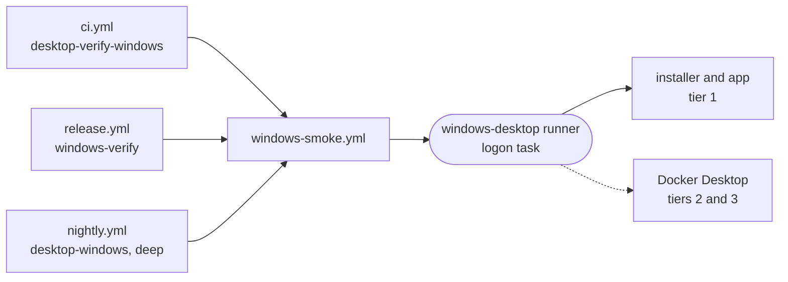

# The Windows CI runner

One interactive Windows machine, labelled `windows-desktop`, installs and drives the shipped Windows installer in a real signed-in desktop session, one job at a time.

- The installer is cross-built on the Linux fleet in `ci-desktop` with cargo-xwin. This machine only runs it, through [`desktop-smoke-windows`](../../_tools/desktop-smoke-windows). Tier 1 installs it, fires an `intentic://` link before and after launch, and uninstalls it; it needs no Docker, so it gates main and the release. Tiers 2 and 3 connect a sandbox and run a turn, so they need Docker and a connected account and run nightly with `deep: true`.
- The label is its own because `runs-on` is an AND over labels: a Windows box carrying `intentic` would be handed the Linux fleet's container jobs.
- A service runs in session 0, which has no desktop, and every tier-1 assertion reads a window title. [`setup-windows-runner.ps1`](../../_tools/scripts/ci/setup-windows-runner.ps1) therefore registers a logon task that starts the listener windowless through `intentic-launch.exe` and re-runs every few minutes, so a dead listener comes back without anyone signing in.
- A sleeping machine is an offline runner, and a locked one takes jobs and fails them. `-KeepAwake` sets the power and lock policy; `-AutoLogon` signs in after a reboot by storing the password in the registry. Use both only on a dedicated box.
- The box carries Node, pnpm and Git. The job installs only the smoke tier's subtree, so no Python or MSVC toolchain is needed, and there is no `/ci-cache` here.
- The repository variable `WINDOWS_AGENT_AUTH_VOLUME` names a Docker volume holding an AI account connected once by hand. Without it tier 3 stands down and says why.
- The same machine hosts the Linux fleet in WSL2 ([ci-runner.md](ci-runner.md)), whose reconciler also runs windowless so it never steals a window from these tiers.

## Provisioning

1. Settings > Actions > Runners > New self-hosted runner (Windows x64) gives a token. An organisation token pairs with `https://github.com/intentic`, a repository token with `https://github.com/intentic/intentic`.
2. From an elevated PowerShell: `./setup-windows-runner.ps1 -Url https://github.com/intentic -Token <token> -AutoLogon -KeepAwake`.
3. The script ends with a `ready: listener in session …` line naming the account and the session it runs in.

## Repairing

1. `node _tools/desktop-smoke-windows/dist/main.js doctor` names what is wrong with the machine and prints the remedy; every job runs it before the tiers.
2. `./setup-windows-runner.ps1 -Repair` (elevated, no token) turns a service or a runner started in a console window back into the logon task. It refuses while a job is running unless you pass `-Force`.
3. A leftover install or sandbox container needs nothing: every run starts with `teardown` and ends with it.
