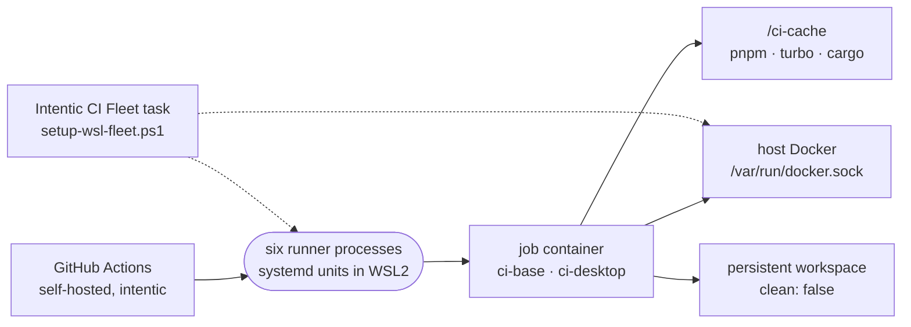

# The CI runner fleet

Six self-hosted GitHub Actions runners, living in one WSL2 distribution on one machine, run almost every CI, release and nightly job inside containers on the host's Docker.

- Every Linux instance carries the labels `intentic` and `desktop`; jobs ask for `[self-hosted, intentic]` or `[self-hosted, intentic, desktop]`. [`.github/actionlint.yaml`](../../.github/actionlint.yaml) declares the labels, so a job asking for one no runner carries fails the lint. The Windows machine carries only `windows-desktop` ([ci-runner-windows.md](ci-runner-windows.md)).
- Jobs run in `ghcr.io/intentic/ci-base` or `ci-desktop` and mount `/ci-cache` and, where they drive Docker, the host docker socket. `/ci-cache` sits on the same filesystem as the runners' work directories so pnpm can hard-link from its store.
- Nothing inside a container can see that six jobs share the box, so `CI_HOST_JOBS: "6"` in `ci.yml`, `verify.yml` and `nightly.yml` tells [`test-workers.mjs`](../../_tools/scripts/verify/test-workers.mjs) to divide memory by it. Change all three with the fleet.
- The host's Docker Desktop also runs the owner's sandboxes, so nothing here prunes a tagged image or a volume.
- Off the fleet: CodeQL, Scorecard, npm publish (provenance needs a GitHub-hosted builder), the arm64 sandbox image, the mobile builds and the engines bump.

## The fork boundary

The repository is public and the runners hold release credentials, a shared cache and the host docker socket, so a fork's code must never reach them.

- In `ci.yml`, the two DAG roots (`changes`, `preflight`) and `e2e-hermetic` skip a pull request whose head repository is not this one; every other job hangs off a root or runs only on main. [`workflow-policy.mjs`](../../_tools/checks/workflow-policy.mjs) fails any job a fork could reach.
- The repository setting that requires approval for all outside contributors covers a fork that edits the workflow file itself.
- To run CI on an outside contribution, read the diff, push the branch here and open the pull request from it.

## The token a checkout leaves behind

Workspaces persist between jobs, so a token written into `.git/config` outlives its job. Every checkout sets `persist-credentials: false` except the two in `release.yml` that run semantic-release; zizmor's `artipacked` rule fails any other.

## Keeping it bounded

Runners are not ephemeral. Fleet checkouts use `clean: false` to keep `node_modules` warm, and a job that stages build outputs first runs [`prepare-workspace`](../../.github/actions/prepare-workspace/action.yml), which removes everything but an allowlist of caches. Each store that outlives a job has an owner:

| Store | What bounds it |
| --- | --- |
| `/ci-cache/turbo` | age sweep in the `pnpm-setup` action |
| `/ci-cache/pnpm-store`, `/ci-cache/cargo` | grow only when a version is added |
| `/ci-cache/xwin`, `/ci-cache/ms-playwright` | fixed-size downloads |
| buildx builder `intentic-cache` | age sweep in `publish-images.sh` |
| dangling images | `docker image prune` in `nightly.yml` |
| host disk | the fleet task prunes build cache under `-LowDiskGb` |

## Registering a runner

1. In the distro, create `/ci-cache` and turn on Docker Desktop's WSL integration for the distro.
2. Settings > Actions > Runners > New self-hosted runner (Linux x64) gives a token. In a new directory per instance: `./config.sh --url https://github.com/intentic --token <token> --name <host>-<n> --labels intentic,desktop --unattended`.
3. `sudo ./svc.sh install && sudo ./svc.sh start`.
4. On Windows, from an ordinary PowerShell, run [`setup-wsl-fleet.ps1`](../../_tools/scripts/ci/setup-wsl-fleet.ps1). The first time add `-Restart`, which applies `vmIdleTimeout=-1`.

## When jobs sit queued

1. `setup-wsl-fleet.ps1 -Check` reports the engine, the distro, the units and the disk without changing anything; `%LOCALAPPDATA%\intentic\ci-fleet\fleet.log` has every pass.
2. `pnpm ci:audit --logs` groups recent failures by step and marks runner-side steps as infra.
