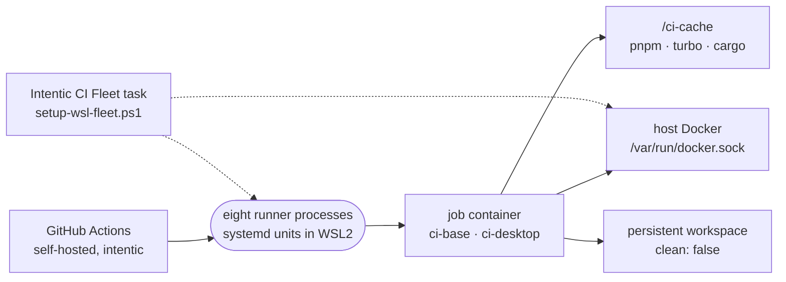

# The CI runner fleet

Eight self-hosted GitHub Actions runners, living in one WSL2 distribution on one machine, run almost every CI, release and nightly job inside containers on the host's Docker. Six share the work; two are kept for the pipeline's first two jobs.

```mermaid
flowchart LR
    gh["GitHub Actions<br/>self-hosted, intentic"] --> fleet(["eight runner processes<br/>systemd units in WSL2"])
    fleet --> job["job container<br/>ci-base · ci-desktop"]
    job --> sock["host Docker<br/>/var/run/docker.sock"]
    job --> cache["/ci-cache<br/>pnpm · turbo · cargo"]
    job --> ws["persistent workspace<br/>clean: false"]
    task["Intentic CI Fleet task<br/>setup-wsl-fleet.ps1"] -.-> fleet
    task -.-> sock
```

- Six Linux instances (`radarsu-worker-N`) carry the labels `intentic` and `desktop`; jobs ask for `[self-hosted, intentic]` or `[self-hosted, intentic, desktop]`. Two more (`radarsu-light-N`) carry only `intentic-light`, which only `changes` and `preflight` ask for. Those two jobs start every pipeline and take seconds, but on the shared runners they waited behind the previous push's long jobs, up to 7.5 minutes, and every other job of the push, including the ones whose start cancels a superseded push, waited with them. [`.github/actionlint.yaml`](../../.github/actionlint.yaml) declares the labels, so a job asking for one no runner carries fails the lint. The Windows machine carries only `windows-desktop` ([ci-runner-windows.md](ci-runner-windows.md)).
- Jobs run in `ghcr.io/intentic/ci-base` or `ci-desktop` and mount `/ci-cache` and, where they drive Docker, the host docker socket. `/ci-cache` sits on the same filesystem as the runners' work directories so pnpm can hard-link from its store.
- One job, `verify-machine`, starts its container `--privileged` with a tmpfs at `/history`: the worktree-isolation suites need `unshare --mount` and an overlay mount, as a sandbox has them. It needs nothing of the host beyond what Docker Desktop grants any privileged container, and a job mounting the docker socket already holds as much.
- Nothing inside a container can see that six jobs share the box. The test suites size their workers from a pool every job draws from: `TEST_SLOTS: "16"` one-GiB slots in `TEST_SLOTS_DIR: /ci-cache/test-slots`, held by flock ([`test-memory-pool.mjs`](../../_tools/scripts/lib/test-memory-pool.mjs)), set in `ci.yml` and `verify.yml`. A run takes at most three quarters of what is free. The first `TEST_SLOTS_RESERVED: "6"` are only for the verify groups (`TEST_SLOTS_PRIORITY: gate` in `verify.yml`), whose suites the release and the platform deploy wait on, and `verify-clocks`, which gates nothing, holds at most `TEST_SLOTS_CAP: "6"`. A suite that wants three workers or more and finds less than half of them free waits up to `TEST_SLOTS_WAIT: "90"` seconds for room, then runs with what it holds, one worker at least. Without the band, the web suite once ran on one worker for 14.6 minutes instead of 4.3 on four. 16 is what the 26 GB WSL VM leaves after typechecks, builds and Docker: change it with the VM's `memory=`. What still sizes by division (the e2e tiers, `nightly.yml`) reads `CI_HOST_JOBS: "6"`, which [`test-workers.mjs`](../../_tools/scripts/verify/test-workers.mjs) divides memory by. Change it with the fleet.
- The web's vue-tsc keeps its build info in `/ci-cache/tsbuildinfo` (`TSBUILDINFO_SHARE_DIR`), so a check on any runner starts from the last passing one rather than from whatever push that runner last saw.
- A newer push supersedes the older one's measurement. Every job that only measures carries a per-job concurrency group with `cancel-in-progress`, so its copy for the older push stops when the newer push's starts; the jobs that publish or deploy carry none. A superseded push publishes nothing, because every publishing job requires its gates to have succeeded, and the push on top publishes instead.
- The host's Docker Desktop also runs the owner's sandboxes, so nothing here prunes a tagged image or a volume.
- Off the fleet: CodeQL, Scorecard, npm publish (provenance needs a GitHub-hosted builder), the arm64 sandbox image, the mobile builds and the engines bump.
- A failing commit still costs a whole pipeline. Every verification job in `ci.yml` runs whatever preflight concluded, so one run reports everything wrong with a commit, and only the jobs that push or deploy wait on proofs. When a gate in front of `images` fails, `images-dry` builds the amd64 sandbox image into the host's docker store and boots it, holding a read-only token. That is one more image build per failing main push that changes the image.

## The fork boundary

The repository is public and the runners hold release credentials, a shared cache and the host docker socket, so a fork's code must never reach them.

- In `ci.yml`, the two DAG roots (`changes`, `preflight`) and `e2e-hermetic` skip a pull request whose head repository is not this one; every other job hangs off a root or runs only on main. [`workflow-policy.mjs`](../../_tools/checks/workflow-policy.mjs) fails any job a fork could reach.
- The repository setting that requires approval for all outside contributors covers a fork that edits the workflow file itself.
- To run CI on an outside contribution, read the diff, push the branch here and open the pull request from it.

## The token a checkout leaves behind

Workspaces persist between jobs, so a token written into `.git/config` outlives its job. Every checkout sets `persist-credentials: false` except the two in `release.yml` that run semantic-release; zizmor's `artipacked` rule fails any other.

## Keeping it bounded

Runners are not ephemeral. Fleet checkouts use `clean: false` to keep `node_modules` warm, and a job that stages build outputs first runs [`prepare-workspace`](../../.github/actions/prepare-workspace/action.yml), which removes everything but an allowlist of caches. Each store that outlives a job has an owner:

| Store | What bounds it |
| --- | --- |
| each runner's `_temp`, including the job's `$HOME` | the janitor, while that runner is idle |
| `actions-work-N/.pnpm-store` | the janitor, above 6 GB |
| `/ci-cache/turbo` | age sweep in the `pnpm-setup` action; the janitor above 10 GB |
| `/ci-cache/*-target` | the janitor, above 20 GB or after 14 days without a build |
| `/ci-cache/onboarding-docker` | the janitor, above 30 GB |
| `/ci-cache/pnpm-store`, `/ci-cache/cargo` | the janitor, above 20 GB |
| any other `/ci-cache` entry (`xwin`, `ms-playwright`, ...) | the janitor, above 15 GB |
| buildx builder `intentic-cache` | age sweep in `publish-images.sh`; the janitor keeps 25 GB |
| `sandbox:dry-*` images `images-dry` loads | the job itself: `SMOKE_RMI=1` after each boot, and a final `docker image rm` that runs whatever happened |
| dangling images | `docker image prune` in `nightly.yml` |
| host disk | the fleet task prunes build cache under `-LowDiskGb` |

The janitor is [`fleet-janitor.sh`](../../_tools/scripts/ci/fleet-janitor.sh), which `setup-wsl-fleet.ps1` installs in the distro with the hourly `intentic-ci-janitor.timer`. It runs as root because job containers write as root, and the runner, which runs as the distro user, cannot empty `_temp` after them. It removes a runner's leftovers only while that runner has no job, and shared `/ci-cache` directories only while no runner has one. `journalctl -u intentic-ci-janitor` in the distro has every pass, and `JANITOR_DRY_RUN=1` reports without removing anything.

Space freed inside the distro stays in its VHDX until a compaction. When one pass frees 40 GB or more, the janitor writes `/var/lib/intentic-ci/compact-requested`, and omen's maintenance task compacts on its next idle hourly pass if C: is below 250 GB free.

## Registering a runner

1. In the distro, create `/ci-cache` and turn on Docker Desktop's WSL integration for the distro.
2. Settings > Actions > Runners > New self-hosted runner (Linux x64) gives a token. In a new directory per instance (`~/actions-runner-<n>`, which the janitor's glob covers): `./config.sh --url https://github.com/intentic/intentic --token <token> --name <host>-<n> --labels intentic,desktop --unattended`. A light-lane instance is `--name <host>-light-<n> --labels intentic-light`, nothing else: a runner that also carried `intentic` would be handed any job and be busy when a pipeline's first job needs it.
3. `sudo ./svc.sh install && sudo ./svc.sh start`.
4. On Windows, from an ordinary PowerShell, run [`setup-wsl-fleet.ps1`](../../_tools/scripts/ci/setup-wsl-fleet.ps1). The first time add `-Restart`, which applies `vmIdleTimeout=-1`. It also points each runner's `.env` at the job-started hook (`ACTIONS_RUNNER_HOOK_JOB_STARTED`) and restarts that runner once it is idle.

## When jobs sit queued

1. `setup-wsl-fleet.ps1 -Check` reports the engine, the distro, the units and the disk without changing anything; `%LOCALAPPDATA%\intentic\ci-fleet\fleet.log` has every pass.
2. `pnpm ci:audit --logs` groups recent failures by step and marks runner-side steps as infra.

## When docker is missing in the distro

Docker Desktop's WSL integration puts `/var/run/docker.sock` into the distro. After a Docker Desktop restart it can fail on a distro that is still booting ("setup groups"), and then it waits for someone to click "Restart the WSL integration" while the engine keeps answering on Windows.

- Each pass of the fleet task asks docker inside the distro, as the runners' user. When no daemon answers there and the engine answers on Windows, it runs `docker desktop restart`, at most once every 10 minutes and only while no job is working. The distro and its runners stay up.
- A job that lands in the meantime waits in its job-started hook (`/usr/local/lib/intentic-ci/wait-for-docker.sh`) for up to 10 minutes. It fails only if docker is still missing after that, with an error naming the machine. A job waiting there does not count as working.

## While the disks are being compacted

A WSL maintenance run (`C:\ProgramData\wsl-maintenance\wsl-maintenance.ps1` on omen) stops Docker Desktop, runs `wsl --shutdown` and compacts every VHDX, and diskpart can compact a file only while nothing has it open.

- The fleet task skips its whole pass while that run's lock (`C:\ProgramData\wsl-maintenance\.lock`) exists, and logs one line saying so. Each pass would otherwise boot the distro or restart Docker Desktop under the compaction. It ignores a lock older than 3 hours, or one whose PowerShell is gone. `-MaintenanceLock ''` turns the skip off.
- The intentic device agent does not boot a distro that WSL stopped. Its session starts again once something else starts the distro, or after 5 minutes.
