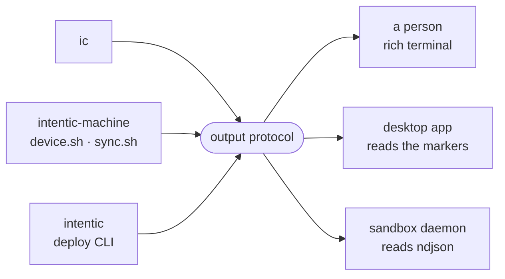

# The CLI output protocol

The rules intentic's command-line tools share for choosing how to render, when to prompt, which words settle a verdict, and what a program reading their output may parse.

Two renderers implement it: [`_sandbox/ic/src/ui.rs`](../../_sandbox/ic/src/ui.rs) for `ic` and [`_devices/local-agent/src/ui.ts`](../../_devices/local-agent/src/ui.ts) for the machine agents. The `intentic` deploy CLI adds structured output ([`_deploy/cli/src/lib/output.ts`](../../_deploy/cli/src/lib/output.ts)).

## Choosing a mode

A tool picks its mode once, at start:

| `INTENTIC_UI` | Mode |
| --- | --- |
| `rich` | checklist, colour, one repainting status line |
| `plain` | the marker stream below, nothing repainted |
| `nested` | lines folded under a parent's running step |
| unset | `INTENTIC_PLAIN=1` means plain; otherwise rich when stdout is a terminal, plain when it is not |

`NO_COLOR` turns colour off and `FORCE_COLOR` turns it back on. ASCII glyphs replace Unicode where the console cannot draw them. `ic` sets `nested` on an agent installer it spawns only while it is drawing a checklist itself; a piped run hands the child the same pipe, and the child's own terminal test picks plain.

## Prompts

Questions go to the controlling terminal (`/dev/tty`, or `CONIN$` on Windows), never stdin, so `curl … | sh` can still ask. `INTENTIC_NO_PROMPT=1` (exactly `1`) says nobody is there: every prompt returns no answer, and a consent question reads that as no. The desktop app sets it on every flow it runs.

## The plain marker stream

Line by line, for a reader with no screen:

- `intentic: [<phase>] <sentence>` on stdout is a step. The desktop app moves its checklist cursor on these.
- `intentic: <text>` is narration under the running step; an indented line is a progress reading.
- `intentic-requirement: {json}` and `intentic-requirement-state: {json}` come from `ic`'s Windows setup. The different prefix keeps a requirement from reading as a phase.
- Warnings go to stderr with the `intentic: ` prefix. A stopped run ends with `error: <message>` on stderr.

## Verdict words

A row settles as `ok`, `warn`, `FAIL` or `skip` in one aligned column. Only the failure is upper case, so it is what the eye finds in a long log. A command built on stricli that throws prints `FAILED: <message>` (`intentic`, `intentic-machine`), and the repository's live probes (`check-install-urls.mjs`, `check-demo-live.mjs`) use the same `ok`/`FAIL` column.

## Structured output

The `intentic` deploy CLI reads `INTENTIC_OUTPUT`:

- `text` (the default, and the fallback for any unknown value): prose and live apply progress.
- `json`: silent during the run, then one document.
- `ndjson`: one JSON object per line, each with a `kind` and a `t` stamp in epoch milliseconds, ending with `kind: "result"`.

Every mode passes through a redactor that masks known secret values. The sandbox daemon always runs it with `ndjson` and parses each line as `IntenticLine` from `@intentic/sandbox-contract`.

## Exit codes

`0` means done. `ic`'s Windows setup also stops without an error on `3` (requirements listed, nothing changed; run again with consent) and `4` (sign out or restart, then it resumes). Any other non-zero code is a failure.
