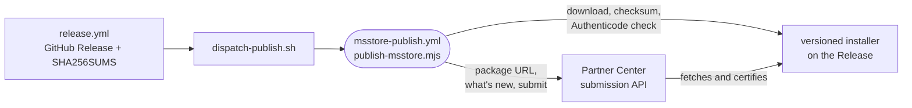

# Microsoft Store

How the desktop app's Microsoft Store listing is set up once, and how each release then points it at that release's signed Windows installer.

- The Store hosts nothing. An EXE listing holds a package URL, and [`publish-msstore.mjs`](../../_tools/scripts/release/publish-msstore.mjs) points it at the versioned installer on the GitHub Release. The site's `/desktop/windows` path always resolves to the newest release, so it is never submitted.
- Microsoft signs MSIX packages, not EXE installers, and an unsigned installer fails certification days later. The script downloads the installer, checks it against `SHA256SUMS` and refuses it without an Authenticode signature ([windows-code-signing.md](windows-code-signing.md)).
- The script writes two parts of the listing: the package, and "What's new" built from the release's `## Breaking changes` and `## What's new` sections. Everything else is typed into the dashboard from [`STORE-LISTING.md`](../../_editor/desktop-app/STORE-LISTING.md).
- The Store takes one submission at a time. A release cut while another is in certification defers with a warning, and the next release carries it. Re-running at the same tag finishes a run that staged the package but did not submit. A tag older than the draft is refused.
- With any of the five settings missing, the run skips with a warning and the release stays green.

## One-time setup

1. In Partner Center, reserve the product name as an EXE app. This creates the product id.
2. Fill in the listing from [`STORE-LISTING.md`](../../_editor/desktop-app/STORE-LISTING.md).
3. Create a Microsoft Entra ID application, associate it with the Partner Center account and give it a client secret.
4. Add repository secrets `MSSTORE_TENANT_ID`, `MSSTORE_CLIENT_ID` and `MSSTORE_CLIENT_SECRET`, and repository variables `MSSTORE_SELLER_ID` and `MSSTORE_PRODUCT_ID` from the dashboard.
5. Turn on Authenticode signing so release installers carry a signature ([windows-code-signing.md](windows-code-signing.md)).

## Publishing

1. A release dispatches `msstore-publish.yml` at its tag through `dispatch-publish.sh`; nothing else is needed.
2. To publish or finish one by hand: Actions > msstore publish > Run workflow, with the release tag as the ref. Locally, `node _tools/scripts/release/publish-msstore.mjs <version>` with the five settings and `GITHUB_TOKEN` in the environment.
3. The run prints the dashboard link. Certification takes up to three business days, and its result is read there.
