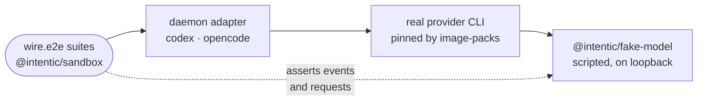

# Provider conformance

A release-gating test tier that drives each agent provider's real CLI, at the version the sandbox image pins, through the daemon's real adapter against a scripted local model.

- The suites are [`codex-wire.e2e.test.ts`](../../_sandbox/sandbox/src/e2e/codex-wire.e2e.test.ts), run against two model families whose wire formats differ, and [`opencode-wire.e2e.test.ts`](../../_sandbox/sandbox/src/e2e/opencode-wire.e2e.test.ts). Each spawns the real binary the way a live turn does and checks both the events the daemon receives and the requests the CLI sends.
- Nothing leaves the machine: no credential, no vendor, no quota. A vendor outage cannot turn it red, which is why `verify-providers` in `ci.yml` is a required success for the release.
- It never skips quietly. With `INTENTIC_E2E_PROVIDERS=1` set and a CLI missing, the suite fails and names the pack to install.
- The versions come from the pack Dockerfiles in [`image-packs/`](../../_sandbox/sandbox/image-packs), which [`install-provider-clis.sh`](../../_tools/scripts/ci/install-provider-clis.sh) reads. `packs.integration.test.ts` keeps those pins in step with the daemon's own dependencies.
- The nightly `provider-canary` job runs the same suites against each CLI's newest release. Red there means "do not bump yet"; it gates nothing.

## Running it

1. `bash _tools/scripts/ci/install-provider-clis.sh` installs `@openai/codex` and `opencode-ai` globally and `@cursor/sdk` into `INTENTIC_CURSOR_SDK_DIR` (default `/opt/cursor-sdk`), all at the pack pins. `--latest` installs the newest instead.
2. `pnpm e2e:providers` from the repository root builds what the suites import and runs them. `pnpm --filter @intentic/sandbox e2e:providers` runs them alone.
3. The package script sets `INTENTIC_E2E_PROVIDERS=1`; without it the suites stand down.

## Adding a provider

1. Pin its CLI in a pack Dockerfile and teach `install-provider-clis.sh` to read that pin.
2. Add `src/e2e/<provider>-wire.e2e.test.ts` in `@intentic/sandbox`: gate it with `e2eTier("<provider> wire conformance", { enabledBy: "INTENTIC_E2E_PROVIDERS" })`, drive a turn through the real adapter against `startFakeModel`, and fail when the binary is missing.
