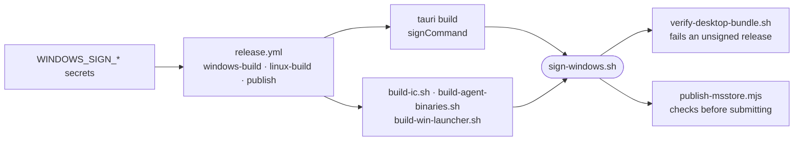

# Windows code signing

How release builds put an Authenticode signature on every Windows binary from Linux, so SmartScreen can name the publisher and the Microsoft Store certifies the installer.

- Windows warns about any program it cannot attribute to a publisher, and only an Authenticode signature from a certificate issued to a verified legal entity supplies one. `TAURI_SIGNING_PRIVATE_KEY` is a different key: minisign, read only by the app's updater.
- [`sign-windows.sh`](../../_tools/scripts/build/sign-windows.sh) does nothing when `WINDOWS_SIGN_TOOL` is unset and says so in the build log, so local and non-release builds stay unsigned and runnable. When it is set, `verify-desktop-bundle.sh` fails a build whose installer carries no signature.
- The installer is cross-built with cargo-xwin, so `signtool.exe` is not available; both supported signers run on Linux.
- Every signature is SHA-256 with an RFC 3161 timestamp (`WINDOWS_SIGN_TIMESTAMP_URL`), so it keeps verifying after the certificate expires.
- `sign-windows.sh --check <file>` reads the PE's certificate table. It proves a signature is present, not that it chains to a trusted root.

## Choosing a signer

| `WINDOWS_SIGN_TOOL` | Where the key lives | Variables it reads |
| --- | --- | --- |
| `jsign` | a service or token: Azure Trusted Signing, Azure Key Vault, AWS or Google KMS, DigiCert ONE, SSL.com eSigner, PKCS#11 | `WINDOWS_SIGN_STORETYPE`, `WINDOWS_SIGN_STORE`, `WINDOWS_SIGN_ALIAS`, `WINDOWS_SIGN_STOREPASS` |
| `osslsigncode` | a `.pfx` file | `WINDOWS_SIGN_PFX`, `WINDOWS_SIGN_PFX_PASSWORD` |

CA/Browser Forum rules keep a code-signing certificate's private key on certified hardware, so a newly bought certificate means `jsign`, against a signing service or a hardware token. `osslsigncode` suits a legacy or test certificate held as a file. On the CI side `jsign` is Java, so choosing it puts a JRE into `ci-desktop`, which every desktop job pulls.

## Turning it on

1. Buy the certificate or set up the signing service, and pick the signer.
2. For `jsign`, add `default-jre-headless` and the jsign `.deb` to [`_tools/ci-desktop/Dockerfile`](../../_tools/ci-desktop/Dockerfile); the image bakes only `osslsigncode`.
3. Add `WINDOWS_SIGN_TOOL` and the signer's variables as repository secrets. `release.yml` passes the `jsign` set to `windows-build`, `linux-build` and `publish`; the `osslsigncode` pair has to be added to those `env` blocks, and `WINDOWS_SIGN_PFX` is a path, so the job must write the certificate to a file first.
4. Cut a release. The build log shows `==> signed <file>` for each binary, and `verify-desktop-bundle.sh` prints `signed` for the installer.
5. If the Microsoft Store is waiting on a signed installer, dispatch `msstore-publish.yml` at that tag ([microsoft-store.md](microsoft-store.md)).
